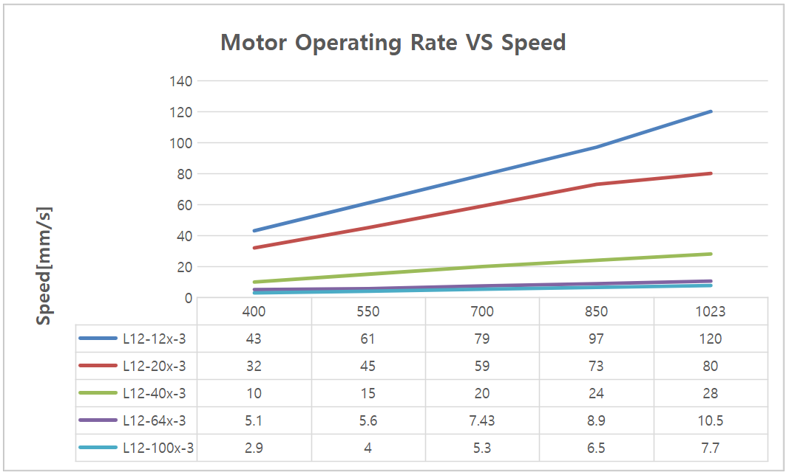

# L12-xxPT-3 Datasheet
## 1. Features
- Micro size
- Precise position control
- Strong force comparing to the size
- Built-in Drive Circuitry
- TTL/PWM communication
- Parameter programmable on the Manager software

## 2. Specification
### 2.1 Common Specifications
| **Property**                              | Value                                                                                                                                                                                                                                               |
| ----------------------------------------- | --------------------------------------------------------------------------------------------------------------------------------------------------------------------------------------------------------------------------------------------------- |
| **Stroke**                                | 27mm(Extendable to 30mm on Manager software)                                                                                                                                                                                                        |
| **Rated Load**                            | 12N~100N according to gear ratio(See appendix.)                                                                                                                                                                                                     |
| **Micro controller**                      | 32bit Arm Cortex                                                                                                                                                                                                                                    |
| **Position Resolution**                   | 4096 Resolution (A/D Converter)                                                                                                                                                                                                                     |
| **Input Voltage**                         | 12.0V(Rated), 7.4V ~ 13 V(Operating)                                                                                                                                                                                                                |
| **Motor Type / Watt**                     | Coreless DC Motor / 3.5 Watt                                                                                                                                                                                                                        |
| **Current consumption**                   | 30mA(Idle), 380mA(Rated), 1.6A(Stall)                                                                                                                                                                                                               |
| **Position repeatability**                | Unidirectional less than 0.03mm(30um)                                                                                                                                                                                                               |
| ^                                         | Bydirectional less than +/0.06mm(60um)                                                                                                                                                                                                              |
| **Position sensor**                       | 10kΩ linearity potentiometer                                                                                                                                                                                                                        |
| **Size, Weight**                          | 57.4(L)x29.9(W)x15(H)mm / 49~52g (to be varied according to gear ratio)                                                                                                                                                                             |
| **Communication**                         | TTL/PWM(Automatic signal recognition)  → TTL Level voltage : 3.3 ~ 5.0V  → PWM Pulse range : 900us(retracted) – 1500us(center) – 2100us(extended)  → TTL Communication range : Max.4m                                                      |
| **Protocol**                              | IR Open Protocol (MODBUS is for Force control lineup only.)                                                                                                                                                                                         |
| **Operating Temperatures**                | -10℃ ~ 60℃                                                                                                                                                                                                                                          |
| **Ingress protection**                    | IP-54                                                                                                                                                                                                                                               |
| **Mechanical Backlash**                   | 0.03mm(30um)                                                                                                                                                                                                                                        |
| **Audible Noise**                         | Max. 50db at 1m                                                                                                                                                                                                                                     |
| **Gear ratio**                            | :10:1(12PT,20PT,40PT) /30:1(64PT) /50:1(100PT)                                                                                                                                                                                                      |
| **Gear type**                             | Engineering plastic gears(12PT,20PT,40PT)  4metal & 2engineering plastic gears(64PT,100PT)(Aluminum and stainless steel combination)                                                                                                             |
| **Rod type**                              | stainless steel                                                                                                                                                                                                                                     |
| **Standard Accessory**                    | 1xHinge base  1x Hinge  1xHinge shaft  1xRod end tip  2x M3 NUT  3 x M2.5x6 screws  1x Molex wire harness (200mm)  1 x M3 spanner  1 x Socket set screwlex wire harness (200mm)  1 x M3 spanner  1 x Socket set screw |
| **Connector Type (Male) in the Actuator** | MOLEX 22-03-5035                                                                                                                                                                                                                                    |
| **Wire Harness**                          | Molex(50-37-5033) to Molex(50-37-5033)/ 200mm / 0.08x60(22AWG)                                                                                                                                                                                      |

### 2.2 Volatges
| Parameter | Min | Norm | Max | Unit | Note |
| :--- | :-: | :--: | :-: | :--: | :--: |
| **Supply voltage** | 7.4 | 12 | 13 | V |   |
| **Logic input voltage** | 2.0 | 3.3 | 5.5 | V | TTL |

### 2.3 Currents
| Parameter | Min | Norm | Max | Unit | Note |
| :--- | :-- | :--- | :-- | :--- | :--- |
| **Maximum peak Current  ** | 2.1 | 2.2 | 2.3 | A | Stall Current |
| **No Load Current  ** | 180 | 200 | 220 | mA | No Load |
| **Rated Load Current  ** | 420 | 450 | 480 | mA | Rated Load |
| **Idle Current** | 25 | 30 | 35 | mA | |

### 2.4 Temperatures
| Parameter | Min | Norm | Max | Unit | Note |
| :--- | :-: | :--: | :-: | :--: | :--: |
| **StorageTemp.** | -20 | - | 70 | ℃ | |
| **Operating Temp.** | -10 | - | 60 | ℃ | |

### 2.5 Strokes
| Parameter | Min | Norm | Max | Unit | Note |
| :--- | :--- | :--- | :--- | :--- | :--- |
| **MIN Position** | 3.3 | 3.8 | 4.3 | mm | |
| **MAX Position** | 30.3 | 30.8 | 31.3 | mm | |
| **Stroke length** | | 27.0 | | mm | |

⁕ Synchronize Min / Max Position by “Min / Max Position Calibration” feature on Manager software or Parameter Map.
### 2.6 PWM Signal
| Parameter | Min | Norm | Max | Unit | Note |
| --- | --- | --- | --- | --- | --- |
| Min Pulse | | 900 | | us | Period 8~21ms |
| Neutral Pulse | | 1500 | | us | |
| Max Pulse | | 2100 | | us | |
### 2.7 No Load Speed
| Parameter | Min | Norm | Max | Unit | Note |
| :--- | :--- | :--- | :--- | :--- | :--- |
| Maximum Speed at 12.0V   | 119 | 120 | 121 | mm/s | L12-12PT-3 |
| ^ | 79.5 | 80.0 | 80.5 | mm/s | L12-20PT-3 |
| ^ | 27.5 | 28.0 | 28.5 | mm/s | L12-40PT-3 |
| ^ | 10.0 | 10.5 | 11.0 | mm/s | L12-64PT-3 |
| ^ | 7.3 | 7.7 | 8.1 | mm/s | L12-100PT-3 |
### 2.8 Load
| Parameter Parameter | Min | Rated | Max | Unit | Note |
| :--- | :-: | :---: | :-: | :--: | :--- |
| Load at 12.0V   | | 12.0 | | N | L12-12PT-3 |
| ^ | | 2.69 | | lbf | ^ |
| ^ | | 1.22 | | kgf | ^ |
| ^ | | 20.0 | | N | L12-20PT-3 |
| ^ | | 4.49 | | lbf | ^ |
| ^ | | 2.04 | | kgf | ^ |
| ^ | | 40 | | N | L12-40PT-3 |
| ^ | | 8.99 | | lbf | ^ |
| ^ | | 4.07 | | kgf | ^ |
| ^ | | 64.0 | | N | L12-64PT-3 |
| ^ | | 14.38 | | lbf | ^ |
| ^ | | 6.52 | | kgf | ^ |
| ^ | | 100.0 | | N | L12-100PT-3 |
| ^ | | 22.48 | | lbf | ^ |
| ^ | | 10.19 | | kgf | ^ |

⁕ 1 kgf = 9.8N, 1lbf = 4.45N

### 2.9 Self Lock Feature

| Parameter | Min | Norm | Max | Unit | Note |
| :--- | :-: | :---: | :-: | :--: | :--- |
| Slef Lock | - | N/A | - | | L12-12x-3 |
| ^ | - | ^ | - | | L12-20x-3 |
| ^ | - | Available | - | | L12-40x-3 |
| ^ | - | ^ | - | | L12-64x-3 |
| ^ | - | ^ | - | | L12-100x-3 |

>[!tip] Tip
>**Self-lock feature :The force which actuator maintains its position by mechanical friction without motor power.**  

## 3. Reference
### 3.1 Load Vs Current

### 3.2 Load Vs Speed

### 3.3 Voltage Vs Stall Force

### 3.4 Voltage Vs Speed

### 3.5 Motor Operating Rate

### 3.6 PIN Map
| PIN NUMBER(COLOR) | PIN NAME&nbsp; | 
FUNCTION
 |
| :--: | :--: | :--: |
| 1(WHITE) | DATA | |
| 2(RED) | VCC | |
| 3(BLACK) | GND | |

