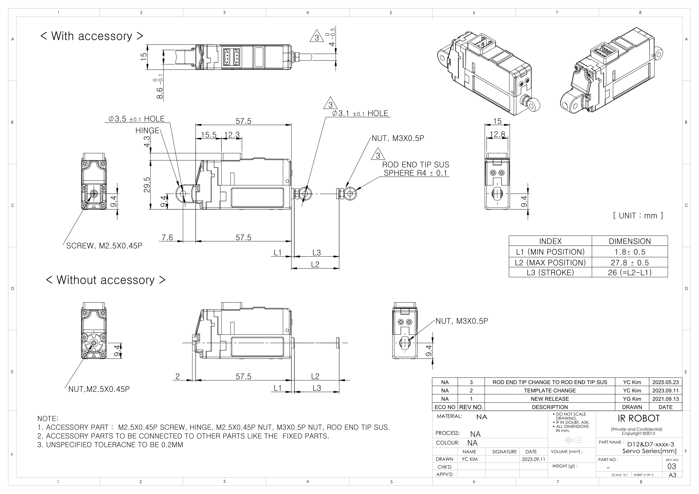
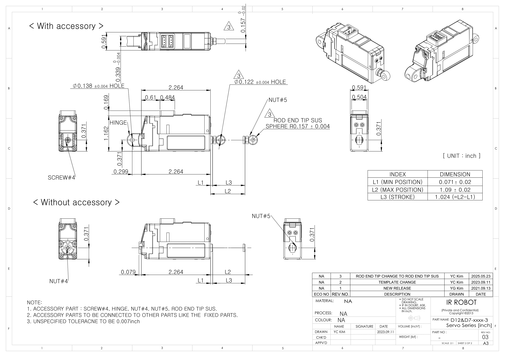

# D7D12-xx-3 Drawings
## D12D7-xx-3 Uint : mm
  
**Download** <a class="downloadbtn" href="./data/ENG-ver_D12D7-xxxxx-3-Servo-Series_mm_Rev03_20250523.pdf" download>PDF</a> <a class="downloadbtn" href="./data/D12D7-xxxx-3-Servo-Series_Rev03_20250523.step" download>STEP</a> <a class="downloadbtn" href="./data/D12D7-xxxx-3-Servo-Seriesmm_Rev03_20250523.DXF" download>DXF</a>
## D12D7-xx-3 Uint : Inch
  
**Download** <a class="downloadbtn" href="./data/ENG-ver_D12D7-xxxxx-3-Servo-Series_inch_Rev03_20250523.pdf" download>PDF</a> <a class="downloadbtn" href="./data/D12D7-xxxx-3-Servo-Series_Rev03_20250523.step" download>STEP</a> <a class="downloadbtn" href="./data/D12D7-xxxx-3-Servo-Seriesinch_Rev03_20250523.DXF" download>DXF</a>
