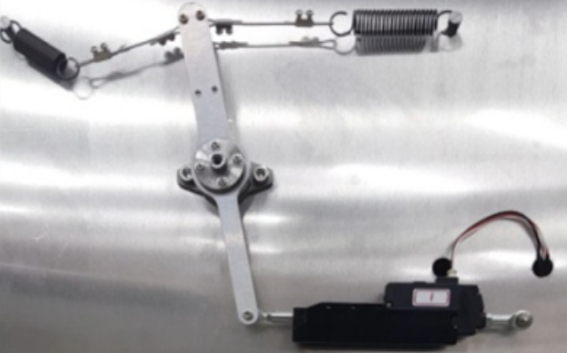

# Lifecycle guideline for mightyZAP (L12/D12/D7 Series)
### Test Condition
- Full Stroke / 50% Duty Cycle / Pull spring Load (Rated full load)
  

### Life Cycle increasing Condition
 - Reducing Stroke
	 - Direct inverse proportional 
	 - ie) 10mm stroke, 2.7times longer lifecycle.
 - Reducing Duty Cycle 
	 - Every 10% duty cycle reduced, 10% cycle increase
	 - ie) 30% duty cycle reduced, 30% cycle increase
 - Reducing Load
	 - 10% load reduced, 5% lifecycle increase
	 - ie) 1kg load reduced, 25% cycle increase

### Life Cycle by Model
- Below data is not for Guarantee, but just reference data.

## D12(D7) Economical Lineup
### 27mm Stroke Series
| Test condition         | 6N          | 12N         |
| ---------------------- | ----------- | ----------- |
| **Model**              | D12-6XX-3   | D12-12XX-3  |
| **Test Load**          | 0.6kg       | 1.2kg       |
| **Duty Cycle**         | 50%         | 50%         |
| **1 cycle stroke(mm)** | 54          | 54          |
| **Average Lifecycle**  | **200,000** | **100,000** |
| **Mileage(km)**        | 10.8        | 5.4         |

## L12 Premium Lineup
### 27mm Stroke Series
| Test condition         | 12N           | 17~20N        | 30~40N      | 50~60N      | 80~10N      |
| ---------------------- | ------------- | ------------- | ----------- | ----------- | ----------- |
| **Model**              | L12-12XX-3    | L12-20XX-3    | L12-40XX-3  | L12-64XX-3  | L12-100XX-3 |
| **Test Load**          | 1.2kg         | 2kg           | 4kg         | 6.4kg       | 10kg        |
| **Duty Cycle**         | 50%           | 50%           | 50%         | 50%         | 50%         |
| **1 cycle stroke(mm)** | 54            | 54            | 54          | 54          | 54          |
| **Average Lifecycle**  | **1,500,000** | **1,300,000** | **650,000** | **351,000** | **195,000** |
| **Mileage(km)**        | 81.0          | 70.2          | 35.1        | 19.0        | 10.5        |
### 41mm Stroke Series
| Test condition         | 17N         | 30N         | 50N         | 80N         |
| ---------------------- | ----------- | ----------- | ----------- | ----------- |
| **Model**              | L12-20XX-4  | L12-30XX-4  | L12-50XX-4  | L12-80XX-3  |
| **Test Load**          | 1.7kg       | 3.1kg       | 5kg         | 7.8kg       |
| **Duty Cycle**         | 50%         | 50%         | 50%         | 50%         |
| **1 cycle stroke(mm)** | 82          | 82          | 82          | 82          |
| **Average Lifecycle**  | **856,000** | **428,000** | **231,000** | **128,000** |
| **Mileage(km)**        | 70.2        | 35.1        | 19.0        | 10.5        |
### 53mm Stroke Series
| Test condition         | 17N         | 30N         | 50N         | 80N        |
| ---------------------- | ----------- | ----------- | ----------- | ---------- |
| **Model**              | L12-20XX-6  | L12-30XX-6  | L12-50XX-6  | L12-80XX-6 |
| **Test Load**          | 1.7kg       | 3.1kg       | 5kg         | 7.8kg      |
| **Duty Cycle**         | 50%         | 50%         | 50%         | 50%        |
| **1 cycle stroke(mm)** | 112         | 112         | 112         | 112        |
| **Average Lifecycle**  | **627,000** | **313,000** | **169,000** | **94,000** |
| **Mileage(km)**        | 70.2        | 35.1        | 19.0        | 10.5       |
### 90mm Stroke Series
| Test condition         | 17N         | 30N         |
| ---------------------- | ----------- | ----------- |
| **Model**              | L12-20XX-10 | L12-30XX-10 |
| **Test Load**          | 1.7kg       | 3.1kg       |
| **Duty Cycle**         | 50%         | 50%         |
| **1 cycle stroke(mm)** | 192         | 192         |
| **Average Lifecycle**  | **366,000** | **183,000** |
| **Mileage(km)**        | 70.2        | 35.1        |
### Important notice
- Described life cycle is not a guarantee as it may vary according to respective using conditions, difference of installation.
- As we are using mechanical contact based position censor(potensiometer), it has a limitation of life cycle in our experiment, from 1mil to 2mil cycle, it's quality can’t be assured on certain.
- Force adjustment : If servo motor’s force and speed are enough for customer’s application, customer may lengthen lifecycle by adjusting “Motor operating rate” by mightyZAP manager software. Please note that speed and stall force will be decreased if motor operating rate is decreased. (Rated force will remain same even after decreasing motor operating rate).