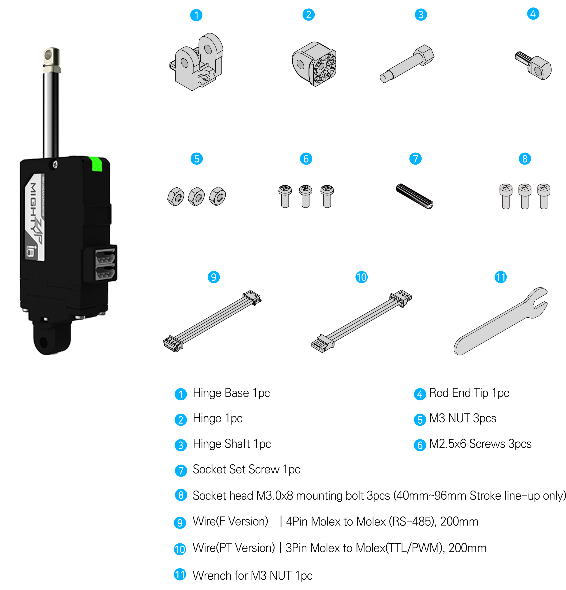
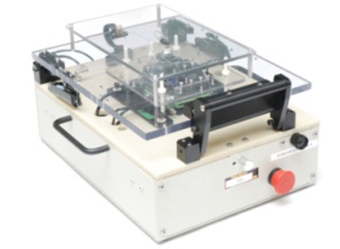
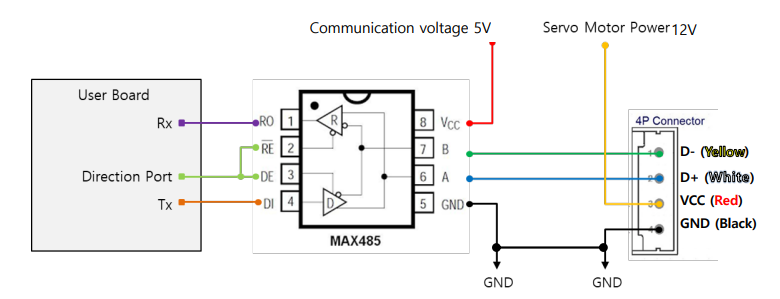
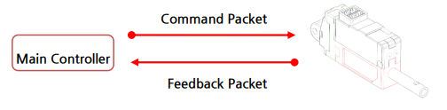
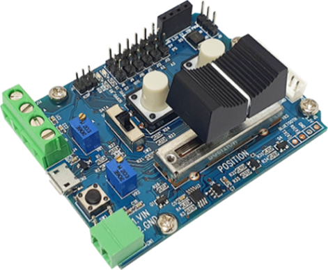

# D7D12L12 Series Manual
>[!note] NOTE
>- This manual is for Position Control Lineup mightyZAP actuators with firmware version 20 or higher whose model names start with L12, D12, or D7. After checking the firmware of your actuator, if the firmware version is lower than V20, please update the actuator firmware first and refer to this manual.
>- For the Users who use Force Control lineup actuators whose model name starts with 12Lf, please refer to the separate force control lineup manual.
## 1. Before Use
### 1.1. Introduction

Thank you for purchasing mightyZAP mini Linear servo motors! Please peruse this manual before use to prevent any unexpected damage of product or serious injury of users.
 
mightyZAP mini Linear servo motors have been developed to provide reliable, high quality linear solution in compact space. mightyZAP mini Linear servo motors can be applied in various fields such as factory automation, medical devices, robotics, professional UAV and radio control hobby     

**\[Features\]**
- Position Control (Positional Accuracy 50~90um – see spec chart of each model)
- Embedded Drive circuit
- 4096 Step High Resolution
- High Performance Coreless Motor
- Minimized Mechanical Backlash (30um)
- Excellent Substitute for pneumatic cylinder which does not support position control
- Reasonable Cost 
### 1.2. For Safety 
Please peruse safety instruction below to use mightyZAP safely. Please kindly note that abuse may invalidate your warranty.
1. <u>Do NOT press the Rod when the servo is being operated.</u> Motor may be damaged(burnt) if higher force than rated force is applied consistently.
2. <u>Apply proper input voltage</u> using power supply or correct battery. For instance, apply 4.0~7.4V for 7.4V input product(L7 series) and 7.0~12V for 12V input product(L12 series). The motor may be burnt when 12V is applied to 7.4V input product.
3. <u>Lifespan of motor can be varied according to the load and duty cycle and etc. </u>
	1) <u>Use under rated force.</u> For instance, rated force of L12-20PT-3 is 20N(approx. 2kg). That is, lifespan of L12- 20PT-3 can be maximized when it is used less than 20N force condition. The lower load comparing to rated force, the longer lifespan of the motor.     
	2) <u>Use under 50% of Duty Cycle</u> : If DC motor operates continuously without any interval (rest), motor will be overloaded and overload protection feature will cut off the power of servo motor. Therefore, user should consider “Duty cycle” which means the percentage of operating time against interval time. In other words, 50% duty cycle means that motor should rest 50% of time when motor operate during 50% of time to manage motor lifespan more efficiently. Use under 50% of duty cycle for optimized lifespan. The less duty cycle, the longer lifespan.    
4. <u>Make sure not to damage servo motor case</u> such as perforation when you apply your own brackets to fix the servo on your system.  
5.  <u>Position command within mechanical limit</u> : There should be mechanical limit which servo rod can move when user install servo motor in their application. Make sure that positional command should be made within user’s mechanical limit. It is too common to mention, but we could see this mistake from time to time. If positional command is out of mechanical limit, servo will be overloaded at certain point of time and power will be cut off to protect the servo due to overload protection feature. (if overload protection is inactivated by user, motor will be not be protected.) Considering precise position control, make sure to re-check this matter when servo is applied. 
6. <u>It is strictly banned to use multiple qty actuators for single objective.</u> Due to DC motor characteristic, each actuator’s speed can be slightly varied even if they are same model and goal position is same. (may cause overload to one of actuator)  
    
7. <u>Do not TWIST the rod with excessive force when tightening the rod end tip.</u> If you apply excessive twisting force to the rod when tightening the rod and tip (while the body is fixed), it may cause damage to internal part (Engineering Plastic rod-insert). Follow below instruction to avoid damage.

	1) Fix the Rod-end with the included M3 spanner (⑤). This is to prevent the rod (①) from turning badly and damage while tightening the M3 nut (②).
	2) According to preference, install the socket set screw (③) or rod end tip (④) to the proper positioning before hard tightening.	
	3) Adjust the angle of the rod end tip (④) to the desired angle. By using a long nose plier(or extra M3 spanner), fix the position by tightening the M3 nut (②) while rod end is fixed with M3 spanner(see above image.). This is “double nuts” concept which fixes mechanical position by friction.

   
   8. <u>Use properly "Overload protection" feature to protect the servo and your system from damage.</u> Overload protection feature is activated from the factory, and for other protection setting, if necessary, set <u>“Alarm shutdown” feature</u> according to your system's condition.
   9. <u>Do NOT touch the servo case right after servo operation.</u> It may hot.     
   10. <u>Keep away from water, humidity, dust and oil.      </u>
   11. It is designed for indoor purpose. <u>Do not use in outdoor.   </u>
   12. <u>Keep out of reach of children. Keep hands off when servo motor operates to avoid unexpected injury.</u>
### 1.3. For Storage
Do NOT store/use servo motor under below extreme condition. It may cause malfunction or damage of product.  
- Direct light and High temperature more than 70 ˚C or Low temperature lower than minus 20˚C.
- Highly Humid space
- Space having Vibrating condition
- Space having Dust
- Space causing Electrostatic
####  Important Note : Constant load / Overload Protection / Force Off Function

Overload protection (Overload shutdown) feature is to prevent overload condition which greatly affect the service life and to motor burnout. Please read the following for proper protection and use it according to the conditions.      
##### About mechanism of overload protection (overload shutdown) and terminology

- The overload protection feature will be activated when the motor exceeds 50% of duty cycle, the cumulative operating time is over 30 seconds without rest. Under these conditions, system will be shutdown.
- Duty cycle is the ratio of the time which motor is actually driven against
- Duty cycle 50% means that 50% of the time should be restored if the motor runs 50% of the time.
- Motor operating time includes the time which the motor rotates/moves normally as well as the time which motor draws current by stuck condition without motor rotating.

##### Overload condition and Shutdown case
For a better understanding, here are some examples of overload conditions and shutdown.

- When Servo actuator is continuously operated for more than 30 seconds without rest / Shutdown after 30 seconds continuous operation.
- When Goal position command is made outside the application's mechanical limit range / Shutdown after 30 seconds continuous operation.
- When stuck condition maintains more than 30 sec / Shutdown after 30 seconds continuous operation.
- When duty cycle is more than 50%. The more severe the duty cycle conditions are, the faster the shutdown to be made, and the lower than 50% duty cycle, the later the shutdown to be made.
##### Overload shutdown Disable
The overload shutdown function protects the servo actuator under overload conditions. Depending on the application, there are applications that need to be operated under severe conditions, even if the overall mechanism protection is more important than the servo actuator, or even if the life of the servo actuator is shortened. For this case, shutdown function can be disabled through mightZAP servo manager software so that shutdown does not work under overload situation.

##### Recovery after overload shutdown
Since the communication line is still functioning after shutdown, it can be restored to the initial state by “Restart” command or by reconnecting power. Be sure to remove the cause of overload before restoration.

##### Exception and Cautions
**Exception)** Overload shutdown does not work when the actual load is heavier than the rated power even though it is an overload environment. However, in order to manage the lifespan of actuator , please be careful not to put heavier load than the rated load. 

**Caution 1)** When the spring is installed between the application and the actuator, or it is installed in Z axis (the direction of gravity), it makes external force to the actuator. Under these conditions, the servo actuator operates slightly, but continuously to keep its position. If this condition persists, actuator may invoke Overload shutdown in some cases. To prevent this, use Force Off command while external power is applied. 

**Caution 2)** Each time overload shutdown is executed, it is not big but it damages the motor. Therefore, the cause of overload must be removed after the first overload shutdown so that shutdown does not occur frequently.    
##### Overload Protection Function
Using Overload protection function, we can protect motor damage from overload condition. Overload protection function is being activated from the factory. When it is activated, motor power will be cut off in case of overload condition to protect the servo actuator.

The easiest way to set(activate/inactivate) Overload protection function is to connect servo with Servo Manager Software using IR-USB01 PC USB interface. Go to "Shutdown Alarm Setting” and simply click(activate) "Overload Error". 

Another method to set Overload protection is to use a Command packet. You can send "Store data" command to the address(0X12) which is the address for Alarm Shutdown. Set bit 5 (see below) for Overload error from to "1"(Overload activation), then send "Store data" command to the servo motor. Servo force will be cut off under overload condition if the bit is set at "1".(1= Overload protection activation / 0=Inactivation)

| Error               | bit |
| :------------------ | :-- |
| NONE                | 7   |
| NONE                | 6   |
| Overload Error      | 5   |
| NONE                | 4   |
| NONE                | 3   |
| NONE                | 2   |
| NONE                | 1   |
| Input Voltage Error | 0   |

Refer to below example for <u>"Store Data"</u> command.  

■ **Command Packet**

| HEADER   | ID   | Size | Command | Factor #1 Address  | Factor #2 Data  | Checksum |
| :------- | :--- | :--- | :------ | :----------------------- | :-------------------- | :------- |
| 0xFFFFFF | 0x00 | 0x04 | 0xF3    | 0x12                     | 0x20                  | 0xD6     |

> [!warning] CAUTION - Use within Rated Load
> For proper performance and better lifespan of mightZAP, it is stronlgy requested to use it within the rated load range.
### 1.4. Force Off 
#### Force Off Function
- After the servo actuator moves to the designated position, the operation stops unless there is an external force that causes the position value change. If the position value of the actuator is continuously changed due to vibration or external force, the actuator is operated continuously without rest to stick to the designated position value, which affects the lifespan of the motor.
- In this case, if the Force Off function is properly utilized, the motor power can be released to allow the motor to rest while maintaining its position with mechanical friction (Mechanical Self Lock function). Even when it is necessary to keep the position for a relatively long time after reaching a certain position, shutting off the power of the motor using the Force off parameter as an added safety function helps to manage the lifespan of the motor.
- Under force off condition, communication is still alive while motor power is off, so servo will move again when servo gets new position command without giving “Force ON” command. 
- Force Off feature can be available for the actuator having “Mechanical self lock” feature. Please see the chart below to see availability. (Below chart shows self-lock force of 27mm stroke mightyZAP only. Refer to the separate specification for 41/56/96mm stroke version’s Self lock force.)

| Rated Load  | Mechanical Self-Lock |
| :---------- | :------------------- |
| 20N Lineup  | Not Available        |
| 40N Lineup  | Available            |
| 640N Lineup | Available            |
| 100N Lineup | Available            |

For Force Off, send 0x00 as a "Store data" command to the address(0X80) which is the address for Force ON/OFF. (For Force ON, send 0x01)

Refer to below example for <u>"Store Data" </u>command.

■ **Command Packet**

| HEADER   | ID   | Size | Command | Factor #1 Address  | Factor #2 Data  | Checksum |
| :------- | :--- | :--- | :------ | :----------------------- | :-------------------- | :------- |
| 0xFFFFFF | 0x00 | 0x04 | 0xF3    | 0x80                     | 0x00                  | 0x88     |

> [!tip] TIP  
>Under Force Off status, if user send "Goal Position" command, it is not necessary to send Force ON packet additionally because "Goal Position" command already includes "Force On" packet in it.    

---
## 2. Basic Information
### 2.1. Component

* #3 M3 nut can be used to fix the hinge and hinge base. Also, M3 nut can be used between rod-end nut and rod-end tip as a stopper.  

 
### 2.2. Specification
#### L12 Series Specifications

| Rated Load | Stroke | Input Volt : 12V | <        | Rated Load / Max Speed(No Load) | Mechanical Self-Lock (Z Axis Use)     | Lead Screw / Gear Ratio / Gear Type                               | Motor Type / Watt    |
| :--------- | :----- | :--------------- | :---------- | :------------------------------ | :------------------------------------ | :---------------------------------------------------------------- | :------------------- |
| ^          | ^      | **RS-485**       | **TTL/PWM** | ^                               | ^                                     | ^                                                                 | ^                    |
| 12N        | 27mm   | L12-12F-3        | L12-12PT-3  | 12N / 110mm/s                   | No (Pay attention to application)  | Lead Angle 20°   / 10:1    / Engineering Plastic Gears   | Coreless Motor / 26W |
| 17N        | 41mm   | L12-20F-4        | L12-20PT-4  | 17N / 80mm/s                    | ^                                     | Lead Angle 15°   / 10:1    / Engineering   Plastic Gears | ^                    |
| ^          | 56mm   | L12-20F-6        | L12-20PT-6  | ^                               | ^                                     | ^                                                                 | ^                    |
| ^          | 96mm   | L12-20F-10       | L12-20PT-10 | ^                               | ^                                     | ^                                                                 | ^                    |
| 20N        | 27mm   | L12-20F-3        | L12-20PT-3  | 20N / 80mm/s                    | ^                                     | ^                                                                 | ^                    |
| 31N        | 41mm   | L12-30F-4        | L12-30PT-4  | 31N / 28.0mm/s                  | Yes (Applicable)                      | Lead Angle 5°   / 10:1    / Engineering   Plastic Gears  | ^                    |
| ^          | 56mm   | L12-30F-6        | L12-30PT-6  | ^                               | ^                                     | ^                                                                 | ^                    |
| ^          | 96mm   | L12-30F-10       | L12-30PT-10 |                                 | ^                                     | ^                                                                 | ^                    |
| 40N        | 27mm   | L12-40F-3        | L12-40PT-3  | 40N/28.0mm/s                    | ^                                     | ^                                                                 | ^                    |
| 50N        | 41mm   | L12-50F-4        | L12-50PT-4  | 50N / 10.5mm/s                  | ^                                     | Lead Angle 5° / 30:1 / Metal Gear                                 | ^                    |
| ^          | 56mm   | L12-50F-6        | L12-50PT-6  | ^                               | ^                                     | ^                                                                 | ^                    |
| 64N        | 27mm   | L12-64F-3        | L12-64PT-3  | 64N / 10.5mm/s                  | ^                                     | ^                                                                 | ^                    |
| 78N        | 41mm   | L12-78F-4        | L12-78PT-4  | 78N / 7.7mm/s                   | ^                                     | Lead Angle 5° / 50:1 / Metal Gears                                | ^                    |
| ^          | 56mm   | L12-78F-6        | L12-78PT-6  | ^                               | ^                                     | ^                                                                 | ^                    |
| 100N       | 27mm   | L12-100F-3       | L12-100PT-3 | 100N / 7.7mm/s                  | ^                                     | ^                                                                 | ^                    |
#### D12, D7 Series Specifications

| Rated Load | Stroke | Input Volt : 12V | <        | Input Volt : 7.4V | <        | Rated Load / Max Speed(No Load) | Mechanical Self-Lock (Z Axis Use) | Lead Screw / Gear Ratio / Gear Type                           | Motor Type / Watt |
| :--------- | :----- | :--------------- | :---------- | :---------------- | :---------- | :------------------------------ | :-------------------------------- | :------------------------------------------------------------ | :---------------- |
| ^          | ^      | **RS-485**       | **TTL/PWM** | **RS-485**        | **TTL/PWM** | ^                               | ^                                 | ^                                                             | ^                 |
| 6N         | 26mm   | D12-6F-3         | D12-6PT-3   | D7-6F-3           | D7-6PT-3    | 6N / 36mm/s                     | No (Not Applicable)            | Lead Angle 15° / 10:1 / Engineering Plastic Gears    | Cored Motor /4.2W |
| 12N        | ^      | D12-12F-3        | D12-12PT-3  | D7-12F-3          | D7-12PT-3   | 12N / 12mm/s                    | Yes (Applicable)                  | Lead Angle 5° / 10:1 / Engineering Plastic Gears     | ^                 |

#### L12 Series Common Specifications

| Repeatability                                 | <     | Stroke                                                                                          | <      | Unidirectional             |
| :-------------------------------------------- | :------- | :---------------------------------------------------------------------------------------------- | :-------- | :------------------------- |
| ^                                             | <     | 27mm / 41mm                                                                                     | <      | 30μm (0.03mm)              |
| ^                                             | <     | 56mm                                                                                            | <      | 40μm (0.04mm)              |
| ^                                             | <     | 96mm                                                                                            | <      | 50μm (0.05mm)              |
| **Mechanical Backlash**                       | <     | 0.03mm (30μm)                                                                                   | <      | <                       |
| **Rod Type**                                  | <     | Metal Alloy Rod                                                                                 | <      | <                       |
| **Motor Type**                                | <     | Coreless Motor                                                                                  | <      | <                       |
| **Motor Watt**                                | <     | 26W                                                                                             | <      | <                       |
| **Recommended Duty Cycle**                    | <     | **At Rated Load**                                                                               | <      | **At Max Applicable Load** |
| ^                                             | <     | Max 50%                                                                                         | <      | Max 20%                    |
| **Position Sensor**                           | <     | 10KΩ linear Potentiometer                                                                       | <      | <                       |
| **Input Voltage Range**                       | <     | 7 ~ 13V                                                                                         | <      | <                       |
| **Current Consumption**                       | <     | **Idle**                                                                                        | **Rated** | **Stall**                  |
| ^                                             | <     | 20mA                                                                                            | 380mA     | 1.6A                       |
| **Audible Noise**                             | <     | Approx. 50db at 1m                                                                              | <      | <                       |
| **Data Communication / Protocol**             | <     | RS-485 or TTL(PT version) / IR Robot open protocol                                              | <      | <                       |
| **LED Indication**                            | <     | Two Errors Indications (Input voltage, Overload)                                                | <      | <                       |
| **Pulse Signal / Pulse Range**                | <     | PWM (PT version, R/C Hobby Signal) / 900μs(Retracted)-1500μs(Center)-2100μs (Extended)          | <      | <                       |
| **Ingress Protection**                        | <     | IP-54 (Dust & Water Tight)                                                                      | <      | <                       |
| **Size / Weight (Excluding rod-end & hinge)** | **27mm** | 57.4(L)x29.9(W)x15(H)mm / 49~52g                                                                | <      | <                       |
| ^                                             | **40mm** | 86.9(L)x36(W)x18(H)mm / 96~99g                                                                  | <      | <                       |
| ^                                             | **53mm** | 111.5(L)x36(W)x18(H)mm / 124~127g                                                               | <      | <                       |
| ^                                             | **90mm** | 151.5(L)x36(W)x18(H)mm / 177g                                                                   | <      | <                       |
| **Operating Temperature**                     | <     | -10℃ ~ 60℃                                                                                      | <      | <                       |
| **Wire Harness**                              | <     | TTL(PT version) : Molex to Molex Type (Molex 50-37-5033, 3pins) / 200mm length, 0.08×60(22AWG)  | <      | <                       |
| ^                                             | <     | RS485(F version) : Molex to Molex Type (Molex 0510650400, 4pins) / 200mm length, 0.08×60(22AWG) | <      | <                       |
* Design and Specification can be changed without prior notice for further improvement.
#### D12, D7 Series Common Specifications

| Repeatability                                 | Stroke                                                                                          | <      | <      | Unidirectional             | <      | <      |
| :-------------------------------------------- | :---------------------------------------------------------------------------------------------- | :-------- | :-------- | :------------------------- | :-------- | :-------- |
| ^                                             | 26mm                                                                                            | <      | <      | 30μm (0.03mm)              | <      | <      |
| **Mechanical Backlash**                       | 0.03mm (30μm)                                                                                   | <      | <      | <                       | <      | <      |
| **Gear Ratio**                                | 10:1                                                                                            | <      | <      | <                       | <      | <      |
| **Gear Type**                                 | Engineering Plastic Gears                                                                       | <      | <      | <                       | <      | <      |
| **Rod Type**                                  | Engineering Plastic Rod                                                                         | <      | <      | <                       | <      | <      |
| **Motor Type**                                | Cored Motor                                                                                     | <      | <      | <                       | <      | <      |
| **Motor Watt**                                | 4.2W                                                                                            | <      | <      | <                       | <      | <      |
| **Recommended Duty Cycle**                    | **At Rated Load**                                                                               | <      | <      | **At Max Applicable Load** | <      | <      |
| ^                                             | Max 50%                                                                                         | <      | <      | Max 20%                    | <      | <      |
| **Position Sensor**                           | 10KΩ linear Potentiometer                                                                       | <      | <      | <                       | <      | <      |
| **Input Voltage Range**                       | 12V lineup : 7~13V (Rated : 12V) / 7.4V lineup : 6.5~8.9V(Rated 7.4V)                           | <      | <      | <                       | <      | <      |
| **Current Consumption**                       | **7.4V Lineup**                                                                                 | <      | <         | **12V Lineup**             | <      | <      |
| ^                                             | **Idle**                                                                                        | **Rated** | **Stall** | **Idle**                   | **Rated** | **Stall** |
| ^                                             | 30mA                                                                                            | 250mA     | 480mA     | 30mA                       | 140mA     | 300mA     |
| **Audible Noise**                             | Approx. 50db at 1m                                                                              | <      | <      | <                       | <      | <      |
| **Data Communication / Protocol**             | RS-485 or TTL(PT version) / IR Robot open protocol                                              | <      | <      | <                       | <      | <      |
| **LED Indication**                            | Two Errors Indications (Input voltage, Overload)                                                | <      | <      | <                       | <      | <      |
| **Pulse Signal / Pulse Range**                | PWM (PT version, R/C Hobby Signal) / 900μs(Retracted)-1500μs(Center)-2100μs (Extended)          | <      | <      | <                       | <      | <      |
| **Ingress Protection**                        | IP-54 (Dust & Water Tight)                                                                      | <      | <      | <                       | <      | <      |
| **Size / Weight (Excluding rod-end & hinge)** | 57.4(L)x29.9(W)x15(H)mm / 49~52g                                                                | <      | <      | <                       | <      | <      |
| **Operating Temperature**                     | -10℃ ~ 60℃                                                                                      | <      | <      | <                       | <      | <      |
| **Wire Harness**                              | TTL(PT version) : Molex to Molex Type (Molex 50-37-5033, 3pins) / 200mm length, 0.08×60(22AWG)  | <      | <      | <                       | <      | <      |
| ^                                             | RS485(F version) : Molex to Molex Type (Molex 0510650400, 4pins) / 200mm length, 0.08×60(22AWG) | <      | <      | <                       | <      | <      |

* Design and Specification can be changed without prior notice for further improvement.
## 3. Application
### Factory Automation

- Better Replacement of Pneumatic Cylinder
- Real-Time Automatic Width Adjustment Conveyer
- Real-Time Automatic Product Alignment (Up/Down or Left/Right)
- Automatic Value Control (oil or water)
- Automatic Dispensing with Syringe
- Automatic Clamping System
- Fitting or Adjusting Distance
- Pick & Place
- In & out / Extension & retraction
- Open & Closing (On-Off )
- Change of Direction Hexapod/Tripod movement
### Production & Test JIGs

- Hole Punching Jig 
- Hole Inspection Jig
- Switch Inspection Jig
- Touch Panel Inspection Jig
- PC Board Testing Jig
### Robotics

- Robot Joints
- Robot Grippers
- Linear Control Parts of Surgical Robot
### UAV / Professional Drone

- Fixed wing (Aileron/Elevator/Throttle/Flap/Air Brake/ Rudder/ Throttle)
- Helicopter (Swash Plate Control/Rudder)
- Multicopter (Retract, Dropping Device)
- Linear control parts for Military products
- Pan/Tilt Camera control
### Medical / Lab Equipment

- Linear position control for Medical Devices (HIFU, etc)
- Camera or Laser Focusing Control
- Laboratory Test Equipment
### Education / Hobby

- 3D Printer
- Arduino or Rapsberry Pie Control
- Maker's DIY Project
## 4. Servo Control
### 4.1. Circuit Connection

mightyZAP Lxx-xxPT-xx Series supports both data communication(Half Duplux TTL) as well as simple pulse(PWM) control. For the control under data communication, UART signal of main board should be converted into Half Duplex Type signal. Conversion circuit will be as below.
#### ■ TTL/PWM(3Pin Connector-Model L(D)xx-xxPT-x Series)   

The direction of data signal for TxD and RxD of TTL level will be determined according to the level of direction_port as below. 
- The level of "direction_port" is LOW :Data signal will be inputted to RxD. 
- The level of "direction_port" is HIGH :TxD signal will be outputted as Data.
**※ Both GNDs between actuator and controller should be connected as above diagram.**   
> [!note] NOTE  
>※ For PWM control, please connect PWM signal(3~5V) to the Data pin above. (GND,VDD are same as above) 
>※ In case of using PWM communication, position control is possible, but feedback data such as the current position value cannot be received, and serial daisy chain connection is not supported since data communication is not supported.

#### ■ RS-485(4Pin Connector - Model Lxx-xxF-x Series)
Model Lxx-xxF-x Series uses RS-485 communication. Pin map and Conversion circuit will be as below.  

| PIN NUMBER(COLOR) | PIN NAME | FUNCTION(RS485) |
| ----------------- | -------- | --------------- |
| 1(Yellow)         | D-       | RS485 –         |
| 2(White)          | D+       | RS485 +         |
| 3(Red)            | VCC      | Power +         |
| 4(Black)          | GND      | Power -         |
  

※ If the power is supplied from outside, you can connect to 485 D+, 485 D- only.

You can convert TX and RX mode by controlling “Direction_Port pin” in above circuit.
- The level of "direction_port" is LOW : Data signal will be inputted to RxD.
- The level of "direction_port" is HIGH : TxD signal will be outputted as Data 
**※ Both GNDs between actuator and controller should be connected as above diagram.**
### 4.2. Communication

mightyZAP and your main controller will communicate by exchanging data packet. The sorts of packet are Command packet (Main controller to mightyZAP) and Feedback packet(mightZAP to your main controller)

#### 1. Specification

##### ① Communication specification
- **2 Mode in One (Pulse / Data Mode Auto-Switching)** 
  L(D)xx-xxPT-xx series mightyZAP will automatically recognize the input signal between data mode(TTL) and pulse mode(PWM).  
- **Data Mode (TTL or RS-485)**
   Asynchronous Serial communication (8 bit, 1 Stop bit, None Parity)    

|Item|Spec|
|---|---|
|**Structure**|Half-duplex UART|
|**Baud Rate**|57600bps(default)|
|**Data Size**|8bit|
|**Parity**|non-parity|
|**Stop Bit**|One bit|

> [!warning] CAUTION
> - mightyZAP uses half duplex communication, and need to put proper delay time to prevent communication error. 
> - **Recommendable delay time is 5msec for data write, 10msec for data read.**
> - Otherwise, there can be communication collision and motor failure.
> - Above delay time is not minimum, but proper delay time for safety.

- **Pulse Mode (PWM)**
  PPM(Pulse Position Modulation) Compatible \[Radio-Control Servo Pulse Mode\]
  (900us(Retracted)~1500 us(Center)~2100 us(Fully Extended)
  
※ Short stroke : Retract stroke / Long stroke : Extend stroke

> [!note] NOTE  
>※ In case of using PWM communication, position control is possible, but feedback data such as the current position value cannot be received, and serial daisy chain connection is not supported since data communication is not supported. 
>※ Feedback data reception and Daisy chain connection are possible by TTL or RS-485 communication. 

##### ② Data specification   
Data range is basically determined as below in both Data and Pulse modes.

| Rod Stroke                               | Data Mode | Pulse Mode |
| ---------------------------------------- | --------- | ---------- |
| **Short Stroke (Max Retracting stroke)** | 0         | 900us      |
| **Half Stroke**                          | 2047      | 1500us     |
| **Long Stroke (Max Extending stroke)**   | 4095      | 2100us     |

> [!note] NOTE   
> The long stroke limit for 30mm stroke products are set to 27mm from the factory and user is able to extend it to 30mm if necessary. The data value of 27mm is 3686. 
> (It is recommended to use 27mm for better mechanical stability related to lateral load)  
##### ③ Daisy-Chain Connection    
After receiving Command Packet at multiple qty of mightZAPs, the servo whose ID is N will be operated only. (Only N ID servo will send Feedback packet and execute Command.)

> [!note] NOTE   
> - Factory default ID is 0 and user needs to assign ID on the Manager software or by API.
> - The PWM mode does not support a daisy chain connection nor Feedback data. 

> [!warning] CAUTION - Unique ID 
> - Each mightZAP servo must have an individual ID to prevent interference between same IDs. Therefore, you need to set individual IDs for each servo in the network node. 
> - User may assign 253 different IDs and connect 253pcs servos in serial via TTL protocol. For RS485 protocol, 253 IDs can be assigned, but available serial connection is upto 32pcs servo motors due to RS-485 node regulation. 
> - As factory default ID is 0, so please assign different, individual IDs for each actuator from ID1~253 for daisy chain connection.
#### 2. Packet Description
##### ① Command Packet
It is command packets for servo operation. Its structure and elements are as below.

■ **Structure**

■ **Element**

| Index     | Data             | Pulse Mode                                                                         |
| --------- | ---------------- | ---------------------------------------------------------------------------------- |
| **0**     | **Start Byte 1** | Start Byte 1 (0xFF)                                                                |
| **1**     | **Start Byte 2** | Start Byte 2 (0xFF)                                                                |
| **2**     | **Start Byte 3** | Start Byte 3 (0xFF)                                                                |
| **3**     | **ID**           | Servo ID (Range: 0 ~ 253, Broadcast ID: 254)                                       |
| **4**     | **SIZE**         | Packet Size (COMMAND+FACTOR+CHECKSUM)                                              |
| **5**     | **COMMAND**      | Instruction                                                                        |
| **5+1**   | **FACTOR #1**    | First Parameter                                                                    |
| **5+m**   | **FACTOR #m**    | "m"th Parameter                                                                    |
| **5+N**   | **FACTOR #N**    | Last Parameter                                                                     |
| **5+N+1** | **Check Sum**    | Check Sum = 0xff ­ ( LOWER_BYTE( ID + SIZE + COMMAND + FACTOR#1 + … + FACTOR#N ) ) |

■ **Element Description**
1. **HEADER (3Byte)**
    - Code to recognize Packet start : 0xFFFFFF 
2. **ID (1Byte)**
    - The ID is an unique number of each servo to support Daisy Chain connection. 
    - Factory default value(ID) is 0.
    - In case of ID = 0 ~253, ID "N" which is stored in the servo will be operated.
    - In case of ID = 254 (0xFE), it is operated under "Broadcasting Mode (move all servos)" and Feedback Packet does not work.
3. **SIZE (1Byte)** 
    - Packet length in Byte unit Data counting value after "Size" data (COMMAND+FACTOR+CHECKSUM) 
    - That is, Size value = Number of byte of "Factor" + 2
4. **COMMAND(1Byte)**
    - Command codes defining the purpose of Packet

| Function            | CODE | Description                                               |
| ------------------- | ---- | --------------------------------------------------------- |
| **Echo**            | 0xF1 | Feedback Packet Reception                                 |
| **Load Data**       | 0xF2 | Send "Address" and get feedback of Data                   |
| **Store Data**      | 0xF3 | Send "Address" and "Data". Then Save.                     |
| **Send Data**       | 0xF4 | Send "Address" and "Data" for temporary storage           |
| **Execution**       | 0xF5 | Execute temporarily stored data that is made by SendData. |
| **Factory Reset**   | 0xF6 | Reset to Factory default parameter value                  |
| **Restart**         | 0xF8 | Restart servo system                                      |
| **Symmetric Store** | 0x73 | Store data in the same address of multiple qty servos     |
5. **FACTOR**
    - Additional Packet factor according to Command
6. **CHECKSUM**
    Verification data to check omission and any changes of Packet data. The interaction formula will be as below.
    - Checksum = 0xff ­ ( LOWER_BYTE( ID + SIZE + COMMAND + FACTOR#1 + … + FACTOR#N ) - LOWER_BYTE = Only the lower 1 byte is taken among the summed data values.
      = Divide the summed data value by 0x100 and take only the remainder. 
    - Here is formula for above. 
      LOWER_BYTE( ID + SIZE + COMMAND + FACTOR#1 + ... + FACTOR#N ) == ( ID + SIZE + COMMAND + FACTOR#1 + ... + FACTOR#N ) % 0x100
##### ② Feedback Packet
After reception of command packet, servo sends Feedback packet including requested information. Its structure and factors are as below.

■ **Structure**

 ■ **Element**

| Index     | Data             | Pulse Mode                                                                       |
| --------- | ---------------- | -------------------------------------------------------------------------------- |
| **0**     | **Start Byte 1** | Start Byte 1 (0xFF)                                                              |
| **1**     | **Start Byte 2** | Start Byte 2 (0xFF)                                                              |
| **2**     | **Start Byte 3** | Start Byte 3 (0xFF)                                                              |
| **3**     | **ID**           | Servo ID (Range: 0 ~ 253, Broadcast ID: 254)                                     |
| **4**     | **SIZE**         | Packet Size (COMMAND+FACTOR+CHECKSUM)                                            |
| **5**     | **ERROR**        | Error Code                                                                       |
| **5+1**   | **FACTOR #1**    | First Parameter                                                                  |
| **5+m**   | **FACTOR #m**    | "m"th Parameter                                                                  |
| **5+N**   | **FACTOR #N**    | Last Parameter                                                                   |
| **5+N+1** | **Check Sum**    | Check Sum = 0xff ­ ( LOWER_BYTE( ID + SIZE + ERROR + FACTOR#1 + … + FACTOR#N ) ) |

■ **Element Description**
1. **HEADER (3Byte)**
	-  Recognizing "Packet start" code. 0xFFFFFF
2. **ID (1Byte)**
	- Individual ID number for each servo (1 ~253)
3. **SIZE (1Byte)** 
	- Packet length in Byte unit 
	- Data counting value after "Size" data (ERROR+FACTOR+CHECKSUM)
	- That is, Size value = Number of byte of "Factor" + 2
4. **HARDWARE ERROR (1Byte)** 
	- Error status during operation for each bit

| Error               | bit | Description                                                                                                              | LED       |
| ------------------- | --- | ------------------------------------------------------------------------------------------------------------------------ | --------- |
| None                | 7   | TBD                                                                                                                      | None      |
| None                | 6   | TBD                                                                                                                      | None      |
| Overload Error      | 5   | In case that current load cannot be controlled with the designated maximum force, it will be set as "1".                 | Red Blink |
| None                | 4   | TBD                                                                                                                      | None      |
| None                | 3   | TBD                                                                                                                      | None      |
| None                | 1   | TBD                                                                                                                      | None      |
| Input Voltage Error | 0   | In case that the input voltage is out of operating voltage range designated in the Control table, it will be set as "1". | Red On    |
5. **FACTOR**
	- Additional Packet factor according to Feedback data.
6. **CHECKSUM**
	Verification data to check omission and any changes of Packet data. The interaction formula will be as below.
	- Checksum = 0xff - ( LOWER_BYTE( ID + SIZE + ERROR + FACTOR#1 + … + FACTOR#N ) )
	- LOWER_BYTE = Only the lower 1 byte is taken among the summed data values.
	  = Divide the summed data value by 0x100 and take only the remainder.
	- Here is the formula for above.
	  LOWER_BYTE( ID + SIZE + ERROR+ FACTOR#1 + … + FACTOR#N ) == ( ID + SIZE + ERROR+ FACTOR#1 + … + FACTOR#N ) % 0x100

### 3. Data Map

##### ① Data Memory Map
■ **Memory using data (Non-volatile)**
- Data to be saved in non-volatile memory which maintains data even after power OFF/ON. 
- All data will be reset to default value when Factory Reset command is executed. 

| Address   | Name                         | Description                            | Access | Default    |
| --------- | ---------------------------- | -------------------------------------- | ------ | ---------- |
| 0 (0x00)  | Model Number(L)              | Lower byte of Model number             | R      |            |
| 1 (0x01)  | Model Number(H)              | High byte of Model number              | R      |            |
| 2 (0x02)  | Version of Firmware          | Firmware version info                  | R      | -          |
| 3 (0x03)  | ID                           | Servo ID                               | RW     | 0 (0x00)   |
| 4 (0x04)  | Baud Rate                    | Communication Speed                    | RW     | 32 (0x20)  |
| 6 (0x06)  | Short Stroke Limit(L)        | Lower byte of Short Stroke Limit       | RW     | 0 (0x00)   |
| 7 (0x07)  | Short Stroke Limit(H)        | High byte of Short Stroke Limit        | RW     | 0 (0x00)   |
| 8 (0x08)  | Long Stroke Limit(L)         | Lower byte of Long Stroke Limit        | RW     | 102 (0x66) |
| 9 (0x09)  | Long Stroke Limit(H)         | High byte of Long Stroke Limit         | RW     | 14 (0x0E)  |
| 12 (0x0C) | the Lowest Limit Voltage     | Lowest Voltage Limit                   | R      | Each SPEC  |
| 13 (0x0D) | the Highest Limit Voltage    | Highest Limit Voltage                  | R      | Each SPEC  |
| 14(0x0E)  | Motor Operating Rate(L)      | Lower byte of Motor Operating Rate     | RW     | 255 (0xFF) |
| 15(0x0F)  | Motor Operating Rate(H)      | High byte of Motor Operating Rate      | RW     | 3 (0x03)   |
| 16 (0x10) | Feedback Return Mode         | Feedback Return Mode                   | RW     | 1 (0x01)   |
| 17 (0x11) | Alarm LED                    | Alarm LED Function                     | RW     | 33 (0x21)  |
| 18 (0x12) | Alarm Shutdown               | Alarm Shutdown Function                | RW     | 33(0x21)   |
| 19 (0x13) | Start Compliance Margin      | Start Compliance Margin                | RW     | Each SPEC  |
| 20 (0x14) | End Compliance Margin        | End Compliance Margin                  | RW     | Each SPEC  |
| 24 (0x18) | Calibration Short Stroke (L) | Lower byte of Calibration Short Stroke | R      | 0 (0x00)   |
| 25 (0x19) | Calibration Short Stroke (H) | High byte of Calibration Short Stroke  | R      | 0 (0x00)   |
| 26 (0x1A) | Calibration Long Stroke (L)  | Lower byte of Calibration Long Stroke  | R      | 255 (0xFF) |
| 27 (0x1B) | Calibration Long Stroke (H)  | High byte of Calibration Long Stroke   | R      | 15 (0x0F)  |
| 33 (0x21) | Acceleration Ratio           | Moving Acceleration Ratio              | RW     | Each SPEC  |
| 34 (0x22) | Deceleration Ratio           | Moving Deceleration Ratio              | RW     | Each SPEC  |
| 37 (0x25) | Position D Gain              | Derivative Gain                        | RW     | Each SPEC  |
| 38 (0x26) | Position I Gain              | Integral Gain                          | RW     | Each SPEC  |
| 39 (0x27) | Position P Gain              | Proportional Gain                      | RW     | Each SPEC  |
| 46 (0x2E) | Min Position Calibration     | Min Position Value Trim                | RW     | Each SPEC  |
| 47 (0x2F) | Max Position Calibration     | Max Position Value Trim                | RW     | Each SPEC  |
##### ② Parameter Map
■ **Parameter Using Data (Volatile)**
- All data to be reset to default value whenever power is On.

| Address    | Name                             | Description                                | Access | Default  |
| ---------- | -------------------------------- | ------------------------------------------ | ------ | -------- |
| 128 (0x80) | Force ON/OFF                     | Force On/Off                               | RW     | 1 (0x01) |
| 129 (0x81) | LED                              | LED On/Off                                 | RW     | 0 (0x00) |
| 134 (0x86) | Goal Position(L)                 | Lower byte of Goal Position Value          | RW     | -        |
| 135 (0x87) | Goal Position(H)                 | High byte of Goal Position Value           | RW     | -        |
| 140 (0x8C) | Present Position(L)              | Lower byte of Present Position Value       | R      | -        |
| 141 (0x8D) | Present Position(H)              | High byte of Present Position Value        | R      | -        |
| 144 (0x90) | Present Motor Operating Rate (L) | Lower byte of Present Motor Operating Rate | R      | -        |
| 145 (0x91) | Present Motor Operating Rate(H)  | High byte of Present Motor Operating Rate  | R      | -        |
| 146 (0x92) | Present Voltage                  | Present Voltage                            | R      | -        |
| 150 (0x96) | Moving                           | Moving Status                              | R      | 0 (0x00) |

### 4. Data Description

Non-Volatile Memory
#### 1) Model Number
- The model number of MightyZAP
- "Read" only to discriminate & recognize concerned model
#### 2) Version of Firmware
Check if current firmware is the latest version.
#### 3) ID \[0~254 / Default : 0\] 
ID to discriminate each servo. Different IDs should be assigned in Daisy-Chain system.   
 - In case of ID = 0 ~253, ID "N" which is stored in the servo will be operated.
 - In case of ID = 254 (0xFE), it is operated under "Broadcasting Mode (move all servos)" and Feedback Packet does not work.
> [!warning] WARNING  
>ID is a non-volatile memory area. If you change the data, communication may stop for a short time during saving process. Therefore, please be careful of frequent value changes during operation.
#### 4) Baudrate
- Determining communication speed. Default value is 57600bps
- Servo system should be rebooted to apply changed baud rate to the servo.
**\[Setting Value\]**

| Value      | Baud Rate(bps) |
| ---------- | -------------- |
| 16 (0x10)  | 115200         |
| 32 (0x20)  | 57600          |
| 48(0x30)   | 38600          |
| 64 (0x40)  | 19200          |
| 128 (0x80) | 9600           |

> [!warning] WARNING  
>non-volatile memory area. If you change the data, communication may stop for a short time during saving process. Therefore, please be careful of frequent value changes during operation.   

> [!note] NOTE  
>In old Firmware version 1.5 or lower, Baudrate 38600bps is not provided. 

#### 5) Stroke Limit (0~4095)  
Stroke limit between Short Stroke (A) and Long Stroke (C) which is the max/min. value of Goal Position. If the Goal Position value is smaller than the Short Stroke Limit value or greater than the Long Stroke Limit value, Goal Position value is replaced with the Stroke Limit value.  
   
> [!warning] WARNING  
> non-volatile memory area. If you change the data, communication may stop for a short time during saving process. Therefore, please be careful of frequent value changes during operation.     
#### 6) The Highest / Lowest Limit Voltage
Max/Min value of input voltage (unit : 0.1V)
According to input voltage, speed and force of actuator can be varied.
For detailed info, please refer to the data sheet of each model.

| Input Volt                  | Lowest Voltage | Highest Voltage |
| --------------------------- | -------------- | --------------- |
| 7.4V Model (D7series)       | 6[V]           | 8.9[V]          |
| 12V Model (L12, D12 series) | 7[V]           | 13[V]           |
#### 7) Motor Operating Rate (0~1023 / Default : 1023)
It represents the maximum operating rate of the motor and the maximum PWM value supplied to the motor. If it is set to less than 400, the motor may not operate. Please note that changing the Motor Operating Rate also changes the speed and stall force.   
> [!warning] WARNING  
> Motor operating rate is a non-volatile memory area. If you change the data, communication may stop for a short time during saving process. Therefore, please be careful of frequent value changes during operation.   

#### 8) Feedback Return Mode
Feedback packet return mode after receipt of Command Packet

| Mode | Feedback Packet Return or NOT                                                  |     |
| ---- | ------------------------------------------------------------------------------ | --- |
| 0    | Do NOT sending Feedback packet for all Commands. (Except for Echo command)  |     |
| 1    | Sending Feedback packet only for Load Data Command.                            |     |
| 2    | Sending Feedback packet for all Commands                                       |     |

> [!tip] TIP 
> Under Broadcast ID(0xFE) mode, feedback packet will NOT be sent regardless values of Feedback Return Mode.    
#### 9) Alarm LED 
If concerned bit is set as "1" when error occurs, error LED indication will be activated.   
(1 : activate, 0: deactivate) 

| Error               | bit | LED Indicate |
| ------------------- | --- | ------------ |
| Overload Error      | 5   | Red Blink    |
| Input Voltage Error | 0   | Red          |

In case of Input Voltage Error, the alarm is immediately cleared when the error is resolved.
In case of Overload Error, the alarm is not cleared even after overload condition is resolved, but can be cleared by rebooting the power or restarting the system.  
> [!warning] Warning  
> Alarm LED is a non-volatile memory area. If you change the data, communication may stop for a short time during saving process. Therefore, please be careful of frequent value changes during op
 
#### 10) Alarm Shutdown
Force will be OFF if concerned bit is set as "1" when error occurs. (1 : activate, 0: deactivate)

| Error               | bit |
| ------------------- | --- |
| Overload Error      | 5   |
| Input Voltage Error | 0   |

In case of Lowest Input Voltage Error, the motor will NOT be shut-down(force off).
In case of Highest Input Voltage Error and Overload Error, the motor will be shut-down(force off) and shut-down status will be cleared by rebooting the power or restarting the system.

> [!tip] TIP  
> Overload error / Input voltage error shutdown feature is activated from the factory.
> These can be disabled by user using mightyZAP manager software according to their wish, but please consider carefully to protect the motor.

> [!warning] Warning   
> Alarm Shutdown is a non-volatile memory area. If you change the data, communication may stop for a short time during saving process. Therefore, please be careful of frequent value changes during operation.

#### 11) Stroke Compliance Margin
**Start Compliance Margin (Recommended margin value : 7)**
- Minimum margin value for the servo actuator to start position movement.
- For example, if the compliance margin is 7 and the current position value is 400, motor start will be made when positional value between 407(400+7) and 393(400-7) is set.
- Likewise, when the positional change occurs by more than +/-7(out of 393~407) from the present position value due to physical external pressure or electrical noise, the motor starts to run to compensate position.
- For this reason, the larger this value means more stable operation without jittering even in the environment where the external pressure, electrical noise, or the clearance increases, but the sensitivity to drive to the desired position may be reduced. In other words, generally, increasing this value increases durability, and reducing it increases precision.
- This value must be equal to or greater than the "End compliance margin value" described below. Setting it to a lower value may cause an error.

**End Compliance Margin (Recommended margin value : 4)**
- Minimum margin value for the servo actuator to complete position movement.
- For example, if actuator is instructed to move to a position value of 400, and assuming that it cannot physically stop at a position value of 400 exactly due to software & mechanical clearance, acceleration, etc. of the servo, End compliance margin will be a criteria to judge if the positional command has been performed properly. If this value is set to 4 and the position command value is set to 400, actuator judges that positional movement has been made properly when it reaches within 396~404 range and then stop movement.
- If this value is increased for stable operation, you should not increase it beyond the "Start Compliance Margin” value which is described above, and if this value is decreased too much to increase the accuracy, it may bring adverse effect such as jitter.
- The smaller the End Compliance Margin, the more sensitive and better the positioning accuracy. However, if it is reduced below a certain value, the effect becomes insignificant.
- If the End Compliance Margin is increased, the operation becomes cleaner and more stable when the target position is reached. Especially, the faster the product, the better the effect. However, if it is too large, conversely, the precision may deteriorate. 

> [!warning] Warning    
>Stroke Compliance Margin is a non-volatile memory area. If you change the data, communication may stop for a short time during saving process. Therefore, please be careful of frequent value changes during

#### 12) Calibration Stroke  
- Calibration Short Stroke : Short Stroke calibration value, Short Stroke Calibration value which is set at the factory will be saved.
- Calibration Long Stroke : Long Stroke calibration value, Long Stroke Calibration value which is set at the factory will be saved. 

#### 13) Acceleration / Deceleration (0~255 / Default : : Individual Spec)  

- Indicates the acceleration/deceleration rate of the motor  
- **Acceleration** : The acceleration value when the motor starts moving. If the value is high, the motor accelerates rapidly. Conversely, if the value is low, smooth acceleration, but if it is too low, the motor may not move. 
- **Deceleration** : The deceleration value when the motor reaches the position. If the value is high, it decelerates rapidly and may stop outside the goal position with a bounding phenomenon occurs that moves from the deviating position to the goal position. In this case, normal braking may not be achieved. If the deceleration is too low, the actuator becomes too slow and the time to reach the goal position may be delayed.
> [!note] NOTE
> When correcting Acceleration / Deceleration, test after applying a small change value.

> [!warning] WARNING  
> It is a non-volatile memory area. If you change the data, communication may stop for a short time during saving process. Therefore, please be careful of frequent value changes during operation.

#### 14) Position PID
- PID value for motor position control. 
- If a PID value larger than the set value is applied, the motor may vibrate without stopping at the set position value due to overshoot or over-response state due to rough operation against the error with the goal position. 
- If a PI value smaller than the set value is applied, it operates smoothly to the error with the goal speed, but the error with the goal speed value may appear large.
**※ Be careful about changing the value, and use it from a small change value.**

> [!warning] WARNING  
> Position PID is a non-volatile memory area. If you change the data, communication may stop for a short time during saving process. Therefore, please be careful of frequent value changes during operation.

#### 15)Min/Max Position Calibration \[0~255 / Default : Individual Spec\] 
- Min Position: The position of the minimum stroke when the Goal Position value is ‘0’.
- Max Position: The maximum stroke position when the Goal Position value is ‘4095’.
- Unlike the Stroke Limit command, the range of the Goal Position value \[0~4095\] is not limited and the length of the actual used stroke is changed.
- Min/Max Position value of each actuator has a mechanical tolerance of ±0.5mm. <u>So, Position Calibration command can be used to synchronize the start and end positions of slightly different servos for the same Goal Position value by correcting each error value. </u>

  

| Parameter            | Goal Position Range                    | Remark                                                                       |
| -------------------- | -------------------------------------- | ---------------------------------------------------------------------------- |
| Stroke Limit         | Short Stroke Limit ~ Long Stroke Limit | No limit on the available stroke range, only limit G/P input range (0~4095)  |
| Position Calibration | 0~4095(Full range)                     | Input range (0~4095) is not limited, but the available stroke range may vary |

For example, if the Min Position Calibration value at Min Position 3.8mm of L12-20F-3 is 5, increasing the Min Position Calibration value increases the Min Position value and the entire stroke range will be reduced as the Min Position increases.

> [!warning] WARNING  
> It is a non-volatile memory area. If you change the data, communication may stop for a short time during saving process. Therefore, please be careful of frequent value changes during operation

Volatile Memory
#### 16)Force ON/OFF
- Setting for Force On and OFF ( 0 : OFF, 1 : ON)

| value | Description                                        |
| ----- | -------------------------------------------------- |
| 0     | Cut off power to the motor and Force is OFF.       |
| 1     | Power to be supplied to the motor and Force is ON. |
> [!tip] TIP  
>  migtyZAP keeps its position due to mechanical design even after motor power is off. For instance, mightyZAP having more than 31N/40N force, rod sticks to its position firmly when motor power is off. 
>  So, in case servo motor needs to keep certain position (if mechanical frictional force is able to keep its position under)
#### 17)LED
- Control LED when there is no Error indication.

| bit | Description                                      |
| --- | ------------------------------------------------ |
| 0   | LED Disable( All LEDs will be Off when it is 1.) |
| 1   | RED LED Control                                  |
| 2   | GREEN LED Control                                |
| 3   | BLUE LED Control                                 |
#### 18) Goal Position ( 0 ~ 4095 )
- Goal position value which is desired position value to move. The goal position value will be affected by both short/long stroke limit. (i.e. move only to the stroke limit position even if the position command is out of the stroke limit range)
- For the 27mm stroke product, the goal position value at 27mm is 3686 due to the long stroke limit setting. It can be extended to 30mm (4095) if desired.
#### 19) Present Position ( 0 ~ 4095 )
- Current Position value monitoring. 
- Range is between 0~4095, and even after the motor is stopped, the minute position change within the margin value can be made, and this is a normal operation.   
#### 20) Present Motor Operating Rate ( 0 ~ 2047 )
- Current Motor operating rate value monitoring. It can be affected by Goal current, Goal speed, Acceleration/ Deceleration adjustment.
- To be shown in the range of 0~2047
- Value 0 indicates the motor is stopped.
- Between 1~1023: Motor operating rate on short stoke direction (retract direction).
- Between 1024~2047: Motor operating rate on long stoke direction (extend direction). 
#### 21) Present Voltage
- Current input voltage. The unit is 0.1V
- For instance, 74 means 7.4V  
#### 22) Moving
- Moving status  

| Value | Description     |
| ----- | --------------- |
| 0     | Motor Stops     |
| 1     | Motor Operating |
## 5. Command Example Pakcet
#### 1) Echo
Receiving Feedback Packet (Refer to the” Load Data” parameter for feedback on position values, etc.)  
■ **Command Pakcet**

| HEADER   | ID   | Size | Command | Checksum |
| -------- | ---- | ---- | ------- | -------- |
| 0xFFFFFF | 0x00 | 0x02 | 0xF1    | 0x0C     |

- Command packet to recognize status of servo connection.

■ **Feedback Pakcet**

| HEADER   | ID   | Size | Error | Checksum |
| -------- | ---- | ---- | ----- | -------- |
| 0xFFFFFF | 0x00 | 0x02 | 0x00  | 0xFD     |

- Feedback packet to inform status of servo connection. (Including Error information)
#### 2) Factory Reset
Reset to factory default parameter value.
- Basic parameter (Memory & Parameter) to be reset to Default value. Additional Reset to be determined according to options. 
- If concerned bit is "1", it means Reset. If it is "0", it means Hold.

| Option   | Bit | Dexcription             |
| -------- | --- | ----------------------- |
| Servo ID | 0   | Reset servo ID to 0     |
| Baudrate | 1   | Reset to 32 (57600 bps) |

■ **Command Pakcet**

| HEADER   | ID   | Size | Command | Factor (Option) | Checksum |
| -------- | ---- | ---- | ------- | ------------------ | -------- |
| 0xFFFFFF | 0x01 | 0x03 | 0xF6    | 0x01               | 0x04     |

- Servo ID to be reset to 0(ID Default) and Baud Rate to be maintained current status.

■ **Feedback Pakcet**

| HEADER   | ID   | Size | Error | Checksum |
| -------- | ---- | ---- | ----- | -------- |
| 0xFFFFFF | 0x01 | 0x02 | 0x00  | 0xFC     |

- Feedback packet informing receipt of Factory reset.
#### 3) Reset
Servo system Restart

■ **Command Pakcet**

| HEADER   | ID   | Size | Command | Checksum |
| -------- | ---- | ---- | ------- | -------- |
| 0xFFFFFF | 0x01 | 0x02 | 0xF8    | 0x05     |

- Command packet to reboot servo system.

■ **Feedback Pakcet**

| HEADER   | ID   | Size | Error | Checksum |
| -------- | ---- | ---- | ----- | -------- |
| 0xFFFFFF | 0x00 | 0x02 | 0x00  | 0xFD     |
- Feedback packet informing receipt of Restart command of servo system (Respond in the Feedback Return Mode 2 only.)
#### 4) Store Data
Store data after sending Address and Data to set ID, goal position, Force limit, Stroke limit, Speed, Force On/Off and etc.

##### ID change : Change ID‘0’ into ID ‘1’(0x01)

| HEADER   | ID   | Size | Command | Factor #1 (Address) | Factor #2 (Data) | Checksum |
| -------- | ---- | ---- | ------- | ---------------------- | ------------------- | -------- |
| 0xFFFFFF | 0x00 | 0x04 | 0xF3    | 0x03                   | 0x01                | 0x04     |
- ID : Servo motor ID 
- Command : Save data at respective address in order. 
- Address : the address which servo motor ID is saved. (see (3)Data Map) 
- Data : Desired Servo ID (put 0x01 at address 0x03)

##### Goal Position command 1: Command packet to assign goal position to 2047(0x07FF)

| HEADER   | ID   | Size | Command | Factor #1 (Address) | Factor #2 (Data #1) | Factor #3 (Data #2) | Checksum |
| -------- | ---- | ---- | ------- | ---------------------- | ---------------------- | ---------------------- | -------- |
| 0xFFFFFF | 0x01 | 0x05 | 0xF3    | 0x86                   | 0xFF                   | 0x07                   | 0x7A     |
- ID : Servo motor ID 
- Command : Save data at respective address in order. 
- Address : the address which goal position value is saved. (see (3)Data Map) 
- Data #1 : Desired goal position’s lower byte (address 0x86 : 0xFF) 
- Data #2 : Desired goal position’s upper byte (address 0x87 : 0x07) 
※Goal position value Hex change (decimal number hexadecimal number) : 2047 → 0x07FF

##### Goal Position command 2 : Command packet to assign goal position to 1000 (0x03E8)

| HEADER   | ID   | Size | Command | Factor #1 (Address) | Factor #2 (Data #1) | Factor #3 (Data #2) | Checksum |
| -------- | ---- | ---- | ------- | ---------------------- | ---------------------- | ---------------------- | -------- |
| 0xFFFFFF | 0x01 | 0x05 | 0xF3    | 0x86                   | 0xE8                   | 0x03                   | 0x95     |
- ID : Servo motor ID 
- Command : Save data at respective address in order. 
- Address : the address which goal position value is saved. (see (3)Data Map)
- Data #1 : Desired goal position’s lower byte (address 0x86 : 0xE8) 
- Data #2 : Desired goal position’s upper byte (address 0x87 : 0x03) 
※ Goal position value Hex change (decimal numberhexadecimal number) : 1000 → 0x03E8

##### Motor Operating Rate 1 : Command packet to assign Motor operating rate to 512(0x0200)

| HEADER   | ID   | Size | Command | Factor #1 (Address) | Factor #2 (Data #1) | Factor #3 (Data #2) | Checksum |
| -------- | ---- | ---- | ------- | ---------------------- | ---------------------- | ---------------------- | -------- |
| 0xFFFFFF | 0x01 | 0x05 | 0xF3    | 0x0E                   | 0x00                   | 0x02                   | 0xF6     |
- ID : Servo motor ID 
- Command : Save data at respective address in order.
- Address : the address which Motor Operating value is saved. (see (3)Data Map) 
- Data #1 : Desired Motor Operating value’s lower byte (address 0x0E : 0x00) 
- Data #2 : Desired Motor Operating value’s upper byte (address 0x0F : 0x02) 
※ Motor Operating value Hex change(decimal numberhexadecimal number) : 512 → 0x0200

##### Motor Operating Rate 2: Command packet to assign Motor operating rate to 400(0x0190)

| HEADER   | ID   | Size | Command | Factor #1 (Address) | Factor #2 (Data #1) | Factor #3 (Data #2) | Checksum |
| -------- | ---- | ---- | ------- | ---------------------- | ---------------------- | ---------------------- | -------- |
| 0xFFFFFF | 0x01 | 0x05 | 0xF3    | 0x0E                   | 0x90                   | 0x01                   | 0x67     |
- ID : Servo motor ID
- Command : Save data at respective address in order. 
- Address : the address which Motor Operating value is saved. (see (3)Data Map) 
- Data #1 : Desired Motor Operating value’s lower byte (address 0x0E : 0x90) 
- Data #2 : Desired Motor Operating value’s upper byte (address 0x0F : 0x01) 
※ Motor Operating value Hex change(decimal numberhexadecimal number) : 400 → 0x0190

##### Stroke Limit 1 : Command packet to assign Short Stroke limit to 100(0x0064)

| HEADER   | ID   | Size | Command | Factor #1 (Address) | Factor #2 (Data #1) | Factor #3 (Data #2) | Checksum |
| -------- | ---- | ---- | ------- | ---------------------- | ---------------------- | ---------------------- | -------- |
| 0xFFFFFF | 0x01 | 0x05 | 0xF3    | 0x06                   | 0x64                   | 0x00                   | 0x9C     |
- ID : Servo motor ID - Command : Save data at respective address in order. 
- Address : the address which short stroke limit value is saved. (see (3)Data Map) 
- Data #1 : Desired Short stroke limit value’s lower byte (address 0x06 : 0x64) 
- Data #2 : Desired Short stroke limit value’s upper byte (address 0x07 : 0x00) 
※ Stroke limit value Hex change(decimal numberhexadecimal number) : 100 → 0x0064

##### Stroke Limit 2: Command packet to assign Long Stroke limit to 3800(0x0ED8)

| HEADER   | ID   | Size | Command | Factor #1 (Address) | Factor #2 (Data #1) | Factor #3 (Data #2) | Checksum |
| -------- | ---- | ---- | ------- | ---------------------- | ---------------------- | ---------------------- | -------- |
| 0xFFFFFF | 0x01 | 0x05 | 0xF3    | 0x08                   | 0xD8                   | 0x0E                   | 0x18     |
- ID : Servo motor ID - Command : Save data at respective address in order. 
- Address : the address which long stroke limit value is saved. (see (3)Data Map) 
- Data #1 : Desired Long stroke limit value’s lower byte (address 0x08 : 0xD8) 
- Data #2 : Desired Long stroke limit value’s upper byte (address 0x09 : 0x0E) 
※ Stroke limit value Hex change(decimal numberhexadecimal number) : 3800 → 0x0ED8

##### Force On/Off : Command packet to cut off Motor power while communication is alive.

| HEADER   | ID   | Size | Command | Factor #1 (Address) | Factor #2 (Data #1) | Checksum |
| -------- | ---- | ---- | ------- | ---------------------- | ---------------------- | -------- |
| 0xFFFFFF | 0x01 | 0x04 | 0xF3    | 0x80                   | 0x00                   | 0x87     |
- ID : Servo motor ID 
- Command : Save data at respective address in order. 
- Address : the address which Force On/Off value is saved. (see (3)Data Map) 
- Data : Desired Force On/Off Data byte (address0x86 : 0x00(Off) / 0x01(On)) 
- After force-off, automatically Force On when next goal position command is made.

##### Feedback Return Mode 1: Command packet to send Feedback packet for Load Data command only.

| HEADER   | ID   | Size | Command | Factor #1 (Address) | Factor #2 (Data #1) | Checksum |
| -------- | ---- | ---- | ------- | ---------------------- | ---------------------- | -------- |
| 0xFFFFFF | 0x01 | 0x04 | 0xF3    | 0x10                   | 0x01                   | 0xF6     |
- ID : Servo motor ID 
- Command : Save data at respective address in order. 
- Address : the address which Feedback Return Mode value is saved. (see (3)Data Map) 
- Data : Feedback Return Mode Data (address 0x10 : 0x01) 
  ( 1: Send Feedback packet only to Load Data(0xF3) Command)

##### Feedback Return Mode 2: Command packet to send Feedback packet for All commands.

| HEADER   | ID   | Size | Command | Factor #1 (Address) | Factor #2 (Data #1) | Checksum |
| -------- | ---- | ---- | ------- | ---------------------- | ---------------------- | -------- |
| 0xFFFFFF | 0x01 | 0x04 | 0xF3    | 0x10                   | 0x02                   | 0xF5     |
- ID : Servo motor ID 
- Command : Save data at respective address in order. 
- Address : the address which Feedback Return Mode value is saved. (see (3)Data Map) 
- Data : Feedback Return Mode Data (address 0x10 : 0x02)
  ( 2: Send Feedback packet to All)

#### 5) Load Data
**Send address and Get data feedback**
- **Load data is data read. To avoid communication collision, at least 10msec communication delay is required in case of 57600bps baud rate.**

##### Present Position : Command packet to read present Position
■ **Command Pakcet**

| HEADER   | ID   | Size | Command | Factor #1 (Address) | Factor #2 (Length) | Checksum |
| -------- | ---- | ---- | ------- | ---------------------- | --------------------- | -------- |
| 0xFFFFFF | 0x00 | 0x04 | 0xF2    | 0x8C                   | 0x02                  | 0x7B     |
- ID : Servo motor ID 
- Command : Read byte (equivalent to the Length number) from Address 
- Address : Address where present position value is saved. (see (3)Data Map) 
- Length: The number of byte to read from Address (present position value consists of 2byte.)

■ **Feedback Pakcet**

| HEADER   | ID   | Size | Error | Factor #1 | Factor #2 | Checksum |
| -------- | ---- | ---- | ----- | --------- | --------- | -------- |
| 0xFFFFFF | 0x00 | 0x04 | 0x00  | 0xFF      | 0x07      | 0xF5     |
- ID : Servo motor ID 
- Error : Error indication during operation 
- Factor 1 : Present position value’s lower byte (ex> 0xff) 
- Factor 2 : Present position value’s upper byte (ex> 0x07) 
※ Present position value Hex change(hexadecimal number  decimal number) : 0x07ff → 2047
##### Present Motor Operating Rate : Command packet to read present Motor operating rate.
■ **Command Pakcet**

| HEADER   | ID   | Size | Command | Factor #1 (Address) | Factor #2 (Length) | Checksum |
| -------- | ---- | ---- | ------- | ---------------------- | --------------------- | -------- |
| 0xFFFFFF | 0x00 | 0x04 | 0xF2    | 0x90                   | 0x02                  | 0x77     |
- ID : Servo motor ID 
- Command : Read byte (equivalent to the Length number) from Address 
- Address : Address where present motor operating rate value is saved. (see (3)Data Map) 
- Length: The number of byte to read from Address (present operating rate value consists of 2byte.)

■ **Feedback Pakcet**

| HEADER   | ID   | Size | Error | Factor #1 | Factor #2 | Checksum |
| -------- | ---- | ---- | ----- | --------- | --------- | -------- |
| 0xFFFFFF | 0x00 | 0x04 | 0x00  | 0xFF      | 0x03      | 0xF9     |
- ID : Servo motor ID - Error : Error indication during operation 
- Factor 1 : Present Motor operating rate value lower byte (ex> 0xff) 
- Factor 2 : Present Motor operating rate value upper byte (ex> 0x03) 
※ Present motor operating rate value Hex change(hexadecimal number → decimal number) : 0x03ff → 1023

##### Present Volt: Command packet to read present input Voltage
■ **Command Pakcet**

| HEADER   | ID   | Size | Command | Factor #1 (Address) | Factor #2 (Length) | Checksum |
| -------- | ---- | ---- | ------- | ---------------------- | --------------------- | -------- |
| 0xFFFFFF | 0x00 | 0x04 | 0xF2    | 0x92                   | 0x01                  | 0x76     |
- ID : Servo motor ID - Command : Read byte (equivalent to the Length number) from Address
- Address : Address where present voltage value is saved. (see (3)Data Map) 
- Length: The number of byte to read from Address (present voltage value consists of 2byte.)

■ **Feedback Pakcet**

| HEADER   | ID   | Size | Error | Factor #1 | Checksum |
| -------- | ---- | ---- | ----- | --------- | -------- |
| 0xFFFFFF | 0x00 | 0x03 | 0x00  | 0x7B      | 0x81     |
- ID : Servo motor ID 
- Error : Error indication during operation 
- Factor 1 : Present Voltage value byte (ex> 0x7B)
※ Present voltage value Hex change(hexadecimal number → decimal number): 0x7B → 123(12.3V)

#### 6) Send Data 
**Send "Address" and "Data", Then temporarily store it.**
■ **Command Pakcet**

| HEADER   | ID   | Size | Command | Factor #1 (Address) | Factor #2 (Data #1) | Factor #3 (Data #2) | Checksum |
| -------- | ---- | ---- | ------- | ---------------------- | ---------------------- | ---------------------- | -------- |
| 0xFFFFFF | 0x01 | 0x05 | 0xF4    | 0x86                   | 0xFF                   | 0x07                   | 0x79     |
- Command packet for temporary store of goal position as 2047(0x07FF).

■ **Feedback Pakcet**

| HEADER   | ID   | Size | Error | Checksum |
| -------- | ---- | ---- | ----- | -------- |
| 0xFFFFFF | 0x00 | 0x02 | 0x00  | 0xFC     |
- Feedback packet informing receipt of temporary store for servo goal position. (Respond in the Feedback Return Mode 2 only)
#### 7) Execution
**Execute temporarily stored data that is made by Send Data.**
■ **Command Pakcet**

| HEADER   | ID   | Size | Command | Checksum |
| -------- | ---- | ---- | ------- | -------- |
| 0xFFFFFF | 0x01 | 0x02 | 0xF5    | 0x07     |
- Command packet to execute all temporarily stored data at the same time.

■ **Feedback Pakcet**

| HEADER   | ID   | Size | Error | Checksum |
| -------- | ---- | ---- | ----- | -------- |
| 0xFFFFFF | 0x01 | 0x02 | 0x00  | 0xFC     |
- Feedback packet informing receipt of execution command for temporarily stored data. (Respond in the Feedback Return Mode 2 only)

#### 8) Symmetric Store
**Save data in the same address of multiple servos.**
- Goal Position : Command packet to assign multiple servo’s goal positions. 
    -Servo ID 1 : 1023(0x03FF), Servo ID 2 : 2047(0x07FF)

| HEADER   | ID   | Size | Command | Factor #1 (Address) | Factor #2 (Length) | Factor #3 (1>ID) | Factor #4 (1>Data #1) | Factor #5 (1>Data #2) | Factor #6 (2>ID) | Factor #7 (2>Data #1) | Factor #8 (2>Data #2) | Checksum |
| -------- | ---- | ---- | ------- | ---------------------- | --------------------- | ------------------- | ------------------------ | ------------------------ | ------------------- | ------------------------ | ------------------------ | -------- |
| 0xFFFFFF | 0xFE | 0x0A | 0x73    | 0x86                   | 0x02                  | 0x01                | 0xFF                     | 0x03                     | 0x02                | 0xFF                     | 0x07                     | 0xF1     |

- Command packet to assign respective goal position to multiple qty servo motors at the same time. 
- Better synchronization without delay than respective command is made for each servo motor. - ID : Broadcast ID (Command to all connected IDs) 
- Command : Send data at the same time to the ID defined in Factor (1>ID, 2>ID …) 
- Address : Address present position value is saved. (See (3)Data Map) 
- Length: The number of byte to read from Address (present position value consists of 2byte.) 
- feedback Packet : No Feedback.

> [!warning] CAUTION - Motion Synchronization of multiple actuators 
> <u>It is strictly banned to use multiple qty actuators for single objective.</u> Due to DC motor characteristic, each actuator’s speed can be slightly varied even if they are same model and goal position is same. (may cause overload to one of actuator)

## 6. Optional Accessories
### Metal Bracket (IR-MB02/IR-MB03/IR-MB04)

 - IR-MB02  

- IR-MB03  

- IR-MB04  

IR-MB02 is the LATERAL mounting bracket for 27mm stroke lineup only and MB04 is the VERTICAL bracket for 27mm stroke mightyZAP. For 41~90mm stroke lineup, they can be mounted via built-in mounting holes on the case. Or, if you wish more flexible mounting, you can use IR-MB03 for 40~90mm stroke versions. The drawing is open at our website, so you may make this bracket at their end.   
### PC USB Interface (IR-USB02)

USB Interface between mightyZAP and user’s PC. 
Through PC software, mightyZAP manager, user is able to control below.  

- Parameter and Memory setting
- Motion test
- Voltage, temperature, present position, force monitoring
- System initialization and Firmware update

### End-Bearing (IR-EB01)

Mount mightyZAP on applications using this end bearings for most optimal installation. Put it on the rod end(M3) and on the end of servo case(M2.5). Two end bearings (M3 & M2.5) to be packed in a set. 

### EZ Controlller (IR-CT01)

- MightyZAP dedicated controller/tester for customers without controller  
- Arduino-based controller with simple operation
- Built-in basic control program, user programmable (provided by Arduino example)  
- Position dial, position command button switch, position command slide built in  
- Control via external switch or voltage level signal  
- Provides three separate I/O pins for analog/digital sensor connection  
- External communication terminals for Bluetooth or Zigbee communication

### Raspberry Pi HAT (IR-STS02)

IR-STS02 is a Raspberry Pi HAT(Hardware Attached on Top) which is compatible with Raspberry Pi B3 or Raspberry Pi Zero. 
With TTL/RS-485/PWM communication interface, power connector and GPIO pins, user is able to control mightyZAP on Raspberry Pie. API and Library can be downloaded from our web.

### Extension Wire (IR-EW01~10)

Optional extension wires for applications which need longer wire harness 

- IR-EW01 :Extension wire - 3pin TTL 1000mm
- IR-EW02 :Extension wire - 3pin TTL 2000mm
- IR-EW03 :Extension wire - 4pin RS-485 2000mm
- IR-EW04 :Extension wire - 4pin RS-485 4000mm
- IR-EW08 :Extension wire - 3pin TTL 500mm
- IR-EW09 :Extension wire - 4pin RS-485 500mm
- IR-EW10 :Extension wire - 4pin RS-485 1000mm

Since it is not shielded, please use a separate shield wire in facilities with a lot of noise environment. The connector and connector terminal for wiring can be purchased separately from our company.

### Rod-End Grip Tip (IR-GT01) 

The Rod-End Grip Tip is a product that attaches a soft pad to the rod end of the nightyZAP, so that it does not cause physical damage to the object of the application. For example, rubber/silicon pads can be attached to the flat grip tip to push or contact vulnerable objects, or to hold or lift objects using the friction of silicon.

> [!note]
> For additional accessories information, please refer to the accessories menu on our website.
 
## 7. Warranty Service
### Warranty & Service

The warranty period of mightZAP is 1 year from the date of purchasing the goods. Please prepare some evidence showing the date of purchase and contact your product supplier or IR Robot.

Warranty service will not cover the malfunctions of product which are derived from customer's abuse, mistake, or carelessness (including normal wearing of gear train, tear of wire harness and motor burnt-out). Please kindly note that all service should be processed by designated engineers and voluntary disassembly or maintenance may void warranty.

Thank you.

>[!info]
>IR Robot Customer Service Team :
>- Tel : +82- 070-7600-9466
>- Adress : (ZIP 14556) 802, Sambo Techno-Tower, 122, Jomaru-ro 385beon-gil, Wonmi-gu, Bucheon-si, Gyeonggi-do, Republic of Kore
>- E-mail  :cs@irrobot.com

  