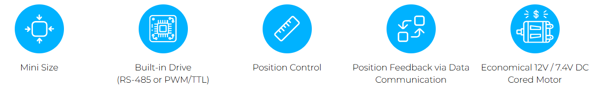

# D7 / D12 / L12 Servo Series 
## Overview
The 1st generation of mightyZAP actuator equipped with reasonable cost Cored DC motor and supporting precise position control / position feedback through communication without speed and current control features. IR Open protocol provided.
image

## Features
- **Position control / Position feedback feature**
- **Built-in drive circuit, position sensor, DC motor and gear box**
- **Reasonable price compared to the 12Lf series**
- **Stall force and speed adjustment within a limited range by adjusting the motor operating rate**
- **12mm diameter cored motor lineup**  
    (For better durability and force, see the 12Lf series)
- **26mm stroke**
- **Rated Load of 6N and 12N according to gear ratio**  
    (Speed ​​is inversely proportional to Rated Load, so the stronger the Rated Load, the slower the speed.)
- **Support RS-485 or TTL / PWM communication**  
    – TTL / PWM communication version operates by automatically recognizing the input TTL / PWM signal  
    – When using PWM communication, only the position command is available without position feedback (For feedback feature, use TTL or RS-485 communication)
- **IR open protocol available.**  
    **(The MODBUS RTU protocol is available with 12Lf series)**