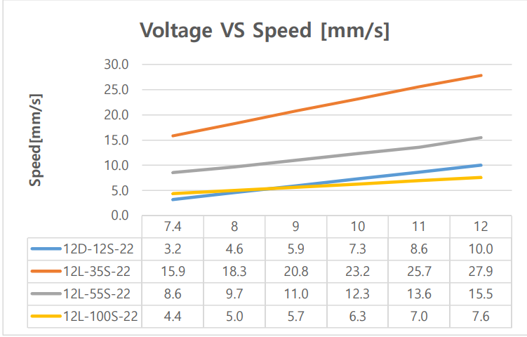
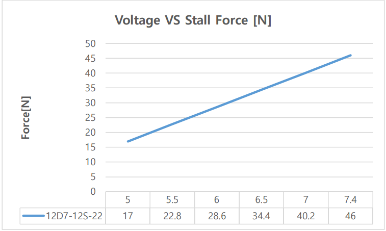

## Features - 12L / 12D Series Limit Switch mightyZAP Actuator 
- Simple linear motion control between two points by limit switch
- Compactly integrated into small case (Limit switch, DC motor, gearbox, lead screw, rod, etc.) 
- 12V Coreless Motor Lineup & 12V/7.4V Cored Motor Lineup : Coreless motor is superior to the Cored motor in its lifespan and output power. 
- Rated Load of 12N ~ 100N according to gear ratio : Speed is inversely proportional to force, the stronger the force, the slower the speed.
- Max 22mm Stroke, Travel can be adjusted within 22mm when external switch is applied.
- Relatively reasonable cost comparing to servo actuator lineup
### Specification - Coreless Motor Lineup
| Motor Voltage                                 | 22mm Stroke                           | <                | <                  |
| --------------------------------------------- | ------------------------------------- | ---------------- | ------------------ |
| ^                                             | Rated Load 35N                        | Rated Load 55N   | Rated Load 100N    |
| **12V**                                       | 12L-35S-22                            | 12L-55S-22       | 12L-100S-22        |
| **Rated Load / Max. Speed(No Load)**       | **35N** / 28mm/s                      | **55N** / 15mm/s | **100N** / 7.7mm/s |
| **Applicable Max Load / Max. Speed(No Load)** | 70N                                   | 110N             | 200N               |
| **Gear Ratio**                                | 10:1                                  | 20:1             | 50:1               |
| **Gear Type**                                 | 4 Metal & 2 Engineering Plastic Gears | <                | <                  |
| **Mechanical Self-Lock**                      | Yes                                   | <                | <                  |
| **Wire**                                      | 300mm / 0.08x60 (22AWG)               | <                | <                  |

### Specification - Cored Motor Lineup
| Motor Voltage                                 | 22mm Stroke               |
| --------------------------------------------- | ------------------------- |
| ^                                             | Rated Load 12N            |
| **7V**                                        | 12D7-12S-22               |
| **12V**                                       | 12D-12S-22                |
| **Rated Load / Max. Speed(No Load)**          | 12N / 10mm/s              |
| **Applicable Max Load / Max. Speed(No Load)** | 24N                       |
| **Gear Ratio**                                | 10:1                      |
| **Gear Type**                                 | Engineering Plastic Gears |
| **Mechanical Self-Lock**                      | Yes                       |
| **Wire**                                      | 300mm / 0.08x60 (22AWG)   |
### Wiring Diagram for 12L / 12D Series Limit Switch mightyZAP Actuator
- Normal Rotation Connection
- Counter Ratation Connection
  
- For actuator control, direction control is performed by applying forward and reverse voltage to the exposed wire. The DPDT switch makes it easy to change the direction of motion.
- The voltage application range is 7V~13VDC, but the rating is 12V, so the power is weakened and the speed is slowed down at the voltage below 12V.
- If voltage over 13V is applied, the circuit and motor may be damaged. Be sure to apply voltage below the rated voltage of 12V.

### How to apply DPDT Switch or External Micro Limit Switch
#### 1. DPDT Switch Connection

**\[Description\]**
- The DPDT switch has two built-in SPDT switches to perform the same operation.
- The operation of the switch according to the above wiring diagram is as follows.
- Pay attention to wiring to avoid short circuit due to incorrect wiring. (The pins of the DPDT switch must not be in contact with each other)

#### 2. External Limit Switch Connection
 

**\[Description\]**
- In order to implement a shorter stroke other than the standard 21.8mm stroke, after installing an additional micro limit switch on the outside, connect the limit switch additionally as shown in the DPDT switch wiring diagram above.
- When the limit switch is pressed by the actuator rod, the operation stops
- Pay attention to wiring to avoid short circuit due to incorrect wiring. (The pins of the DPDT switch must not be in contact with each other)

### Figure 1. Voltage/Speed[mm/s]
#### Figure 1-1 12V Model

 - Data includes tolerance.

#### Figure 1-2 7.4V Model

 - Data includes tolerance.

### Figure 2. Voltage / Stall Force[N]
#### Fugure2-1 12V Model

 - Data includes tolerance.

#### Fugure2-2 7.4V Model

 - Data includes tolerance.
