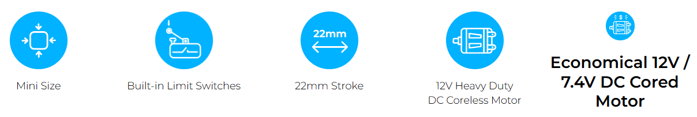

# 12L / 12D MINI Limit Switch Series
## Overview
Simple linear operation via built-in limit switches without drive circuit & potentiometer.

## Features
- Built-in limit switches, DC motor and gear box without drive circuit & potentiometer.
- Simple & easy linear operation (No servo data communication)
- Reasonable cost comparing to 12Lf and L12 servo actuators
- 12mm diameter 12V coreless motor lineup and cored motor lineup and 12V / 7.4V Cored motor lineup
 * The coreless motor is superior to the cored motor in terms of force and durability.
- 22mm stroke (Longer stroke options to be released later)
- Rated Load of 12N ~ 100N according to gear ratio for each stroke
- Stroke limit adjustable using external limit switch.

