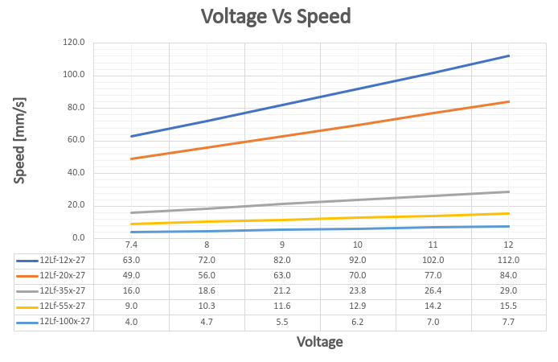
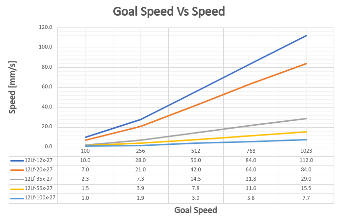

## 1. Features
- Micro size
- Precise position control
- Force control by current feedback
- Speed control (1024 resolution)
- Strong force comparing to the size
- Built-in Drive Circuitry
- RS-485 communication
- Parameter programmable on the Manager software

## 2. Specification
### 2.1 Common Specifications
| **Property** | Value |
| ---- | ---- |
| **Stroke** | 27mm |
| **Rated Load** | 12N ~ 100N |
| **Recommended duty cycle at rated load** | 50% |
| **Max apllicable Load** | 2times rated load |
| **Recommended duty cycle at max applicable load:** | under 20% |
| **Micro controller** | 32bit Arm Cortex |
| **Position Resolution** | 4096 Resolution (A/D Converter) |
| **Input Voltage** | 12.0V(Rated), 7.4V ~ 13 V(Operating) |
| **Motor Type / Watt** | Coreless DC Motor / 3.5 Watt |
| **Current consumption** | 30mA(Idle), 380mA(Rated), 1.6A(Stall) |
| **Position repeatability** | Unidirectional less than 0.03mm(30um) |
| ^ | Bydirectional less than +/0.06mm(60um) |
| **Current Tolerance** | ±15% at Over 50mA |
| **Position sensor** | 10kΩ linearity potentiometer |
| **Size, Weight** | 86.9(L)x36(W)x18(H)mm /96~99g (to be varied according to gear ratio) be varied according to gear ratio |
| **Communication** | RS485 |
| **Protocol** | IR Robot Open Protocol (switchable to MODBUS RTU protocol) |
| **Operating Temperatures** | -10℃ ~ 60℃ |
| **Ingress protection** | IP-54 |
| **Mechanical Backlash** | 0.03mm(30um) |
| **Audible Noise** | Max. 50db at 1m |
| **Gear ratio** | 10:1(10F,17F,27F) /20:1(42F) /50:1(78F) |
| **Gear type** | Engineering plastic gears(10F,17F,27F) 4metal & 2engineering plastic gears(42F,78F) (Aluminum and stainless steel combination) |
| **Rod type** |  |
| **Standard Accessory** | 1xHinge base 1x Hinge 1xHinge shaft 1xRod end tip 2x M3 NUT 3 x M2.5x6 screws 1x Molex wire harness (200mm) 1 x M3 spanner 1 x Socket set screwlex wire harness (200mm) 1 x M3 spanner 1 x Socket set screw |
| **Connector Type (Male) in the Actuator** | MOLEX 53253-0470 |
| **Wire Harness** | Molex(51065-0400) to Molex(51065-0400)/ 200mm / 0.08x60(22AWG) |

### 2.2 Voltages
| Parameter | Min | Norm | Max | Unit | Note |
|:-------------------------------------------------|:-------------------------------:|:--------------------:|:--------------------:|:-------------------:|:----------------------------------------------------------:|
| **Supply voltage** | 7.4 | 12 | 13 | V |   |
| **Logic input voltage** | -7.0 | - | 12.0 | V | RS-485 |

### 2.3 Currents
| Parameter | Min | Norm | Max | Unit | Note |
|:---|:---|:---|:-----------------|:-------------------|:---|
| **Maximum peak Current ** | | ≤1.6 | | A | Stall Current |
| **No Load Current ** | | ≤300 | | mA | No Load |
| **Rated Load Current ** | | ≤400 | | mA | 800mA |
| **Max Applicable Load Current ** | | ≤600 | | | 1.6A |
| **Idle Current** | | ≤20 | | mA | |

### 2.4 Temperatures
| Parameter | Min | Norm | Max | Unit | Note |
|:--------------------------------|:-------:|:--------:|:-------:|:--------:|:--------:|
| **StorageTemp.** | -20 | - | 70 | ℃ | |
| **Operating Temp.** | -10 | - | 60 | ℃ | |

### 2.5 Strokes
| Parameter | Min | Norm | Max | Unit | Note |
|:----------------------------|:------|:-------|:------|:-------|:--------------------------------|
| **MIN Position** | 3.3 | 3.8 | 4.3 | mm | ⁕ |
| **MAX Position** | 30.3 | 30.8 | 31.3 | mm | |
| **Stroke length** | | 27.0 | | mm | |

### 2.6 No Load Speed
| Parameter | Min | Norm | Max | Unit | Note |
| :----------------------------------------- | :---- | :---- | :---- | :--- | :----------- |
| Maximum Speed at 12.0V  | 100.8 | 112.0 | 123.2 | mm/s | 12Lf-12F-27 |
| ^ | 75.6 | 84.0 | 92.4 | mm/s | 12Lf-20F-27 |
| ^ | 26.1 | 29.0 | 31.9 | mm/s | 12Lf-35F-27 |
| ^ | 13.95 | 15.5 | 17.05 | mm/s | 12Lf-55F-27 |
| ^ | 6.93 | 7.7 | 8.47 | mm/s | 12Lf-100F-27 |
### 2.7 Load
| Parameter Parameter | Min | Rated | Max | Unit | Note |
| :--- | :--: | :--: | :--: | :--: | :--- |
| Load at 12.0V  | | 12.0 | 24.0 | N | 12Lf-12F-27 |
| ^ | | 2.69 | 5.39 | lbf | ^ |
| ^ | | 1.22 | 2.44 | kgf | ^ |
| ^ | | 20.0 | 30.0 | N | 12Lf-20F-27 |
| ^ | | 4.49 | 8.98 | lbf | ^ |
| ^ | | 2.04 | 4.08 | kgf | ^ |
| ^ | | 35.0 | 70.0 | N | 12Lf-35F-27 |
| ^ | | 7.87 | 15.73 | lbf | ^ |
| ^ | | 3.57 | 7.14 | kgf | ^ |
| ^ | | 55.0 | 110.0 | N | 12Lf-55F-27 |
| ^ | | 12.37 | 24.72 | lbf | ^ |
| ^ | | 5.61 | 11.22 | kgf | ^ |
| ^ | | 100.0 | 200.0 | N | 12Lf-100F-27 |
| ^ | | 22.48 | 44.94 | lbf | ^ |
| ^ | | 10.19 | 20.4 | kgf | ^ |

⁕ 1 kgf = 9.8N, 1lbf = 4.45N

>[!warning] Caution
>Use at rated load as much as possible. When applying max applicable load (2x rated load), set Goal current to 1600(1.6A) and Duty cycle to under 20%.

### 2.8 Self Lock Feature

| Parameter | Min | Norm | Max | Unit | Note |
| :--- | :--: | :--: | :--: | :--: | :--- |
| Slef Lock | - | N/A | - | | 12Lf-12x-27 |
| ^ | - | ^ | - | | 12Lf-20x-27 |
| ^ | - | Available | - | | 12Lf-35x-27 |
| ^ | - | ^ | - | | 12Lf-55x-27 |
| ^ | - | ^ | - | | 12Lf-100x-27 |

>[!tip] Tip
>Self-Lock means the actuator can hold its position by mechanical friction without motor power.
## 3. Reference Data
### 3.1 Voltage Vs Speed
Graph of speed change at no load according to input voltage. Data includes error, use as reference.
<!-- ![[27_voltageVSspeed.png|700]] -->

>[!note] Note
>Voltage Vs Speed data tested at Goal Current 800.
>Data includes about +/-15% error.
### 3.2 Voltage Vs Stall Force
Stall Force measured at 800mA according to input voltage. Data includes error, use as reference.

> [!note] Note
> Voltage Vs Stall Force data tested at Goal Current 1600.
>Each Force value error is +/- 15%.

>[!warning] Caution
>Stall force is for reference only. To prevent product damage, use at rated load in actual application.
### 3.3 Goal Speed Vs Speed
Shows no load speed change according to Goal Speed Parameter value at Goal Current 800.
At less than rated load, time to reach max speed varies by load.

>[!note] Note
>Goal Speed Vs Speed data tested at Goal Current 800.
### 3.4 Goal Current vs Stall Force
Shows mightyZAP Stall Force for each Goal Current value.
Stall Force measured at minimum speed to reflect only current-based force.

>[!tip] TIP
>This data shows motor force. It is recommended to set Goal current to 3x actual load.
>If the difference between actual load and motor force is small, speed decreases. If equal, motor does not move.

>[!warning] Caution
>Each Stall Force value error is +/- 15%.
>Red-marked areas have large error due to internal load and heat, use as reference only.
>If continuous load causes current over 1A, current value will decrease and stabilize at 1A.

>[!warning] 2x load setting
>mightyZAP can be used up to 2x load. At 2x load, set Duty Rate to under 20%.
>**ex>**
>
>|Load|Goal Current|Duty rate|Load|Goal Current|Duty Rate|
>|---|---|---|---|---|---|
>|20N(Rated)|800|Max. 50%|35N(Rated)|800|Max. 50%|
>|40N(Max)|1600|Max. 20%|70N(Max)|1600|Max. 20%|
>
### 3.5 Goal Current vs Speed at Rated Load
Shows mightyZAP speed change for each Goal Current value at rated load.
![[27_goalcurrentVSspeed 1.png|700]]
>[!tip] TIP
>Goal Current Vs Speed data measured at rated load.

 >[!warning] Caution
>Speed data has about +/-10% error.
>Red-marked areas are where Stall Force and rated load are similar, mightyZAP may not move. Use as reference only.

### 3.6 PIN Map

| PIN NUMBER(COLOR) | PIN NAME&nbsp; | 
FUNCTION
 |
|:------------------:|:---------------:|:--------------------:|
| 1(YELLOW) | D-& | RS-485- |
| 2(WHITE) | D+ | RS-485+ |
| 3(RED) | VCC | Power + |
| 4(BLACK) | GND | Power - |

