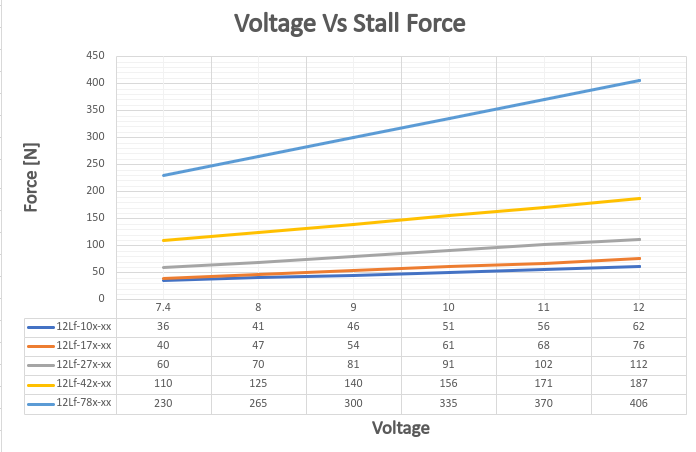
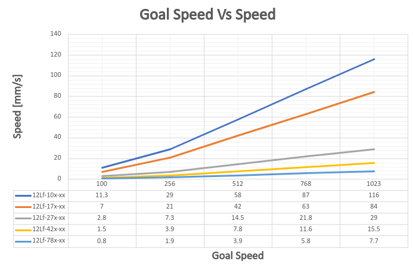
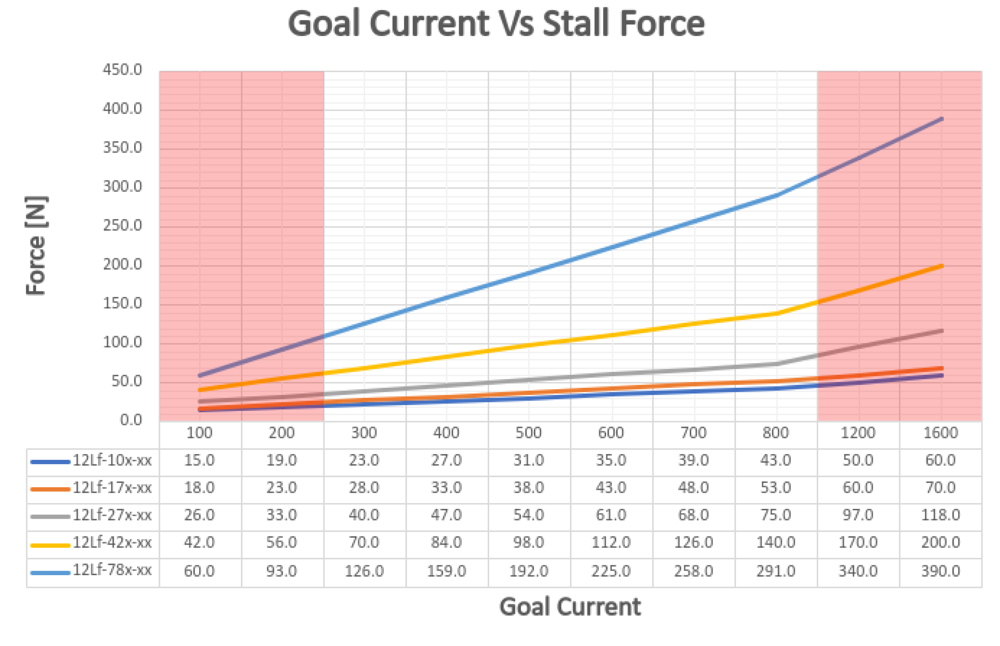
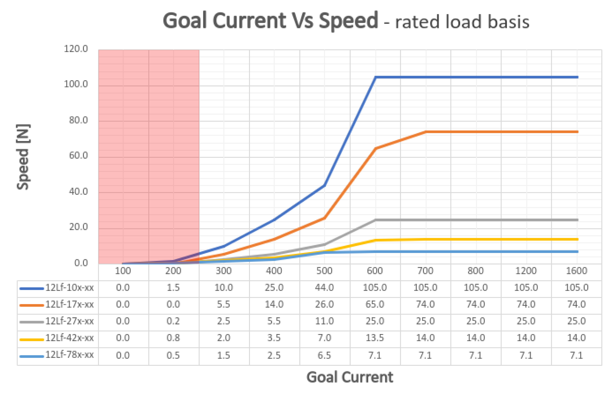

# 12Lf-xxF-90 Datasheet
## 1. Features
- Micro size
- Precise position control
- Force control by current feedback
- Speed control (1024 resolution)
- Strong force comparing to the size
- Built-in Drive Circuitry
- RS-485 communication
- Parameter programmable on the Manager software

## 2. Specification
### 2.1 Common Specifications
| **Property** | Value |
| ---- | ---- |
| **Stroke** | 90mm |
| **Rated Load** | 10N ~ 27N |
| **Recommended duty cycle at rated load** | 50% |
| **Max apllicable Load** | 2times rated load |
| **Recommended duty cycle at max applicable load** | under 20% |
| **Micro controller** | 32bit Arm Cortex |
| **Position Resolution** | 4096 Resolution (A/D Converter) |
| **Input Voltage** | 12.0V(Rated), 7.4V ~ 13 V(Operating) |
| **Motor Type / Watt** | Coreless DC Motor / 3.5 Watt |
| **Current consumption** | 30mA(Idle), 380mA(Rated), 1.6A(Stall) |
| **Position repeatability** | Unidirectional less than 0.05mm(50um) |
| ^ | Bydirectional less than +/0.100mm(100um) |
| **Current Tolerance** | ±15% at Over 50mA |
| **Position sensor** | 10kΩ linearity potentiometer |
| **Size, Weight** | 151.5(L)x36(W)x18(H)mm /177g (to be varied according to gear ratio) |
| **Communication** | RS485 |
| **Protocol** | IR Robot Open Protocol (switchable to MODBUS RTU protocol) |
| **Operating Temperatures** | -10℃ ~ 60℃ |
| **Ingress protection** | IP-54 |
| **Mechanical Backlash** | 0.03mm(30um) |
| **Audible Noise** | Max. 50db at 1m |
| **Gear ratio** | 10:1(10F,17F,27F) |
| **Gear type** | Engineering plastic gearss(10F,17F,27F) |
| **Rod type** | Stainless steel rod |
| **Standard Accessory** | 1xHinge base  1x Hinge  1xHinge shaft  1xRod end tip  2x M3 NUT  3 x M2.5x6 screws  1x Molex wire harness (200mm)  1 x M3 spanner  1 x Socket set screwlex wire harness (200mm)  1 x M3 spanner  1 x Socket set screw |
| **Connector Type (Male) in the Actuator** | MOLEX 53253-0470 |
| **Wire Harness** | Molex(51065-0400) to Molex(51065-0400)/ 200mm / 0.08x60(22AWG) |

### 2.2 Volatges
| Parameter | Min | Norm | Max | Unit | Note |
|:---|:---:|:---:|:---:|:---:|:---:|
| **Supply voltage** | 7.4 | 12 | 13 | V |   |
| **Logic input voltage** | -7.0 | - | 12.0 | V | RS-485 |

### 2.3 Currents
| Parameter | Min | Norm | Max | Unit | Note |
|:---|:---:|:---:|:---:|:---:|:---:|
| **Maximum peak Current** | | ≤1.6 | | A | Stall Current |
| **No Load Current** | | ≤300 | | mA | No Load |
| **Rated Load Current** | | ≤400 | | mA | |
| **Max Applicable Load Current** | | ≤600 | | | |
| **Idle Current** | | ≤20 | | mA | |

### 2.4 Temperatures
| Parameter | Min | Norm | Max | Unit | Note |
|:---|:---:|:---:|:---:|:---:|:---:|
| **StorageTemp.** | -20 | - | 70 | ℃ | |
| **Operating Temp.** | -10 | - | 60 | ℃ | |

### 2.5 Strokes
| Parameter | Min | Norm | Max | Unit | Note |
| :--- | :--- | :--- | :--- | :--- | :--- |
| **MIN Position** | 5.3 | 5.8 | 6.3 | mm | ⁕ |
| **MAX Position** | 95.8 | 96.3 | 96.8 | mm | |
| **Stroke length** | | 90.5 | | mm | |

### 2.6 No Load Speed
| Parameter | Min | Norm | Max | Unit | Note |
| :--- | :--- | :--- | :--- | :--- | :--- |
| Maximum Speed at 12.0V | 104.4 | 116.0 | 127.6 | mm/s | 12Lf-10F-90 |
| ^ | 75.6 | 84.0 | 92.4 | mm/s | 12Lf-17F-90 |
| ^ | 26.1 | 29.0 | 31.9 | mm/s | 12Lf-27F-90 |

### 2.7 Load
| Parameter | Min | Rated | Max | Unit | Note |
| :--- | :--: | :--: | :--: | :--: | :--- |
| Load at 12.0V | | 10.0 | 20.0 | N | 12Lf-10F-90 |
| ^ | | 2.24 | 4.49 | lbf | ^ |
| ^ | | 1.01 | 2.03 | kgf | ^ |
| ^ | | 17 | 34 | N | 12Lf-17F-90 |
| ^ | | 3.82 | 7.64 | lbf | ^ |
| ^ | | 1.73 | 3.47 | kgf | ^ |
| ^ | | 27 | 54 | N | 12Lf-27F-90 |
| ^ | | 6.07 | 12.13 | lbf | ^ |
| ^ | | 2.76 | 5.51 | kgf | ^ |
| ^ | | 7.96 | 15.91 | kgf | ^ |

⁕ 1 kgf = 9.8N, 1lbf = 4.45N
  

>[!warning] Caution
>Use under rated load conditions as much as possible. When applying max applicable load (2x rated load), set Goal current to 1600(1.6A) and reduce Duty cycle to 20% or less.

### 2.8 Self Lock Feature

| Parameter | Min | Norm | Max | Unit | Note |
| :--- | :--: | :--: | :--: | :--: | :--- |
| Slef Lock | - | N/A | - | | 12Lf-10x-90 |
| ^ | - | ^ | - | | 12Lf-17x-90 |
| ^ | - | Available | - | | 12Lf-27x-90 |

>[!tip] Tip
>Self-Lock means the actuator can hold its position by mechanical friction without motor power.

## 3. Reference Data
### 3.1 Voltage Vs Speed
Graph of speed change at no load according to input voltage. This data includes error and is for reference only.
!(voltageVSspeed)[00_voltageVSspeed.png]
>[!note] Note
>Voltage Vs Speed data was tested at Goal Current 800.
>This data includes about +/-15% error.

### 3.2 Voltage Vs Stall Force
Stall Force measured at 800mA according to input voltage. This data includes error and is for reference only.

> [!note] Note
> Voltage Vs Stall Force data was tested at Goal Current 1600.
>Each Force value has an error of +/- 15%.

>[!warning] Caution
>Stall force is for reference only. To prevent product damage, use according to rated load in actual application.

### 3.3 Goal Speed Vs Speed
Shows no load speed change according to Goal Speed Parameter value at Goal Current 800.
At less than rated load, the time to reach maximum speed varies depending on the load.

>[!note] Note
>Goal Speed Vs Speed data was tested at Goal Current 800.

### 3.4 Goal Current vs Stall Force
Shows mightyZAP's Stall Force for each Goal Current value.
Stall Force was measured at minimum speed to reflect only current-based force.

>[!tip] TIP
>This data shows motor force. It is recommended to set Goal current to 3x the actual load.
>The smaller the difference between actual load and motor force, the slower the speed. If equal, the motor will not move.

>[!warning] Caution
>Each Stall Force value has an error of +/- 15%.
>Red-marked areas have large error due to internal load and heat, so use for reference only.
>If continuous load causes current over 1A, the current value will gradually drop and stabilize at 1A.

>[!warning] Double load setting
>mightyZAP can be used up to 2x load. For 2x load, set Duty Rate to 20% or less.
>**ex>**
>
>|Load|Goal Current|Duty rate|Load|Goal Current|Duty Rate|
>|---|---|---|---|---|---|
>|20N(Rated)|800|Max. 50%|35N(Rated)|800|Max. 50%|
>|40N(Max)|1600|Max. 20%|70N(Max)|1600|Max. 20%|

### 3.5 Goal Current vs Speed at Rated Load
Shows mightyZAP's speed change for each Goal Current value at rated load.

>[!tip] TIP
>Goal Current Vs Speed data was measured at rated load.

 >[!warning] Caution
>Speed data has about +/-10% error.
>Red-marked areas are where Stall Force and rated load are similar, so mightyZAP may not move. Use for reference only.

### 3.6 PIN Map

| PIN NUMBER(COLOR) | PIN NAME&nbsp; | 
FUNCTION
 |
|:------------------:|:---------------:|:--------------------:|
| 1(YELLOW) | D-& | RS-485- |
| 2(WHITE) | D+ | RS-485+ |
| 3(RED) | VCC | Power + |
| 4(BLACK) | GND | Power - |

