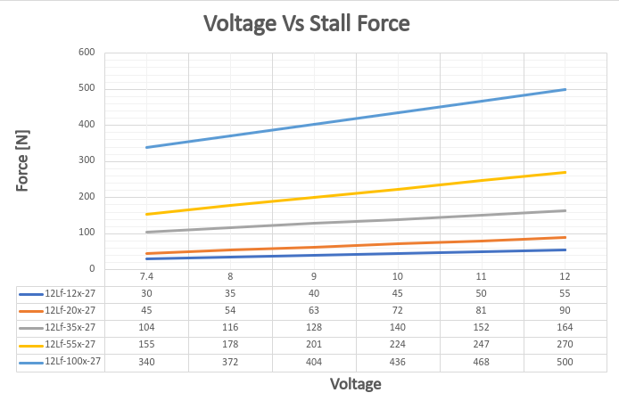
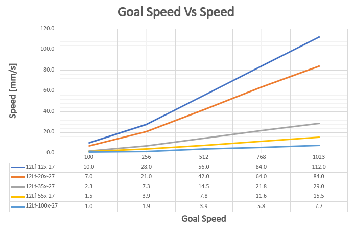

## 1. Features
- Micro size
- Precise position control
- Force control by current feedback
- Speed control (1024 resolution)
- Strong force comparing to the size
- Built-in Drive Circuitry
- RS-485 communication
- Parameter programmable on the Manager software

## 2. Specification
### 2.1 Common Specifications
| **Property** | Value |
| ---- | ---- |
| **Stroke** | 27mm |
| **Rated Load** | 12N ~ 100N |
| **Recommended duty cycle at rated load** | 50% |
| **Max apllicable Load** | 2times rated load |
| **Recommended duty cycle at max applicable load:** | under 20% |
| **Micro controller** | 32bit Arm Cortex |
| **Position Resolution** | 4096 Resolution (A/D Converter) |
| **Input Voltage** | 12.0V(Rated), 7.4V ~ 13 V(Operating) |
| **Motor Type / Watt** | Coreless DC Motor / 3.5 Watt |
| **Current consumption** | 30mA(Idle), 380mA(Rated), 1.6A(Stall) |
| **Position repeatability** | Unidirectional less than 0.03mm(30um) |
| ^ | Bydirectional less than +/0.06mm(60um) |
| **Current Tolerance** | ±15% at Over 50mA |
| **Position sensor** | 10kΩ linearity potentiometer |
| **Size, Weight** | 86.9(L)x36(W)x18(H)mm /96~99g (to be varied according to gear ratio) be varied according to gear ratio) |
| **Communication** | TTL/PWM(Automatic signal recognition)  → TTL Level voltage : 3.3 ~ 5.0V  → PWM Pulse range : 900us(retracted) – 1500us(center) – 2100us(extended)  → TTL Communication range : Max.4m |
| **Protocol** | IR Robot Open Protocol (switchable to MODBUS RTU protocol) |
| **Operating Temperatures** | -10℃ ~ 60℃ |
| **Ingress protection** | IP-54 |
| **Mechanical Backlash** | 0.03mm(30um) |
| **Audible Noise** | Max. 50db at 1m |
| **Gear ratio** | 110:1(1PT,20PT,35PT) /20:1(55PT) /50:1(100PT) |
| **Gear type** | Engineering plastic gears(12PT,20PT,35PT)  4metal & 2engineering plastic gears(42PT,78PT) (Aluminum and stainless steel combination) |
| **Rod type** |  |
| **Standard Accessory** | 1xHinge base  1x Hinge  1xHinge shaft  1xRod end tip  2x M3 NUT  3 x M2.5x6 screws  1x Molex wire harness (200mm)  1 x M3 spanner  1 x Socket set screwlex wire harness (200mm)  1 x M3 spanner  1 x Socket set screw |
| **Connector Type (Male) in the Actuator** | MOLEX 22-03-5035 |
| **Wire Harness** | Molex(50-37-5033) to Molex(50-37-5033)/ 200mm / 0.08x60(22AWG) |

### 2.2 Volatges
| Parameter | Min | Norm | Max | Unit | Note |
|:--------------|:----------------:|:--------------:|:------------:|:--------:|:---------:|
| **Supply voltage** | 7.4 | 12 | 13 | V |   |
| **Logic input voltage** | 2.0 | 3.3 | 5.5 | V | RS-485 |

### 2.3 Currents
| Parameter | Min | Norm | Max | Unit | Note |
|:------------|:--------------|:----------------------------|:-----------------|:-----------------|:---|
| **Maximum peak Current** | | ≤1.6 | | A | Stall Current |
| **No Load Current** | | ≤300 | | mA | No Load |
| **Rated Load Current** | | ≤400 | | mA | 800mA or higher setting |
| **Max Applicable Load Current** | | ≤600 | | | 1.6A setting |
| **Idle Current** | | ≤20 | | mA | |

### 2.4 Temperatures
| Parameter | Min | Norm | Max | Unit | Note |
|:--------------------------------|:-------:|:--------:|:-------:|:--------:|:--------:|
| **StorageTemp.** | -20 | - | 70 | ℃ | |
| **Operating Temp.** | -10 | - | 60 | ℃ | |

### 2.5 Strokes
| Parameter | Min | Norm | Max | Unit | Note |
|:----------------------------|:------|:-------|:------|:-------|:--------------------------------|
| **MIN Position** | 3.3 | 3.8 | 4.3 | mm | ⁕ |
| **MAX Position** | 30.3 | 30.8 | 31.3 | mm | |
| **Stroke length** | | 27.0 | | mm | |

### 2.6 No Load Speed
| Parameter | Min | Norm | Max | Unit | Note |
| :--- | :--- | :--- | :--- | :--- | :--- |
| Maximum Speed at 12.0V | 100.8 | 112.0 | 123.2 | mm/s | 12Lf-12PT-27 |
| ^ | 75.6 | 84.0 | 92.4 | mm/s | 12Lf-20PT-27 |
| ^ | 26.1 | 29.0 | 31.9 | mm/s | 12Lf-35PT-27 |
| ^ | 13.95 | 15.5 | 17.05 | mm/s | 12Lf-55PT-27 |
| ^ | 6.93 | 7.7 | 8.47 | mm/s | 12Lf-100PT-27 |
### 2.7 Load
| Parameter | Min | Rated | Max | Unit | Note |
| :--- | :--: | :--: | :--: | :--: | :--- |
| Load at 12.0V | | 12.0 | 24.0 | N | 12Lf-12PT-27 |
| ^ | | 2.69 | 5.39 | lbf | ^ |
| ^ | | 1.22 | 2.44 | kgf | ^ |
| ^ | | 20.0 | 30.0 | N | 12Lf-20PT-27 |
| ^ | | 4.49 | 8.98 | lbf | ^ |
| ^ | | 2.04 | 4.08 | kgf | ^ |
| ^ | | 35.0 | 70.0 | N | 12Lf-35PT-27 |
| ^ | | 7.87 | 15.73 | lbf | ^ |
| ^ | | 3.57 | 7.14 | kgf | ^ |
| ^ | | 55.0 | 110.0 | N | 12Lf-55PT-27 |
| ^ | | 12.37 | 24.72 | lbf | ^ |
| ^ | | 5.61 | 11.22 | kgf | ^ |
| ^ | | 100.0 | 200.0 | N | 12Lf-100PT-27 |
| ^ | | 22.48 | 44.94 | lbf | ^ |
| ^ | | 10.19 | 20.4 | kgf | ^ |

### 2.8 Self Lock Feature

| Parameter | Min | Norm | Max | Unit | Note |
| :--- | :--: | :--: | :--: | :--: | :--- |
| Slef Lock | - | N/A | - | | 12Lf-12x-27 |
| ^ | - | ^ | - | | 12Lf-20x-27 |
| ^ | - | Available | - | | 12Lf-35x-27 |
| ^ | - | ^ | - | | 12Lf-55x-27 |
| ^ | - | ^ | - | | 12Lf-100x-27 |

## 3. Reference
### 3.1 Voltage Vs Speed

### 3.2 Voltage Vs Stall Force

### 3.3 Goal Speed Vs Speed

### 3.4 Goal Current vs Stall Force
![[27_goalcuttentVSstallforce.png|700]]

### 3.5 Goal Current vs Speed at Rated Load
![[27_goalcurrentVSspeed 1.png|700]]

### 3.6 PIN Map

| PIN NUMBER(COLOR) | PIN NAME&nbsp; | 
FUNCTION
 |
| :--: | :--: | :--: |
| 1(WHITE) | DATA | |
| 2(RED) | VCC | |
| 3(BLACK) | GND | |

