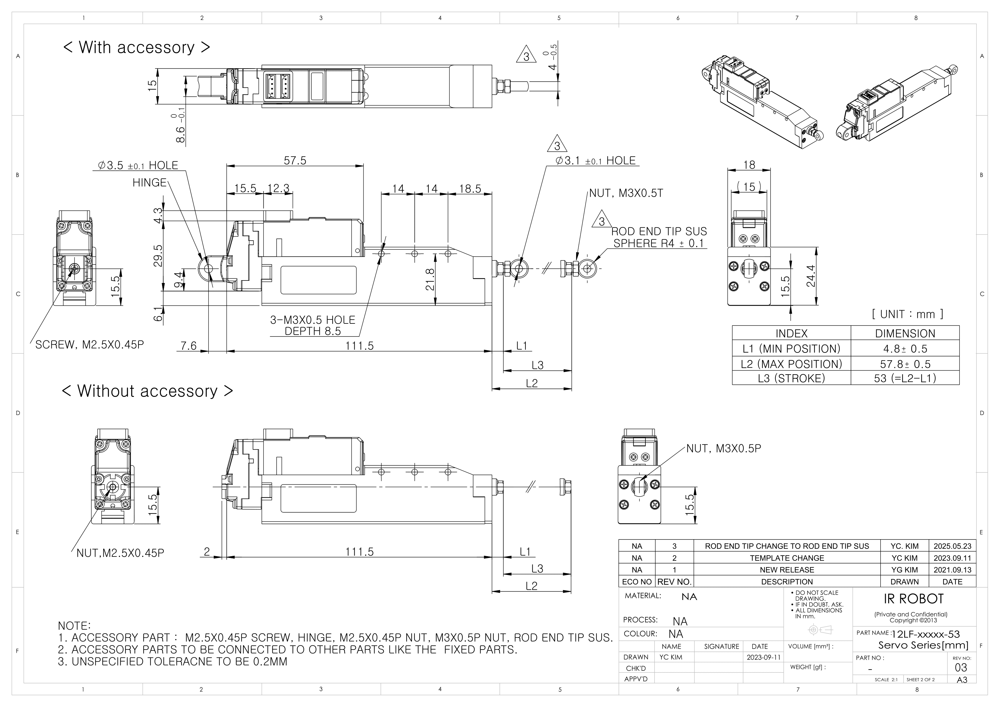
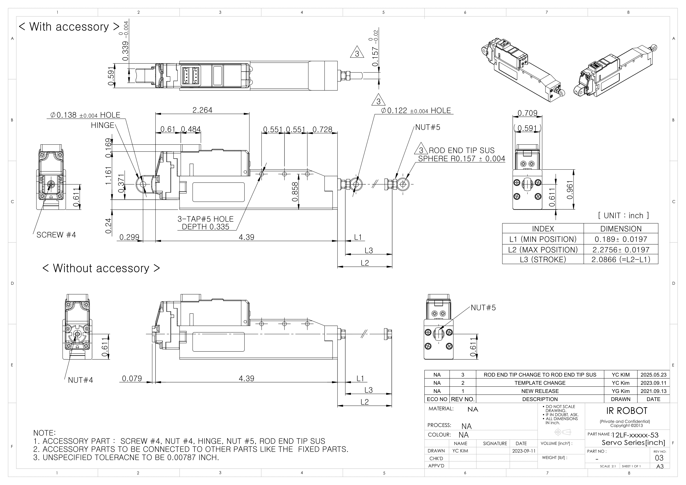

## 12Lf-xx-53 Uint : mm
  
**Download** <a href="./data/ENG-ver_12Lf-xxxxx-53-Servo-Series_mm_Rev03_20250523.pdf" download>PDF</a> <a href="./data/12Lf-xxxxx-35-Servo-Series_Rev03_20250523.step" download>STEP</a> <a href="./data/12Lf-xxxxx-53-Servo-Seriesmm_Rev03_20250523.DXF" download>DXF</a>
## 12Lf-xx-53 Uint : Inch
  
**Download** <a href="./data/ENG-ver_12Lf-xxxxx-53-Servo-Series_inch_Rev03_20250523.pdf" download>PDF</a> <a href="./data/12Lf-xxxxx-53-Servo-Series_Rev03_20250523.step" download>STEP</a> <a href="./data/12Lf-xxxxx-53-Servo-Seriesinch_Rev03_20250523.DXF" download>DXF</a>
