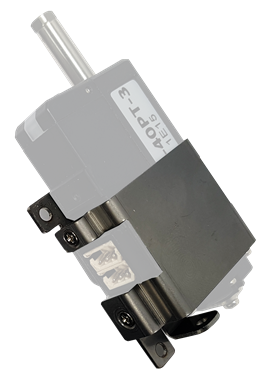
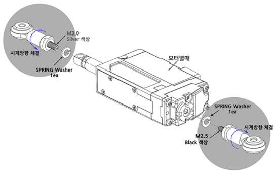
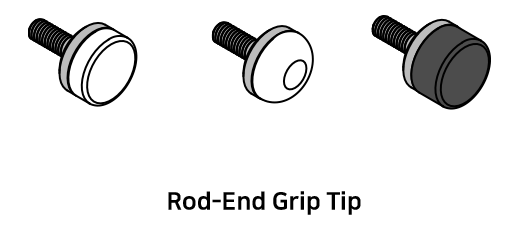

# mightyZAP 12Lf User Manual
### **Check your product series!  
Does your model number start with 12Lf-?  **

>[!note] NOTE
> This manual is the dedicated manual for **12Lf FORCE control version actuator** which support force/speed control as well as position control. 
> This manual is for the 12Lf Force control version user who has the model number which starts with **“12Lf”** with our own IR protocol. 
> For the users with 12Lf series who uses MODBUS RTU protocol, please refer separated “Force control/MODBUS RTU” manual and for the users who have the actuator which starts with D or L, please refer to the separate “Position control” actuator manual. 

# 1. Before Use
## 1.1. Introduction
Thank you for purchasing mightyZAP mini Linear servo motors! Please peruse this manual before use to prevent any unexpected damage of product or serious injury of users.  
mightyZAP mini Linear servo motors have been developed to provide reliable, high quality linear solution in compact space. mightyZAP mini Linear servo motors can be applied in various fields such as factory automation, medical devices, robotics, professional UAV and radio control hobby.  

**Features**
- Position Control (Positional Accuracy 50~90um – see spec chart of each model)
- Stall Force Control based on Current feedback
- Speed Control by 1024 Resolution 
- Bulit-in Drive circuit
- 4096 Step High Resolution
- High Performance Coreless Motor 
- Minimized Mechanical Backlash (30um)
- Excellent Substitute for pneumatic cylinder which does not support position control
- Reasonable Cost
 
## 1.2. For Safety
> [!warning] warning
>⚠ Please peruse safety instruction below to use mightyZAP safely. Please kindly note that abuse may invalidate your warranty.  

1.   <u>Do NOT press the Rod when the servo is being operated.</u> Motor may be damaged(burnt) if higher force than rated force is applied consistently.   
2.   <u>Apply proper input voltage</u> using power supply or correct battery. For instance, 7.0~12V for 12V input product(12Lf series). The motor may be burnt when higher voltage than 13V is applied to the actuator.   
3.   <u>Lifespan of motor can be varied according to the load and duty cycle and etc.      </u>
	1)       <u>Use under rated force.</u> For instance, rated force of 12Lf-20PT-27 is 20N(approx. 2kg). That is, lifespan of 12Lf-20PT-27 can be maximized when it is used less than 20N force condition.  The lower load comparing to rated force, the longer lifespan of the motor. 
	2)      <u>Use under 50% of Duty Cycle</u> : If DC motor operates continuously without any interval (rest), motor will be overloaded and overload protection feature will cut off the power of servo motor. Therefore, user should consider “Duty cycle” which means the percentage of operating time against interval time. In other words, 50% duty cycle means that motor should rest 50% of time when motor operate during 50% of time to manage motor lifespan more efficiently. Use under 50% of duty cycle for optimized lifespan. The less duty cycle, the longer lifespan.  
	3)      <u>"Force Off" feature when servo motor is in standby mode may prolong the lifespan of servo motor. </u>  However, this feature can be used when there is no problem in your system even if rod position is changed due to external force because "force off" makes servo force is released.  ( [[#1.5. Force Off]] )  
4.    <u>Proper wiring</u> : There is little chance of incorrect wiring when using wire harness with connector provided by our factory. However, if users use soldering or a third-party connector according to user’s desire, please pay attention to mis-wiring between the communication and power lines. Incorrect wiring results in fatal damage to the PC board or certain electrical components. Please refer to the wiring pin map on [[#4.1.Circuit Connection]] page on this manual to prevent incorrect wiring.   
5.   <u>Position command within mechanical limit</u> : There should be mechanical limit which servo rod can move when user install servo motor in their application. Make sure that positional command should be made within user’s mechanical limit. It is too common to mention, but we could see this mistake from time to time. If positional command is out of mechanical limit, servo will be overloaded at certain point of time and power will be cut off to protect the servo due to overload protection feature. (if overload protection is inactivated by user, motor will be not be protected.) Considering precise position control, make sure to re-check this matter when servo is applied.   
   
6.   <u>It is strictly banned to use multiple qty actuators for single objective.</u> Due to DC motor characteristic, each actuator’s speed can be slightly varied even if they are same model and goal position is same. (may cause overload to one of actuator)

7.   Do not TWIST the rod with excessive force when tightening the rod end tip. If you apply excessive twisting force to the rod when tightening the rod and tip (while the body is fixed), it may cause damage to internal part (Engineering Plastic rod-insert). Follow below instruction to avoid damage.    
	   **instruction – M3 spanner**
	
		1) Fix the Rod-end with the included M3 spanner (⑤). This is to prevent the rod (①) from turning badly and damage while tightening the M3 nut (②). 
		2) According to preference, install the socket set screw (③) or rod end tip (④) to the proper positioning before hard tightening.
		3) Adjust the angle of the rod end tip (④) to the desired angle. By using a long nose plier(or extra M3 spanner), fix the position by tightening the M3 nut (②) while rod end is fixed with M3 spanner(see above image.). This is “double nuts” concept which fixes mechanical position by friction.

8.  Use properly "Overload protection" feature to protect the servo and your system from damage. Overload protection feature is activated from the factory, and for other protection setting, if necessary, set “Alarm shutdown” feature according to your system's condition. 
9.  Do NOT touch the servo case right after servo operation. It may hot. 
10.  Keep away from water, humidity, dust and oil.
11.  It is designed for indoor purpose. Do not use in outdoor. 
12. Keep out of reach of children.  Keep hands off when servo motor operates to avoid unexpected injury. 
## 1.3. For Storage
Do NOT store/use servo motor under below extreme condition. It may cause malfunction or damage of product.
- Direct light and High temperature more than 70 ˚C or Low temperature lower than minus 20˚C. 
- Highly Humid space / Space having Vibrating condition / Space having Dust / Space causing Electrostatic
## 1.4. Constant Load / Overload Protection 

> **Important Note : Constant load / Overload Protection Force Off Feature**

Overload protection (Overload shutdown) feature is to prevent overload condition which greatly affect the service life and to motor burnout. Please read the following for proper protection and use it according to the conditions.
### 1.4.1. About mechanism of overload protection (overload shutdown) and terminology
- The overload protection mechanism of the 12Lf Force Control series uses a combination of current accumulation and operation time accumulation.
	-	In case of continuous operation AT rated load, Shutdown occurs after about 30 sec as the accumulated current value.
	-	In case of continuous operation UNDER rated load, Shutdown occurs after longer than 30 sec, but Shutdown will be made within max. 180 sec even at the lowest load.
	-	In case of continuous operation ABOVE rated load, Shutdown occurs shorter than 30 seconds due to the high amount of current accumulation. For example, shutdown occurs within 2 seconds when the maximum current of 1.6A flows.  
- Duty cycle is the ratio of the time which motor is actually driven against the time of motor rest.
- Duty cycle 50% means that 50% of the time should be restored if the motor runs 50% of the time. 
- Motor operating time includes the time which the motor rotates/moves normally as well as the time which motor draws current by stuck condition without motor rotating. 
### 1.4.2. Overload shutdown Disable
The overload shutdown function protects the servo actuator under overload conditions. Depending on the application, there are applications that need to be operated under severe conditions, even if the overall mechanism protection is more important than the servo actuator, or even if the life of the servo actuator is shortened.  For this case, shutdown function can be disabled through mightZAP servo manager software so that shutdown does not work under overload situation.  However, in the 12Lf force control series, the goal current can be set so that the motor can be protected by not exceeding the set maximum current even in an overload situation. 
### 1.4.3. Recovery after overload shutdown
Since the communication line is still functioning after shutdown, it can be restored to the initial state by “Restart” command or by reconnecting power. Be sure to remove the cause of overload before restoration.
### 1.4.4. Exception and Cautions
- **Caution 1)** When the spring is installed between the application and the actuator, or it is installed in Z axis (the direction of gravity), it makes external force to the actuator. Under these conditions, the servo actuator operates slightly, but continuously to keep its position.  If this condition persists, actuator may invoke Overload shutdown in some cases. To prevent this, use Force Off command while external power is applied.
- **Caution 2)** Each time overload shutdown is executed, it is not big but it damages the motor. Therefore, the cause of overload must be removed after the first overload shutdown so that shutdown does not occur frequently.
### 1.4.5. Overload Protection Function
Using Overload protection function, we can protect motor damage from overload condition.  
Overload protection function is being activated from the factory.  When it is activated, motor power will be cut off in case of overload condition to protect the servo actuator   

The easiest way to set(activate/inactivate) Overload protection function is to connect servo with Servo Manager Software using IR-USB01 PC USB interface. Go to "Shutdown Alarm Setting” and simply click(activate) "Overload Error".   

Another method to set Overload protection is to use a Command packet. You can send "Store data" command to the address(0X12) which is the address for Alarm Shutdown.  Set bit 5 (see below) for Overload error from  to "1"(Overload activation), then send "Store data" command to the servo motor. Servo force will be cut off under overload condition if the bit is set at "1".(1= Overload protection activation / 0=Inactivation)  

| Error                                         | bit                            |
| :-------------------------------------------- | :----------------------------- |
| NONE                                          | 7                              |
| NONE                                          | 6                              |
|  Overload Error  | 5 |
| NONE                                          | 4                              |
| NONE                                          | 3                              |
| NONE                                          | 2                              |
| NONE                                          | 1                              |
| Input Voltage Error                           | 0                              |

Refer to below example for"Store Data" command.  

Command Packet 

| HEADER   | ID   | Size | Command | Factor #1 Address  | Factor #2 Data  | Checksum |
| :------- | :--- | :--- | :------ | :----------------------- | :-------------------- | :------- |
| 0xFFFFFF | 0x00 | 0x04 | 0xF3    | 0x12                     | 0x20                  | 0xD6     |

>[!caution] Caution - Use within Rated Load**
>For proper performance and better lifespan of mightZAP, it is strongly requested to use it within the rated load range. 

## 1.5. Force Off 
**Force Off Function**
- After the servo actuator moves to the designated position, the operation stops unless there is an external force that causes the position value change. If the position value of the actuator is continuously changed due to vibration or external force, the actuator is operated continuously without rest to stick to the designated position value, which affects the lifespan of the motor. 
- In this case, if the Force Off function is properly utilized, the motor power can be released to allow the motor to rest while maintaining its position with mechanical friction (Mechanical Self Lock function). Even when it is necessary to keep the position for a relatively long time after reaching a certain position, shutting off the power of the motor using the Force off parameter as an added safety function helps to manage the lifespan of the motor.
- Under force off condition, communication is still alive while motor power is off, so servo will move again when servo gets new position command without giving “Force ON” command. 
- Force Off feature can be available for the actuator having “Mechanical self-lock” feature. Please see the chart below to see availability. (Below chart shows self-lock force of 27mm stroke mightyZAP only.  Refer to the separate specification for 40/53/90mm stroke version’s Self lock force.)

| Rated Load Spec | Mechanical Self-Lock |
| :-------------- | :------------------- |
| 10-20N          | NOT Available        |
| 27-100N         | Available            |

For Force Off, send 0x00 as a "Store data" command to the address(0X80) which is the address for Force ON/OFF. (For Force ON, send 0x01) 

Refer to below example for "Store Data" command.

**Command Packet** 

| HEADER   | ID   | Size | Command | Factor #1 Address  | Factor #2 Data  | Checksum |
| :------- | :--- | :--- | :------ | :--------- | :----------- | :------- |
| 0xFFFFFF | 0x00 | 0x04 | 0xF3    | 0x80 | 0x00 | 0x88     |

> [!tip] TIP  
>Under Force Off status, if user send "Goal Position" command, it is not necessary to send Force ON packet additionally because "Goal Position" command already includes "Force On" packet in it. . 

---

# 2. Basic Information
## 2.1. Component

* #3 M3 nut can be used to fix the hinge and hinge base. Also, M3 nut should be used between rod-end nut and rod-end tip as a stopper as shown on the picture. 

## 2.2. Specification
### 2.2.1. 12Lf Series Specifications

| Rated Load | Stroke | Communication(RS-485) | Communication(TTL/PWM) | Rated Load/ Max Speed(No Load) | Stall Force at Current (1.6A/800mA/100mA) | Mechanical   Self Lock   (Z Axis Use) | Lead Screw / Gear Ratio / Gear Type                               |
| ---------- | ------ | --------------------- | ---------------------- | --------------------------------- | -------------------------------------------- | ------------------------------------------- | ----------------------------------------------------------------- |
| 10N        | 40mm   | 12Lf-10F-40           | 12Lf-10PT-40           | 10N / 110mm/s                     | 60N / 40N / 10N                              | No (Pay attention to application)           | Lead Angle 20°   / 10:1    / Engineering   Plastic Gears |
| ^          | 53mm   | 12Lf-10F-53           | 12Lf-10PT-53           | ^                                 | ^                                            | ^                                           | ^                                                                 |
| ^          | 90mm   | 12Lf-10F-90           | 12Lf-10PT-90           | ^                                 | ^                                            | ^                                           | ^                                                                 |
| 12N        | 27mm   | 12Lf-12F-27           | 12Lf-12PT-27           | 12N / 110mm/s                     | 100N / 60N / 8N                              | ^                                           | ^                                                                 |
| 17N        | 40mm   | 12Lf-17F-40           | 12Lf-17PT-40           | 17N / 80mm/s                      | 100N / 60N / 8N                              | ^                                           | Lead Angle 15°   / 10:1    / Engineering   Plastic Gears |
| ^          | 53mm   | 12Lf-17F-53           | 12Lf-17PT-53           | ^                                 | ^                                            | ^                                           | ^                                                                 |
| ^          | 90mm   | 12Lf-17F-90           | 12Lf-17PT-90           | ^                                 | ^                                            | ^                                           | ^                                                                 |
| 20N        | 27mm   | 12Lf-20F-27           | 12Lf-20PT-27           | 20N / 80mm/s                      | 120N / 72N / 9.6N                            | ^                                           | ^                                                                 |
| 27N        | 40mm   | 12Lf-27F-40           | 12Lf-27PT-40           | 27N / 28mm/s                      | 160N / 96N / 12.8N                           | Yes (Applicable)                            | Lead Angle 5°   / 10:1    / Engineering   Plastic Gears  |
| ^          | 53mm   | 12Lf-27F-53           | 12Lf-27PT-53           | ^                                 | ^                                            | ^                                           | ^                                                                 |
| ^          | 90mm   | 12Lf-27F-90           | 12Lf-27PT-90           | ^                                 | ^                                            | ^                                           | ^                                                                 |
| 35N        | 27mm   | 12Lf-35F-27           | 12Lf-35PT-27           | 35N / 28mm/s                      | 210N / 126N / 16.8N                          | ^                                           | ^                                                                 |
| 42N        | 40mm   | 12Lf-42F-40           | 12Lf-42PT-40           | 42N / 15mm/s                      | 240N / 144N / 19.2N                          | ^                                           | Lead Angle 5°   / 20:1    / Metal Gear                      |
| ^          | 53mm   | 12Lf-42F-53           | 12Lf-42PT-53           | ^                                 | ^                                            | ^                                           | ^                                                                 |
| 55N        | 27mm   | 12Lf-55F-27           | 12Lf-55PT-27           | 55N / 15mm/s                      | 300N / 180N / 24N                            | ^                                           | ^                                                                 |
| 78N        | 40mm   | 12Lf-78F-40           | 12Lf-78PT-40           | 78N / 7.7mm/s                     | 420N / 252N / 33.6N                          | ^                                           | Lead Angle 5°   / 50:1    / Metal Gears                     |
| ^          | 53mm   | 12Lf-78F-53           | 12Lf-78PT-53           | ^                                 | ^                                            | ^                                           | ^                                                                 |
| 100N       | 27mm   | 12Lf-100F-27          | 12Lf-100PT-27          | 100N / 7.7mm/s                    | 600N / 360N / 48N                            | ^                                           | ^                                                                 |

### 2.2.2. 12Lf Series Common Specifications	
| Item                              | <                      | <       | Value                                                                                                                                                                                                                |
| :-------------------------------- | :--------------------- | :------ | :------------------------------------------------------------------------------------------------------------------------------------------------------------------------------------------------------------------- |
| **Repeatability**                 | 27mm / 40mm            | <       | 30μm (0.03mm)                                                                                                                                                                                                        |
| ^                                 | 53mm                   | <       | 40μm (0.04mm                                                                                                                                                                                                         |
| ^                                 | 90mm                   | <       | 50μm (0.05mm))                                                                                                                                                                                                       |
| **Mechanical Backlash**           | <                      | <       | 0.03mm (30μm)                                                                                                                                                                                                        |
| **Rod Type**                      | <                      | <       | Metal Alloy Rod                                                                                                                                                                                                      |
| **Motor Type**                    | <                      | <       | Coreless Motor                                                                                                                                                                                                       |
| **Rated Voltage**                 | <                      | <       | 12V                                                                                                                                                                                                                  |
| **Motor Watt**                    | <                      | <       | W                                                                                                                                                                                                                    |
| **Recommended Duty Cycle**        | At Rated Load          | <       | Max 50%                                                                                                                                                                                                              |
| ^                                 | At Max Applicable Load | <       | Max 20%                                                                                                                                                                                                              |
| **Current Accuracy**              | <                      | <       | ±15% at Over 50mA                                                                                                                                                                                                    |
| **Position Sensor**               | <                      | <       | 10KΩ linear Potentiometer                                                                                                                                                                                            |
| **Input Voltage Range**           | <                      | <       | 7 ~ 13V                                                                                                                                                                                                              |
| **Current Consumption**           | Idle                   | <       | 20mA                                                                                                                                                                                                                 |
| ^                                 | Rated                  | <       | 280mA                                                                                                                                                                                                                |
| ^                                 | Stall                  | Default | 800mA                                                                                                                                                                                                                |
| ^                                 | ^                      | MAX     | 1.6A                                                                                                                                                                                                                 |
| **Audible Noise**                 | <                      | <       | 약 50db at 1m                                                                                                                                                                                                         |
| **LED Indication**                | <                      | <       | Two Errors Indications (Input voltage, Overload)                                                                                                                                                                     |
| **Pulse Signal / Pulse Range**    | <                      | <       | PWM (PT version, R/C Hobby Signal) 900μs(Retracted)-1500μs(Center)-2100μs (Extended)                                                                                                                                 |
| **Data Communication / Protocol** | <                      | <       | RS-485 or TTL(PT version) / IR Robot open protocol                                                                                                                                                                   |
| **Ingress Protection**            | <                      | <       | IP-54 (Dust &amp; Water Tight)                                                                                                                                                                                       |
| **Size / Weight**                 | <                      | <       |                                                                                                                                                                                                                      |
| **27mm**                          | <                      | <       | 57.5(L)x29.9(W)x15(H)mm / 49~52g                                                                                                                                                                                     |
| **40mm**                          | <                      | <       | 86.9(L)x36(W)x18(H)mm / 96~99g                                                                                                                                                                                       |
| **53mm**                          | <                      | <       | 111.5(L)x36(W)x18(H)mm / 124~127g                                                                                                                                                                                    |
| **90mm**                          | <                      | <       | 151.5(L)x36(W)x18(H)mm / 약177g                                                                                                                                                                                       |
| **Operating Temperature**         | <                      | <       | -10℃ ~ 60℃                                                                                                                                                                                                           |
| **Wire Harness**                  | <                      | <       | TTL(PT version) :&nbsp; Molex to Molex Type&nbsp;(Molex 50-37-5033, 3pins) / 200mm length, 0.08×60(22AWG) <br&gt; 또는 RS485(F version) : Molex to Molex Type (Molex 0510650400, 4pins) / 200mm length, 0.08×60(22AWG) |
*  Design and Specification can be changed without prior notice for further improvement.   

# 3. Application
## 3.1. Factory Automation

- Better Replacement of Pneumatic Cylinder
- Real-Time Automatic Width Adjustment Conveyer
- Real-Time Automatic Product Alignment (Up/Down or Left/Right)
- Automatic Value Control (oil or water)
- Automatic Dispensing with Syringe
- Automatic Clamping System
- Fitting or Adjusting Distance
- Pick & Place
- In & out / Extension & retraction 
- Open & Closing (On-Off )
- Change of Direction
- Hexapod/Tripod movement

## 3.2. Production & Test JIGs

- Hole Punching Jig
- Hole Inspection Jig
- Switch Inspection Jig
- Touch Panel Inspection Jig
- PC Board Testing Jig
## 3.3. Robotics

- Robot Joints
- Robot Grippers
- Linear Control  Parts of Surgical Robot
## 3.4. UAV / Professional Drone

- Fixed wing (Aileron/Elevator/Throttle/Flap/Air Brake/ Rudder/ Throttle)
- Helicopter (Swash Plate Control/Rudder)
- Multicopter (Retract, Dropping Device)
- Linear control parts for Military products
- Pan/Tilt Camera control
## 3.5. Medical / Lab Equipment 

- Linear position control for Medical Devices (HIFU, etc)
- Camera or Laser Focusing Control
- Laboratory Test Equipment

## 3.6. Education / Hobby

- 3D Printer
- Arduino or Rapsberry Pie Control
- Maker's DIY Project

# 4. Servo Control
## 4.1. Circuit Connection
mightyZAP(12Lf-xxPT-xx) supports both data communication (Half Duplux TTL) as well as simple pulse(PWM) control. For the control under data communication, UART signal of main board should be converted into Half Duplex Type signal.  TTL Conversion circuit will be as below.   
### 4.1.1. TTL/PWM (3Pin Connector-Model 12Lfxx-xxPT-xx Series) 

The direction of data signal for TxD and RxD of TTL level will be determined according to the level of direction_port as below.
	- The level of "direction_port" is LOW :Data signal will be inputted to RxD.
	- The level of "direction_port" is HIGH :TxD signal will be outputted as Data.
	※ Both GNDs between actuator and controller should be connected as above diagram. 
> [!note] NOTE  
> - For PWM control, please connect PWM signal(3~5V) to the Data pin above. (GND,VDD are same as above) 
> - In case of using PWM communication, position control is possible, but feedback data such as the current position value cannot be received, and serial daisy chain connection is not supported since data communication is not supported.
> - Feedback data reception and Daisy chain connection are possible by TTL or RS-485 communication.

### 4.1.2. RS-485(4Pin Connector - Model 12Lf-xxF-xx Series)
Model 12Lfxx-xxF-xx Series uses RS-485 communication. Pin map and Conversion circuit will be as below.

|PIN NUMBER(COLOR)|PIN NAME|FUNCTION(RS485)|
|---|---|---|
|1(Yellow)|D-|RS485 –|
|2(White)|D+|RS485 +|
|3(Red)|VCC|Power +|
|4(Black)|GND|Power -|

※ If the power is supplied from outside, you can connect to 485 D+, 485 D- only. 

You can convert TX and RX mode by controlling “Direction_Port pin” in above circuit. 
	- The level of "direction_port" is LOW : Data signal will be inputted to RxD.
	- The level of "direction_port" is HIGH : TxD signal will be outputted as Data
	※ Both GNDs between actuator and controller should be connected as above diagram. 

## 4.2. Communication

mightyZAP and your main controller will communicate by exchanging data packet. The sorts of packet are Command packet (Main controller to mightyZAP) and Feedback packet(mightZAP to your main controller) 

### 4.2.1. Communication specification   
- 2 Mode in One (Pulse / Data Mode Auto-Switching)
  mightyZAP 12Lf-xxPT-xx series will automatically recognize the input signal between data mode(TTL) and pulse mode(PWM).
- Data Mode (TTL/RS-485)
  Asynchronous Serial communication (8 bit, 1 Stop bit, None Parity)

|Item|Spec|
|---|---|
|Structure|Half-duplex UART|
|Baud Rate|57600bps(default)|
|Data Size|8bit|
|Parity|non-parity|
|Stop Bit|One bit|

> [!warning] CAUTION 
>- mightyZAP uses half duplex communication, and need to put proper delay time to prevent communication error. 
>- Recommendable delay time is 5msec for data write, 10msec for data read. 
>- Otherwise, there can be communication collision and motor failure. 
>- Above delay time is not minimum, but proper delay time for safety. 

- PWM Pulse Mode 
  PM(Pulse Position Modulation) Compatible [ Radio-Control Servo Pulse Mode]
  (900us(Retracted)~1500 us(Center)~2100 us(Fully Extended). Under PWM mode, position command available without feedback data.

  
※ Short stroke : Retract stroke / Long stroke : Extend stroke
※ Period (8ms~23ms) 20ms     
> [!note] NOTE  
> - Since PWM control is vulnerable to noise, it is highly recommended to control with a saturation-type PWM signal (continuous PWM) rather than a single PWM signal, so that it does not break at a specific frequency. Recommended frequency is 50Hz(20ms).
> - In case of using PWM communication, position control is possible, but feedback data such as the present position value cannot be received, and serial daisy chain connection is not supported since data communication is not supported.  Feedback data reception and Daisy chain connection are possible by TTL or RS-485 communication.
> - Alternatively, PWM control is possible in the following way. 
> Frequency 50Hz / Duty rate 4.5% ~ 10.5%. (Control by 0.05% unit)

### 4.2.2. Data specification    
Data range is basically determined as below in both Data and Pulse modes.

|Rod Stroke|Data Mode|Pulse Mode|
|---|---|---|
|Short (Retracting) Stroke|0|900us|
|Half Stroke|2047|1500us|
|Long (Extending) Stroke**|4095**|2100us|

> [!tip] TIP  
> For 27mm stroke mightyAP, long stroke limit is set at 27mm, but user is able to extend the long stroke to max.30mm. Data value for 27mm stroke is 3686. (for better mechanical stability against lateral load, 27mm is recommended.)

#### 4.2.3. Daisy-Chain Connection
After receiving Command Packet at multiple qty of mightZAPs, the servo whose ID is N will be operated only. (Only N ID servo will send Feedback packet and execute Command.) 

> [!warning] CAUTION - Unique ID   
> - Each mightZAP servo must have an individual ID to prevent interference between same IDs. Therefore, you need to set individual IDs for each servo in the network node. 
> - User may assign 253 different IDs and connect 253pcs servos in serial via TTL protocol. For RS-485 protocol, 253 IDs can be assigned, but available serial connection is up to 32pcs servo motors due to RS-485 node regulation.
> - As factory default ID is 0, so please assign different, individual IDs for each actuator from ID0~253 for daisy chain connection. 

## 4.3. Data Map
### 4.3.1. IR Protocol 
#### Memory using data (Non-volatile)
- Data to be saved in non-volatile memory which maintains data even after power OFF/ON. 
- All data will be reset to default value when Factory Reset command is executed. 

|Address|Name|Description|Access|Default|
|---|---|---|---|---|
|0 (0x00)|Model Number(L)|Lower byte of Model number|R||
|1 (0x01)|Model Number(H)|High byte of Model number|R||
|2 (0x02)|Version of Firmware|Firmware version info|R|-|
|3 (0x03)|ID|Servo ID|RW|0 (0x00)|
|4 (0x04)|Baud Rate|Communication Speed|RW|32 (0x20)|
|6 (0x06)|Short Stroke Limit(L)|Lower byte of Short Stroke Limit|RW|0 (0x00)|
|7 (0x07)|Short Stroke Limit(H)|High byte of Short Stroke Limit|RW|0 (0x00)|
|8 (0x08)|Long Stroke Limit(L)|Lower byte of Long Stroke Limit|RW|102 (0x66)|
|9 (0x09)|Long Stroke Limit(H)|High byte of Long Stroke Limit|RW|14 (0x0E)|
|10 (00x0A)|Protocol Type|Comm. Protocol (MODBUS RTU or  IR Open)|RW|0x01 (IRPROTOCOL)|
|12 (0x0C)|the Lowest Limit Voltage|Lowest Voltage Limit|R|Each SPEC|
|13 (0x0D)|the Highest Limit Voltage|Highest Limit Voltage|R|Each SPEC|
|14 (0x0E)|Motor Operating Rate(L)|Lower byte of Motor Operating Rate|RW|255 (0xFF)|
|15 (0x0F)|Motor Operating Rate (H)|High byte of Motor Operating Rate|RW|3 (0x03)|
|16 (0x10)|Feedback Return Mode|Feedback Return Mode|RW|1 (0x01)|
|17 (0x11)|Alarm LED|Alarm LED Function|RW|33 (0x21)|
|18 (0x12)|Alarm Shutdown|Alarm Shutdown Function|RW|33(0x21)|
|19 (0x13)|Start Compliance Margin|Start Compliance Margin|RW|Each SPEC|
|20 (0x14)|End Compliance Margin|End Compliance Margin|RW|Each SPEC|
|21 (0x15)|Speed Limit(L)|Lower byte of average motor speed limit|RW|255(0xFF)|
|22 (0x16)|Speed Limit(H)|High byte of average motor speed limit|RW|3(0x03)|
|24 (0x18)|Calibration Short Stroke (L)|Lower byte of Calibration Short Stroke|R|0 (0x00)|
|25 (0x19)|Calibration Short Stroke (H)|High byte of Calibration Short Stroke|R|0 (0x00)|
|26 (0x1A)|Calibration Long Stroke (L)|Lower byte of Calibration Long Stroke|R|255 (0xFF)|
|27 (0x1B)|Calibration Long Stroke (H)|High byte of Calibration Long Stroke|R|15 (0x0F)|
|33 (0x21)|Acceleration Ratio|Moving Acceleration Ratio|RW|Each SPEC|
|34 (0x22)|Deceleration Ratio|Moving Deceleration Ratio|RW|Each SPEC|
|35 (0x23)|Current I Gain|Current Integral Gain|RW|Each SPEC|
|36 (0x24)|Current P Gain|Current Proportional Gain|RW|Each SPEC|
|37 (0x25)|Speed D Gain|Derivative Gain|RW|Each SPEC|
|38 (0x26)|Speed I Gain|Integral Gain|RW|Each SPEC|
|39 (0x27)|Speed P Gain|Proportional Gain|RW|Each SPEC|
|46 (0x2E)|Min Position Calibration|Min Position Value Trim|RW|Each SPEC|
|47 (0x2F)|Max Position Calibration|Max Position Value Trim|RW|Each SPEC|
|52 (0x34)|Current Limit (L)|Lower Byte of Current Limit|RW|32 (0x20)|
|53 (0x35)|Current Limit (H)|High Byte of Current Limit|RW|3 (0x03)|
#### Parameter Using Data (Volatile) 
- All data to be reset to default value whenever power is On.

| Address    | Name                             | Description                                | Access | Default       |
| :--------- | :------------------------------- | :----------------------------------------- | :----- | :------------ |
| 128 (0x80) | Force ON/OFF                     | Force On/ Off                              | RW     | 1 (0x01)**    |
| 129 (0x81) | LED                              | LED On/Off                                 | RW     | 0 (0x00)      |
| 134 (0x86) | Goal Position(L)                 | Low byte of Goal position value            | RW     | -             |
| 135 (0x87) | Goal Position(H)                 | High byte of Goal position value           | RW     | -             |
| 136 (0x88) | Goal Speed(L)                    | Low byte of Goal speed value               | RW     | Speed Limit   |
| 137 (0x89) | Goal Speed(H)                    | High byte of Goal speed value              | RW     | Speed Limit   |
| 138 (0x8a) | Goal Current(L)                  | Low byte of Goal curent value              | RW     | Current Limit |
| 139 (0x8b) | Goal Current(H)”                 | High byte of Goal curent value             | RW     | Current Limit |
| 140 (0x8C) | Present Position(L)              | Low byte of present position value         | R      | -             |
| 141 (0x8D) | Present Position(H)              | High byte of present position value        | R      | -             |
| 142 (0x8e) | Present Current (L)              | Low byte of present Current                | R      | -             |
| 143 (0x8f) | Present Current (H)              | High byte of present Current               | R      | -             |
| 144 (0x90) | Present Motor Operating Rate (L) | Low byte of present motor operating value  | R      | -             |
| 145 (0x91) | Present Motor Operating Rate (H) | High byte of present motor operating value | R      | -             |
| 146 (0x92) | Present Voltage                  | Current voltage                            | R      | -             |
| 150 (0x96) | Moving                           | Moving status                              | R      | 0 (0x00)      |

**Applied from firmware ver.2.0 or higher   

#### 4.3.2 MODBUS RTU
- 산업 표준화 프로토콜인 [Modbus RTU]] Protocol 을 사용한 제어 Data Map 입니다.  
- 해당 모델은 Readd Single Register(0x03)와 Write Holding Register(0x06)만 사용 가능합니다.  
- Reset명령 수행 시 모든 데이터는 Default값으로 설정되게 됩니다.  
#### Memory using data (Non-volatile)
- Multi write function is not supported. 
- All data will be reset to default value when Reset command is executed. 

| Address | addr   | Name                                 | Access | Default         | MIN | MAX  |
| :------ | :----- | :----------------------------------- | :----- | :-------------- | :-- | :--- |
| 40001   | 0x0000 | Model Number                         | R      | -               |     |      |
| 40002   | 0x0001 | Version of Firmware                  | R      | -               |     |      |
| 40003   | 0x0002 | ID                                   | RW     | 1               | 1   | 247  |
| 40004   | 0x0003 | Baud Rate                            | RW     | 32(0x20)        | 16  | 128  |
| 40005   | 0x0004 | Protocol Type (MODBUS RTU / IRROBOT) | RW     | 0               | 0   | 1    |
| 40006   | 0x0005 | Short Stroke Limit                   | RW     | 0(0x0000)       | 0   | 4095 |
| 40007   | 0x0006 | Long Stroke Limit                    | RW     | Individual Spec | 0   | 4095 |
| 40008   | 0x0007 | Lowest Limit Voltage                 | R      | 70              | -   | -    |
| 40009   | 0x0008 | Highest Limit Voltage                | R      | 130             | -   | -    |
| 40010   | 0x0009 | Alarm LED                            | RW     | 33              | -   | -    |
| 40011   | 0x000a | Alarm Shutdown                       | RW     | 33              | -   | -    |
| 40012   | 0x000b | Start Compliance Margin              | RW     | 7               | 0   | 255  |
| 40013   | 0x000c | End Compliance Margin                | RW     | 2               | 0   | 255  |
| 40014   | 0x000d | Speed Limit                          | RW     | 1023            | 0   | 1023 |
| 40015   | 0x000e | Current Limit                        | RW     | 800             | 0   | 1600 |
| 40016   | 0x000f | Calibration Short Stroke             | R      | Individual Spec | 0   | 4095 |
| 40017   | 0x0010 | Calibration Long Stroke              | R      | Individual Spec | 0   | 4095 |
| 40018   | 0x0011 | Acceleration Ratio                   | RW     | Individual Spec | 0   | 255  |
| 40019   | 0x0012 | Deceleration Ratio                   | RW     | Individual Spec | 0   | 255  |
| 40020   | 0x0013 | Current I Gain                       | RW     | Individual Spec | 0   | 255  |
| 40021   | 0x0014 | Current P Gain                       | RW     | Individual Spec | 0   | 255  |
| 40022   | 0x0015 | Speed D Gain                         | RW     | Individual Spec | 0   | 255  |
| 40023   | 0x0016 | Speed I Gain                         | RW     | Individual Spec | 0   | 255  |
| 40024   | 0x0017 | Speed P Gain                         | RW     | Individual Spec | 0   | 255  |
| 40025   | 0x0018 | Min Stroke Position                  | RW     | Individual Spec | 0   | 255  |
| 40026   | 0x0019 | Max Stroke Position                  | RW     | Individual Spec | 0   | 255  |
#### Parameter Using Data (Volatile) 
- All data to be reset to default value whenever power is On.

| Address | addr   | Name                                 | Access | Default         | MIN | MAX  |
| :------ | :----- | :----------------------------------- | :----- | :-------------- | :-- | :--- |
| 40051   | 0x0032 | Force ON/OFF                         | RW     | 1**             | 0   | 1    |
| 40052   | 0x0033 | LED                                  | RW     | 0               | 0   | 255  |
| 40053   | 0x0034 | Goal Position                        | RW     | -               | 0   | 4095 |
| 40054   | 0x0035 | Goal Speed                           | RW     | Speed Limit     | 0   | 1023 |
| 40055   | 0x0036 | Goal Current                         | RW     | Current Limit   | 0   | 1600 |
| 40056   | 0x0037 | Present Position                     | R      | -               | 0   | 4095 |
| 40057   | 0x0038 | Present Current                      | R      | -               | 0   | 1600 |
| 40058   | 0x0039 | Present Motor Operating Rate         | R      | -               | 0   | 2048 |
| 40059   | 0x003a | Present Voltage                      | R      | -               | 0   | 255  |
| 40060   | 0x003b | Moving                               | R      | -               | 0   | 1    |
| 40061   | 0x003c | Hardware Error State                 | R      | 0               | 0   | 255  |

** from firmware 2.0 or above

## 4.4. Data Description
[Non-Volatile Memory]
> [!warning] WARNING  
> non-volatile memory area. If you change the data, communication may stop for a short time during saving process. Therefore, please be careful of frequent value changes during operation.
### 4.4.1. Model Number
The model number of MightyZAP
"Read" only to discriminate & recognize concerned model
### 4.4.2. Version of Firmware
Check if current firmware is the latest version. 
### 4.4.3. ID 
ID to discriminate each servo.  Different IDs should be assigned in Daisy-Chain system.

|             | Range   | Broadcast | default |
| ----------- | ------- | --------- | ------- |
| IR Protocol | 0 ~ 253 | 254       | 0       |
| Modbus RTU  | 1~247   | 0         | 1       |
	  
### 4.4.4. Baudrate
- Determining communication speed.  Default value is 57600bps
- Servo system MUST be rebooted to apply changed baud rate to the actuator.

|Value |Baud Rate(bps)|
|---|---|
|16 (0x10)|115200|
|32 (0x20)|57600|
|48(0x30)|38400|
|64 (0x40)|19200|
|128 (0x80)|9600|

> [!note] NOTE  
> In old Firmware version 1.5 or lower, Baudrate 38400bps is not provided. 

### 4.4.5. Stroke Limit (0~4095)  
   Stroke limit between Short Stroke (A) and Long Stroke (C) which is the max/min. value of Goal Position. If the Goal Position value is smaller than the Short Stroke Limit value or greater than the Long Stroke Limit value, Goal Position value is replaced with the Stroke Limit value. 

   (Range : 0 ~ 4095 )

### 4.4.6. Protocol type (Default : IR Protocol)
Select the communication protocol method.

|Value|Protocol|Description|
|---|---|---|
|0 (0x00)|MODBUS RTU|Industrial RS485 Standard Communication Protocol   ※Refer to the separate MODBUS Protocol user manual|
|1(0x01)|IR Protocol|IRROBOT Open Protocol|

> [!warning] WARNING  
> In old Firmware version 1.5 or lower, only IR Protocol is provided. (MODBUS available from V2.0 or higher) 

### 4.4.7. The Highest / Lowest Limit Voltage
  Max/Min. value of input voltage (unit : 0.1V)
  According to input voltage, speed and force of actuator can be varied. 
  For detailed info, please refer to the data sheet of each model.

|Input Volt|Default Value|
|---|---|
|Lowest Voltage|7.0 [V]|
|Highest Voltage|13 [V]|
- If higher voltage than 13V supplied, input voltage error will be triggered and motor power will be shutdown. 

### 4.4.8. Motor Operating Rate (0~1023 / Default : 1023)
   It represents the maximum operating rate of the motor and the maximum PWM value supplied to the motor. If it is set to less than 400, the motor may not operate. Please note that changing the Motor Operating Rate also changes the speed and stall force.

### 4.4.9. Feedback Return Mode
  Feedback packet return mode after receipt of Command Packet
  
| Mode | Feedback Packet Return or NOT                                              |
| ---- | -------------------------------------------------------------------------- |
| 0    | Do NOT sending Feedback packet for all Commands. (Except for Echo command) |
| 1    | Sending Feedback packet only for Load Data Command.                        |
| 2    | Sending Feedback packet for all Commands.                                  |

> [!note]  Note
> Under Broadcast ID(0xFE) mode, feedback packet will NOT be sent regardless values of Feedback Return Mode.

### 4.4.10. Alarm LED  (Default : 33)  
If concerned bit is set as "1" when error occurs, error LED indication will be activated. (1 : activate, 0: deactivate)

|Error|bit|LED Indicate|
|---|---|---|
|Overload Error|5|Red Blink|
|Input Voltage Error|0|Red Steadily ON|
In case of Input Voltage Error, the alarm is immediately cleared when the error is resolved.
In case of Overload Error, the alarm is not cleared even after overload condition is resolved, but can be cleared by rebooting the power or restarting the system.

### 4.4.11. Alarm Shutdown (Default : 33)
Force will be OFF if concerned bit is set as "1" when error occurs. (1 : activate, 0: deactivate)

|Error|bit|
|---|---|
|Overload Error|5|
|Input Voltage Error|0|

Lowest input voltage의 경우 모터가 Force Off(shutdown) 되지는 않습니다.   
highest voltage 및 Overload Error의 경우 Force Off (shutdown) 되며, 전원 재 부팅 또는 System Restart 명령을 내려야 shutdown이 해제됩니다.  

> [!tip] TIP  
>  Overload 보호 자동 shutdown기능은 공장 출하 시 활성화 되어 출하되며, 나머지 기능도 사용자 필요에 따라 서보 매니저 프로그램을 통해 활성화 / 비활성화가 가능합니다.

### 4.4.12. Compliance Margin
    
**Start Compliance Margin(Long/Short)(Recommended margin value 값 : 7)**
- Minimum margin value for the servo actuator to start position movement.
- For example, if the compliance margin is 7 and the current position value is 400, motor start will be made when positional value between 407(400+7) and 393(400-7) is set. 
- Likewise, when the positional change occurs by more than +/-7(out of 393~407) from the present position value due to physical external pressure or electrical noise, the motor starts to run to compensate position.
- For this reason, the larger this value means more stable operation without jittering even in the environment where the external pressure, electrical noise, or the clearance increases, but the sensitivity to drive to the desired position may be reduced. In other words, generally, increasing this value increases durability, and reducing it increases precision.
- This value must be equal to or greater than the "End compliance margin value" described below.  Setting it to a lower value may cause an error.

**End Compliance Margin (Recommended margin value : 4)**
  - Minimum margin value for the servo actuator to complete position movement. 
  - For example, if actuator is instructed to move to a position value of 400, and assuming that it cannot physically stop at a position value of 400 exactly due to software & mechanical clearance, acceleration, etc. of the servo, End compliance margin will be a criteria to judge if the positional command has been performed properly. If this value is set to 4 and the position command value is set to 400, actuator judges that positional movement has been made properly when it reaches within 396~404 range and then stop movement.
  - If this value is increased for stable operation, you should not increase it beyond the "Start Compliance Margin” value which is described above, and if this value is decreased too much to increase the accuracy, it may bring adverse effect such as jitter.
  - The smaller the End Compliance Margin, the more sensitive and better the positioning accuracy. However, if it is reduced below a certain value, the effect becomes insignificant.
  - If the End Compliance Margin is increased, the operation becomes cleaner and more stable when the target position is reached. Especially, the faster the product, the better the effect. However, if it is too large, conversely, the precision may deteriorate.
  
### 4.4.13. Current Limit (0~1600 / Default : 800) 
- It is the maximum current limit value of the motor (0~1600). In other words, the stall force is adjusted by controlling the stall current limit. (Stall force : maximum power of the motor.)
- The control value is set from 0 to 1600, and the control value of 1600 represents the maximum stall current - 1600mA. (Error range :+/-15%)
- The default set value is 800 (mA) from the factory to prevent unnecessary use of the maximum stall current in case of emergency, but guarantees the maximum speed at the rated load.
- As the Current Limit is set closer to the stall force, the maximum force that the motor can produce in an overload situation increases, but it may cause a shortening of motor lifespan.
- The Current Limit is a non-volatile parameter stored in memory. Thus, it is highly recommended to set the “Current Limit” value only at the initial setting. For frequent current changes during operation, please use the “Goal Current” command, which is a volatile parameter. 
- When the non-volatile “Current Limit” value is changed, note that the volatile parameter “Goal Current” is also changed when power is reapplied. 
- Actuator operation may be irregular or may not move in the low current setting (less than 200mA) depending on the deviation of internal mechanical resistance of each product.
- For the difference in stall force value according to the current setting, refer to the related graph in the data sheet.
> [!warning] Warning  
>  non-volatile memory area. If you change the data, communication may stop for a short time during saving process. Therefore, please use volatile parameter “Goal Current” for frequent value changes during operation.

### 4.4.14. Speed Limit (0~1023 / Default : 1023)  
- Average moving speed limit value of the motor (0~1023). When it is 0, the starting power is OFF, and when it is 1023, the maximum speed is achieved.
- Changing the Speed Limit does not affect the Force.
- However, if the speed limit is set too low, the response of the motor may be delayed or it may not be able to move.
- When the Speed Limit value is changed, the Goal Speed is also changed.

### 4.4.15. Calibration Stroke  
- Calibration Short Stroke : Short Stroke calibration value, Short Stroke Calibration value which is set at the factory will be saved.
- Calibration Long Stroke : Long Stroke calibration value, Long Stroke Calibration value which is set at the factory will be saved.

### 4.4.16. Acceleration / Deceleration (0~255 / Default : Individual Spec)

- Indicates the acceleration/deceleration rate of the motor.
- Acceleration: The acceleration value when the motor starts moving. If the value is high, the motor accelerates rapidly. Conversely, if the value is low, smooth acceleration, but if it is too low, the motor may not move.
- Deceleration: The deceleration value when the motor reaches the position. If the value is high, it decelerates rapidly and may stop outside the goal position with a bounding phenomenon occurs that moves from the deviating position to the goal position. In this case, normal braking may not be achieved. If the deceleration is too low, the actuator becomes too slow and the time to reach the goal position may be delayed.
> [!tip] TIP  
>   When correcting Acceleration / Deceleration, test after applying a small change value.

### 4.4.17.  Current PI (0~255 / Default : Individual  Spec)
- PI value for motor current control.
- If you apply a larger PI value than the set value, it may operate harshly against the error with the Goal Current.
- If you apply a smaller PI value than the set value, it may operate smoothly against the error with the Goal Current, but the error with the Goal Current value may appear large.
> [!warning] WARNING  
>   Please test by applying from small change values.

### 4.4.18.Speed PID (0~255 / Default : Individual  Spec)  
- PID value for speed control of motor.
- If a PID value larger than the set value is applied, the motor may vibrate without being able to stop at the set position value due to overshoot or over-response state due to rough operation against the error between the goal speed and the current speed
- If a PI value smaller than the set value is applied, it operates smoothly in the error between the goal speed and the current speed, but the error between the goal speed value may appear large.

> [!warning] WARNING  
>> Test from applying a small change value.

### 4.4.19.  Min/Max Position Calibration (0~255 / Default : Individual  Spec)  
- Min Position: The position of the minimum stroke when the Goal Position value is ‘0’.
- Max Position: The maximum stroke position when the Goal Position value is ‘4095’.
  
- Unlike the Stroke Limit command, the range of the Goal Position value [0~4095] is not limited and the length of the actual used stroke is changed.
- Min/Max Position value of each actuator has a mechanical tolerance of ±0.5mm.
  So, Position Calibration command can be used to synchronize the start and end positions of slightly different servos for the same Goal Position value by correcting each error value.

|Parameter|Goal Position Range|Remark|
|---|---|---|
|Stroke Limit|Short Stroke Limit ~ Long Stroke Limit|No limit on the available stroke range, only limit G/P input range (0~4095)|
|Position Calibration|0 ~ 4095(Full range)|Input range (0~4095) is not limited, but the available stroke range may vary.|
For example, if the Min Position Calibration value at Min Position 3.8mm of 12Lf-20F-27 is 5, increasing the Min Position Calibration value increases the Min Position value and the entire stroke range will be reduced as the Min Position increases.

[Volatile Memory]
### 4.4.20.  Force ON/OFF (Default : 1 / Force ON)
- Setting for Force On and OFF ( 0 :  OFF, 1 :  ON)  
    
|value|Description|
|---|---|
|0|Cut off power to the motor and Force is OFF. |
|1|Power to be supplied to the motor and Force is ON.|
> [!tip] TIP  
> migtyZAP keeps its position due to mechanical design even after motor power is off.  For instance, mightyZAP having more than 27N rated load, rod sticks to its position firmly when motor power is off. So, in case servo motor needs to keep certain position (if mechanical frictional force is able to keep its position under power off condition against your load), apply FORCE OFF parameter. In this case, communication line is still alive and only motor power can be off which helps longer lifespan of the servo. Upon new positional command, servo will be FORCE on and do its next movement. 

### 4.4.21. LED
- Control LED when there is no Error indication. 

|bit|Description|
|---|---|
|0|LED Disable ( All LEDs will be Off when it is 1)|
|1|RED LED Control|
|2|GREEN LED Control|

### 4.4.22. . Goal Position (0~4095)
- Goal position value which is desired position value to move. The goal position value will be affected by both short/long stroke limit. (i.e. move only to the stroke limit position even if the position command is out of the stroke limit range) 
- For the 27mm stroke product, the goal position value at 27mm is 3686 due to the long stroke limit setting. It can be extended to 30mm (4095) if desired.
### 4.4.23.  Goal Speed (0~1023 / Default : 1023)
- Goal speed is the average moving speed value of motor (0 ~ 1023) and it is volatile memory parameter.
- When the servo motor power is applied or the Restart command is applied, the value of Speed Limit, which is a non-volatile parameter, is copied to Goal Speed.
- It reacts faster than the Speed Limit command and can be used to change the speed in real time during operation.
- When it is 0, the maneuverability is OFF and when it is 1023, it gives the maximum speed.
- Changing the Goal Speed does not affect the force.
- However, if the GoalSpeed setting is too low, the motor response may be slowed down or it may not be able to move.
### 4.4.23. Goal Current (0~1600 / Default : 800)
- It is the maximum current limit value of the motor (0~1600). In other words, the stall force is adjusted by controlling the stall current limit. (Stall force : maximum power of the motor.)
- Goal Current is functionally same as Current Limit which is a non-volatile parameter, but for frequent current setting changes during operation, use the Goal Current command, a volatile parameter for faster response and preventing communication failure.
- The control value is set from 0 to 1600, and the control value of 1600 represents the maximum stall current - 1600mA. (Error range :+/-15%)
- The default set value is 800 (mA) from the factory to prevent unnecessary use of the maximum stall current in case of emergency, but guarantees the maximum speed at the rated load.
- As the Goal Current is set closer to the stall force current, the maximum force that the motor can produce in an overload situation increases, but it may cause a shortening of motor lifespan.
- When the non-volatile “Current Limit” value is changed, note that the volatile parameter “Goal Current” is also changed when power is reapplied. 
- Actuator operation may be irregular or may not move in the low current setting (less than 200mA) depending on the deviation of internal mechanical resistance of each product. So, please set the current to higher than 200mA for proper performance.
- For the difference in stall force value according to the current setting, refer to the related graph in the data sheet.

### 4.4.24. Goal Current (0~1600 / Default : 800)
- 모터의 최대 전류 제한 값입니다(0~1600). 즉, 모터의 최대 힘인 stall 전류를 제어하여 stall force를 조정합니다.    
- 기능적으로는 비 휘발성 파라메터인 Current Limit과 동일하지만, 동작 중의 빈번한 전류 설정 변경은, 응답이 빠른 휘발성 파라메터인 Goal Current 명령을 사용하시기 바랍니다. 
- 제어 값은 0~1600으로 설정하며, 제어 값 1600은 최대 stall 전류 값 1600mA를 나타냅니다.   (오차 범위 :+/-15%)  
- 공장 출하 시에는 800(mA)으로 셋팅되어 유사시 불필요한 최대 stall 전류 사용을 방지하되, 최대속도를 보장합니다.     
- Stall force에 가깝게 Goal Current를 설정할수록 과부하 상황에서 모터가 낼 수 있는 최대 force도 올라가지만, 모터 수명 단축의 원인이 될 수도 있습니다.    
- 메모리에 저장되는 비 휘발성 파라메터인 Current Limit 값은 초기 설정에서만 설정하시기를 권장하며, 동작 중 빈번한 전류 변경은 휘발성 파라메터인 Goal Current명령을 사용하시기를 추천 드립니다.                      
- 비 휘발성 Current Limit 값을 변경할 경우, 전원 재 인가 시 휘발성 파라메터인 Goal Current 도 같이 변경됩니다.    
- 제품 마다의 내부 기구 저항 편차에 따라 저 전류(200mA이하) 설정에서는 액츄에이터의 동작이 불규칙하거나 움직이지 않을 수도 있으니, 가급적 200mA이상의 전류 설정을 해 주시기 바랍니다.     
- 전류 설정에 따른 stall force값의 차이는 데이터 시트의 그래프를 참고하여 주십시오.       
### 4.4.25.  Present Position [0~4095]
- Current Position value.
- Range is between 0~4095, and even after the motor is stopped, the minute position change within the margin value can be made, and this is a normal operation.

### 4.4.26.  Present Motor Operating Rate [0~2047]
- Current Motor operating rate value. It can be affected by Goal current, Goal speed, Acceleration/ Deceleration adjustment. 
- To be shown in the range of 0~2047
- Value 0 indicates the motor is stopped.
- Between1~1023: Motor operating rate on short stoke direction (retract direction). 
- Between 1024~2047: Motor operating rate on long stoke direction (extend direction). 

### 4.4.27. Present Current [0~1600]
- Present motor Current value.
- To be displayed in the range of 0 ~ 1600.
- The value includes the error(+/-15%) of the actual current value. Please use it just for reference.
### 4.4.28. Present Voltage
- Current input voltage. The unit is 0.1V
- For instance, 74 means 7.4V, 120 means 12V

### 4.4.29. Moving
- Moving status

|Value|Description|
|---|---|
|0|Goal Position command execution is completed. (Motor stop)|
|1|Goal Position command execution is under operation. (Motor moving)|

# 5. Optional Accessories
## 5.1. Metal Bracket (IR-MB02/IR-MB03/IR-MB04) 

 - IR-MB02  

- IR-MB03  

- IR-MB04  
IR-MB02 is the LATERAL mounting bracket for 27mm stroke lineup only and MB04 is the VERTICAL bracket for 27mm stroke mightyZAP. 
For 41~90mm stroke lineup, they can be mounted via built-in mounting holes on the case. Or, if you wish more flexible mounting, you can use IR-MB03 for 40~90mm stroke versions. The drawing is open at our website, so you may make this bracket at their end. 

## 5.2. PC USB Interface (IR-USB02)

USB Interface between mightyZAP and user’s PC.  Through PC software, mightyZAP manager, user is able to control below. 

- Parameter and Memory setting
- Motion test
- Voltage, temperature, present position, force monitoring
- System initialization and Firmware update

## 5.3. End-Bearing  (IR-EB01)

Mount mightyZAP on applications using this end bearings for most optimal installation. Put it on the rod end(M3) and on the end of servo case(M2.5). Two end bearings (M3 & M2.5) to be packed in a set. 

## 5.4. EZ Controller (IR-CT01)

- mightyZAP controller/tester for customers who do not have their own controller
- Arduino based simple operation
- Built-in basic control program, User programmable (Arduino example provided)
- Built-in position setting dials, position command button switches and position command slide
- Controllable through external switch or voltage level signal
- 6 x I/O pins for analog/digital sensor connection
- External communication terminal for Bluetooth or Zigbee communication

## 5.5. Raspberry Pi HAT (IR-STS02) 

IR-STS02 is a Raspberry Pi HAT(Hardware Attached on Top) which is compatible with Raspberry Pi B3 or Raspberry Pi Zero.
With TTL/RS-485/PWM communication interface, power connector and GPIO pins, user is able to control mightyZAP on Raspberry Pie.
API and Library can be downloaded from our web.

## 5.6. Extension Wire  (IR-EW01~10)

Optional extension wires for applications which need longer wire harness. 
- IR-EW01 :Extension wire - 3pin TTL 1000mm
- IR-EW02 :Extension wire - 3pin TTL 2000mm
- IR-EW03 :Extension wire - 4pin RS-485 2000mm
- IR-EW04 :Extension wire - 4pin RS-485 4000mm
- IR-EW08 :Extension wire - 3pin TTL 500mm
- IR-EW09 :Extension wire - 4pin RS-485 500mm
- IR-EW10 :Extension wire - 4pin RS-485 1000mm
Above extension wires are NOT shielded wires. For the customer’s application having considerable electrical noise, please use shielded wires. Make shielded wires and we are selling optional Molex connector housings and terminals for it. 

## 5.7. Rod End Tips (IR-GT01) 

The IR-GT01 Rod-End Grip tip is an accessory that prevents physical damage to the application object by attaching a grip tip with a soft pad onto the rod-end of mightyZAP.
For example, by attaching a rubber/silicone pad to the flat grip tip, it can be used to push or touch an object that is easy to be scratched or damaged, or to hold or lift an object using the frictional force of the silicone. 

> For more information for all available accessories, please visit our website – [www.mightyzap.com](http://www.mightyzap.com)
 
# 6. Warranty Service
## 6.1. Warranty & Service
The warranty period of mightZAP is 1 year from the date of purchasing the goods. Please prepare some evidence showing the date of purchase and contact your product supplier or IR Robot. 
Warranty service will not cover the malfunctions of product which are derived from customer's abuse, mistake, or carelessness (including normal wearing of gear train, tear of wire harness and motor burnt-out). Please kindly note that all service should be processed by designated engineers and voluntary disassembly or maintenance may void warranty.  

>[!info]
> IR Robot Customer Service Team : 
> Tel : +82- 070-7600-9466 
> Address : (ZIP 14502) 1303, Bucheon Techno Park 401, Pyeongcheon-Ro 655, Wonmi-Gu, Gyeonggi-Do, Korea. 
> E-mail : cs@irrobot.com

Thank you. 

  