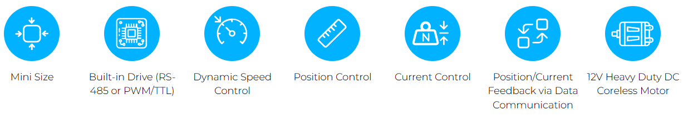
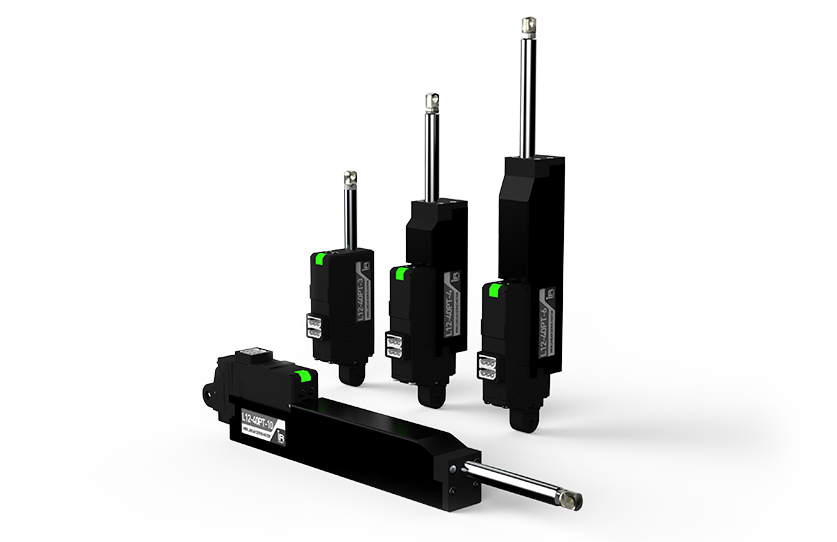

# 12Lf Servo Series
## Overview
The 2nd Generation of mightyZAP actuators supporting position, current and speed control. Both MODBUS RTU & IR Open Protocols available

## Features
- **The 2nd generation mightyZAP series supporting dynamic speed & current control as well as position control along with position & current feedback**
- **Built-in drive circuit, position sensor, 12mm diameter coreless DC motor and gear box**
- **27/40/53/90mm stroke option**
- **Rated Load of 12N ~ 100N according to gear ratio for each stroke**
	- Speed is inversely proportional to Rated Load, so the stronger the Rated Load, the slower the speed.
- **Support RS-485 or TTL / PWM communication**
    * TTL / PWM communication version operates by automatically recognizing the input TTL / PWM signal
    * When using PWM communication, only the position command is available without position feedback (For feedback feature, use TTL or RS-485 communication)
- **Both MODBUS RTU and IR open protocols available (Default : IR Open protocol)**