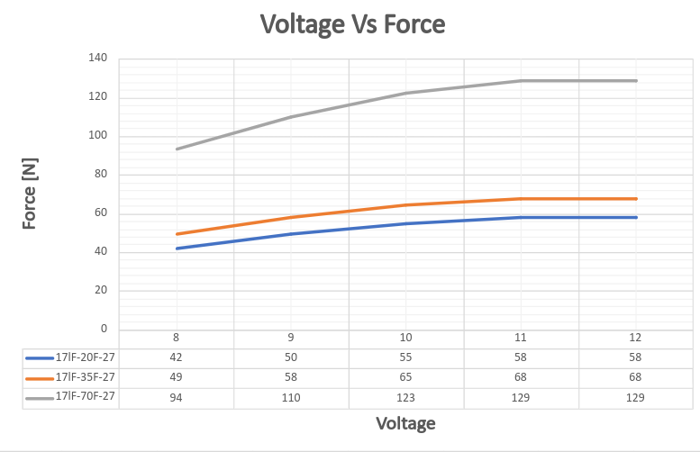
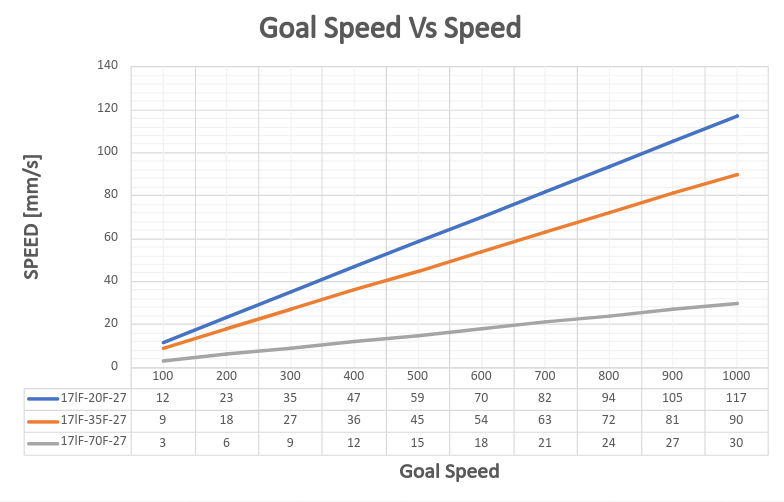
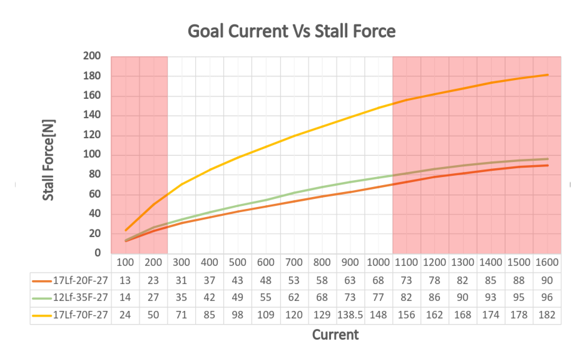
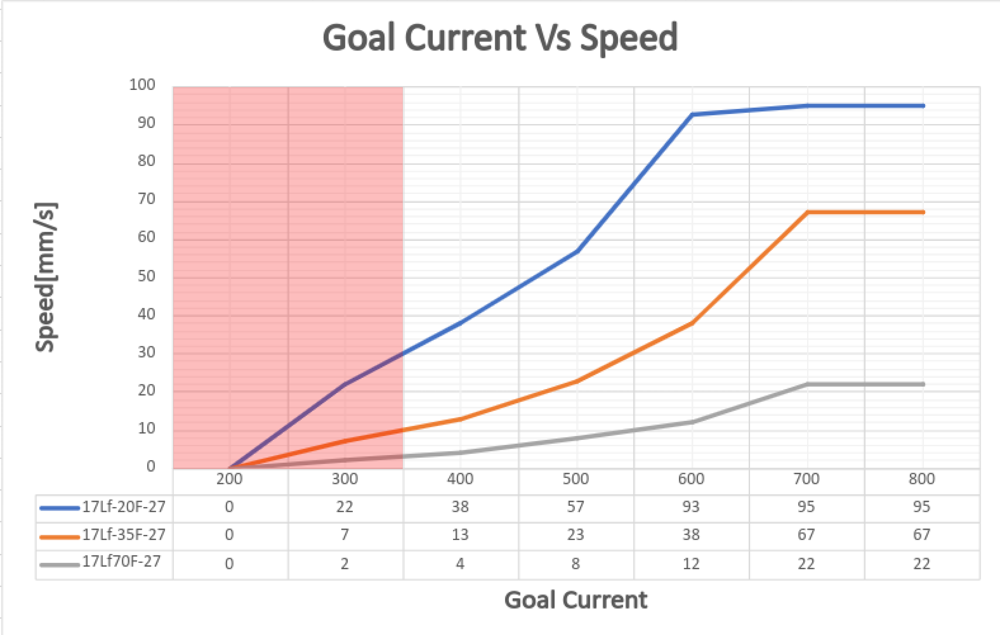
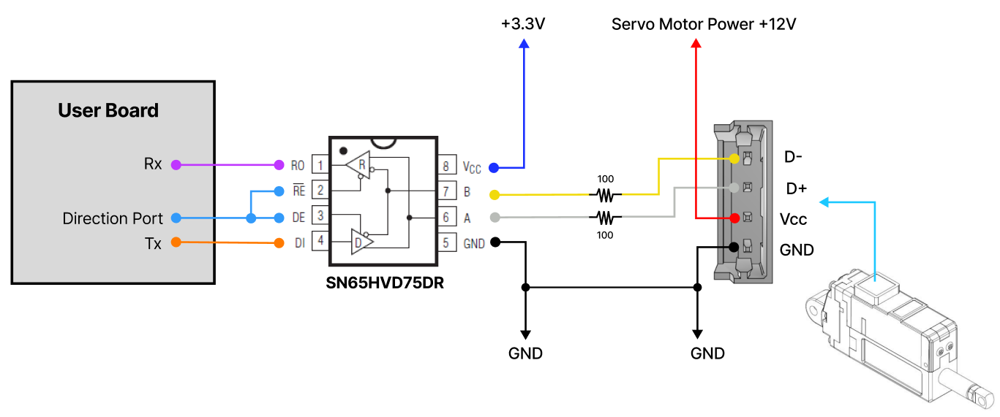
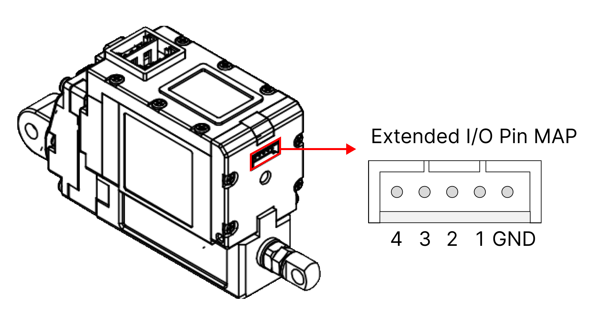
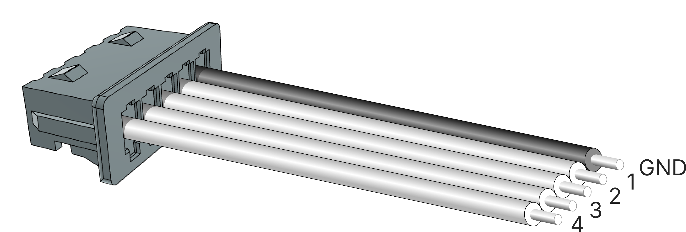
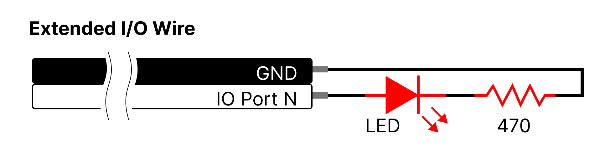
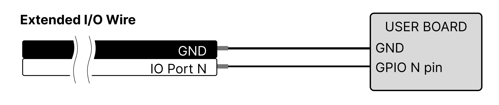
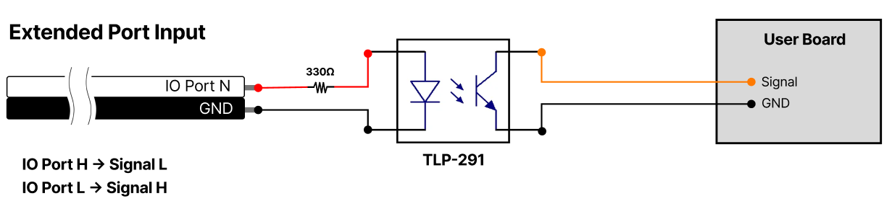

## 1 Features
- Micro size
- Precise position control & feedback
- Stall Force control by current feedback
- Speed control (1000 resolution)
- Strong force comparing to the size
- Built-in Drive Circuitry
- RS-485 communication
- MODBUS RTU Protocol
- Extended I/O Port
- Action function (No coding)
- Parameter programmable on the Manager software

## 2 Specification
### 2.1 Common Specifications
| **Property** | Value |
| -------------------- | ---------------- |
| **Stroke** | 27mm |
| **Rated Load** | 20N ⁓ 70N according to leadscrew pitch |
| **Recommended duty cycle at rated load** | Under 50% |
| **Micro controller** | 32bit Arm Cortex |
| **Position Resolution** | 10000 Resolution (A/D Converter) |
| **Input Voltage** | 12.0V(Rated), 8V ⁓ 13 V(Operating) |
| **Motor Type / Watt** | Coreless DC Motor / 3.8 Watt |
| **Current consumption** | 30mA(Idle), 400mA(Rated), 1.6A(Stall) |
| **Position repeatability** | Unidirectional less than +/-0.03mm(30um) |
| ^ | Bydirectional less than +/-0.06mm(60um) |
| **Current Tolerance** | ±15% at Over 50mA |
| **Position sensor** | 10kΩ linearity potentiometer |
| **Size, Weight** | 57.5(L)x 40.6(W)x 23(H)mm / 65.5g [+/-5%] |
| **Communication** | RS-485 |
| **Protocol** | MODBUS RTU |
| **Operating Temperatures** | -10℃ ⁓ 60℃ |
| **Ingress protection** | IP54 |
| **Mechanical Backlash** | 0.03mm(30um) |
| **Audible Noise** | Max. 50db at 1m |
| **Gear ratio** | 9.3 : 1 |
| **Gear type** | Engineering Plastic |
| **Rod type** | Stainless Steel |
| **Standard Accessory** | 1 x Hinge base  1 x Hinge  1 x Hinge shaft  1 x Rod end tip  2 x M3 NUT  3 x M2.5x6 screws  1 x RS485 Molex wire harness (200mm)  1 x Extended I/O Molex wire harness (200mm)  1 x M3 spanner  1 x Socket set screw |
| **Connector Type (Male) in the Actuator** | MOLEX 53253-0470 |
| **Wire Harness** | Molex(51065-0400) to Molex(51065-0400)/ 200mm / 0.08x60(22AWG) |
| **Extended I/O Wire Harness** | Molex(51021-0500), 5pins / 200mm length, 0.16 x 7 (26AWG) |

### 2.2 Voltages
| Parameter | Min | Norm | Max | Unit | Note |
| :--------------------------------- | :--: | :--: | :--: | :--: | :-----------: |
| **Supply voltage** | 8 | 12 | 13 | V |   |
| **Logic input voltage** | -7.0 | - | 12.0 | V | RS-485 D-, D+ |

### 2.3 Currents
| Parameter | Min | Norm | Max | Unit | Note |
| :-------------------------------------------------- | :-- | :--- | :-- | :--- | :-------------------------------------------------- |
| **Maximum peak Current** | | ≤1.6 | | A | Stall Current |
| **No Load Current** | | ≤300 | | mA | No Load |
| **Rated Load Current** | | ≤400 | | mA | at over Goal current800mA setting |
| **Max Applicable Load Current** | | ≤600 | | mA | at Goal current 1.6Asetting |
| **Idle Current** | | ≤30 | | mA | |

### 2.4 Temperatures
| Parameter | Min | Norm | Max | Unit | Note |
| :-------------------------- | :-: | :--: | :-: | :--: | :--: |
| **StorageTemp.** | -20 | - | 70 | ℃ | |
| **Operating Temp** | -10 | - | 60 | ℃ | |

### 2.5 Strokes
| Parameter | Min | Norm | Max | Unit | Note |
| :-------------------------- | :--- | :--- | :--- | :--- | :--- |
| **MIN Position** | 3.3 | 3.8 | 4.3 | mm | |
| **MAX Position** | 30.3 | 30.8 | 31.3 | mm | |
| **Stroke length** | | 27.0 | | mm | |

⁕Min/Max position values ​​can be synchronized using the "Min/Max Position Calibration" function on the Manager software or parameter coding.

### 2.6 No Load Speed
| Parameter | Min | Norm | Max | Unit | Note |
| :------------------------------------------ | :---- | :---- | :---- | :--- | :---------- |
| Maximum Speed at 12.0V | 105.3 | 117.0 | 128.7 | mm/s | 17Lf-20F-27 |
| ^ | 81 | 90 | 99 | mm/s | 17Lf-35F-27 |
| ^ | 27 | 30 | 33 | mm/s | 17Lf-70F-27 |
### 2.7 Load
| Parameter | Rated | Unit | Note |
| :----------------------------- | :---: | :--: | :---------- |
| Load at 12.0V | 20 | N | 17Lf-20F-27 |
| ^ | 4.49 | lbf | ^ |
| ^ | 2.04 | kgf | ^ |
| ^ | 35 | N | 17Lf-35F-27 |
| ^ | 7.86 | lbf | ^ |
| ^ | 3.57 | kgf | ^ |
| ^ | 70 | N | 17Lf-70F-27 |
| ^ | 15.73 | lbf | ^ |
| ^ | 7.14 | kgf | ^ |

### 2.8 Self Lock Feature
| Parameter | Min | Norm | Max | Unit | Note |
| :--------- | :-: | :-----------: | :-: | :--: | :---------- |
| Seklf Lock | | N/A | - | | 17Lf-20F-27 |
| ^ | - | N/A | - | | 17Lf-35F-27 |
| ^ | - | Available | - | | 17Lf-70F-27 |

## 3 Reference Data
### 3.1 Voltage Vs Speed
The graph of the speed change according to the input voltage at no-load condition. This data contains errors, so please use it for reference only.

>[!note] Note
>Tested at Goal Current 800.

### 3.2 Voltage Vs Stall Force
The Stall Force graph according to the input voltage. This data contains errors, so please use it for reference only.

>[!note] Note
>Tested at Goal Current 800.

> [!warning] CAUTION
>The error for each Force value is +/- 15%.

### 3.3 Goal Speed Vs Speed
No-load speed according to the change in the Goal Speed parameter value. Depending on the load, the maximum speed may be reduced or the time to reach maximum speed may be longer.

>[!note] Note
>Tested at Goal Current 800.

### 3.4 Goal Current vs Stall Force
The Stall Force for the Goal Current setting value.

The Stall Force is measured by minimizing the speed value to measure only the force for pure current values.
>[!warning] CAUTION
>The error of the Stall Force value corresponding each Goal Current value is +/- 15%.
>The areas marked in red has a relatively large error due to the internal load (for 200mA or less) and heat generation (for 1100mA or more), so please use it only for reference.
>If a continuous load occurs and a current of 1A or more flows, the current value gradually decreases and converges to 1A, and if the overload protection function is activated, an overload alarm and shutdown occur within several seconds.

>[!tip] TIP
>This data represents the power of the DC motor, and we recommend users to set the Goal current to 3 times the actual load applied to the actuator.
>The smaller the difference between the actual load and the power produced by the motor, the slower the motor speed will be, and if they are the same, the motor will not move.

>[!warning] CAUTION : Setting the maximum allowable load (twice the rated load)
>Maximum allowable load is the twice the rated load. In this case, the Duty Rate must be lower than 20%.
>**EX>**
>
>|Load|Goal Current|Duty rate|Load|Goal Current|Duty Rate|
>|---|---|---|---|---|---|
>|20N(Rated)|800|Max. 50%|35N(Rated)|800|Max. 50%|
>|40N(Max)|1600|Max. 20%|70N(Max)|1600|Max. 20%|

### 3.5 Goal Current vs Speed at Rated Load
The speed change of mightyZAP for the Goal Current setting value at rated load.

For rated load speed, it shows about 80 to 90% of the no-load maximum speed depending on the model.
>[!Note] Note
>Measured under rated load.

 >[!warning] CAUTION
>Speed Data has an error of about +/-10%.
>The area marked in red is where the Stall Force at the corresponding Goal Current setting and the rated load are similar, so mightyZAP may not move. Please use it for reference only.

### 3.6 PIN Map
##### 3.6.1 RS-485 PIN Map
##### 3.6.1.1 PIN MAP Table

| PIN NUMBER(COLOR) | PIN NAME&nbsp; | 
FUNCTION
 |
| :---------------: | :------------: | :-----------------: |
| 1(YELLOW) | D- | RS-485- |
| 2(WHITE) | D+ | RS-485+ |
| 3(RED) | VCC | Power + |
| 4(BLACK) | GND | Power - |

In case of user board, user can implement the communication circuit as follows.

#### 3.6.2 Extended I/O Port
##### 3.6.2.1 PIN Map Table
>[!warning] CAUTION
>Since the Extended I/O is not isolated, please use a separate Photo Coupler or Relay to implement an isolated circuit for safety or use it with caution.

| PIN NUMBER(COLOR) | PIN NAME | FUNCTION |
| :---------------: | :-----------: | :---------------------------------------------------------------------------------- |
| GND (BLACK) | GND | GND |
| 1 (WHITE) | Extended IO 1 | Switch, JOG, Action Next, Action Enable, Force Off, Stop, Pause, Alarm Out, Restart |
| 2 (WHITE) | Extended IO 2 | Switch, JOG, Action Next, Action Enable, Force Off, Stop, Pause, Alarm Out, Restart |
| 3 (WHITE) | Extended IO 3 | Action Enable, Force Off, Stop, Pause, Alarm Out, Restart |
| 4 (WHITE) | Extended IO 4 | Action Enable, Force Off, Stop, Pause, Alarm Out, Restart |
>[!note]
>For the detailed description of each I/O function, please refer to the 17Lf series User Manual [[mightyZAP 17Lf User Manualeng#2.4.18 Extended I/O Control |17Lf User manual 2.4.18 Extended I/O Control]] (==링크연결안됨)==

**Extended I/O Pin Map**

**Extended I/O Wire**

##### 3.6.2.2 Circuit connection according to function
- **Switch/ JOG**
	- Switch: When SW1 (Short Stroke Limit) or SW2 (Long Stroke Limit) is pressed, the motor moves to each position.
	- JOG: When SW1 (Short Stroke Limit) or SW2 (Long Stroke Limit) is pressed, the motor moves while pressing in each direction.

- **Action Enable / Force Off / Stop / Pause / Restart**
	- Action Enable: Start/stop the internal Action operation.
    - Force Off: On/Off the motor's driving force.
    - Stop: The motor stops and sets the stopped position as a Goal position.
    - Pause: The motor pauses, then actuator moves to the original Goal position when the switch is pressed again.
    - Restart: Restarts the servo actuator system.
  
- **Alarm Out**
	- Turns ON when a Hardware Error occurs.
  
  
##### 3.6.2.3 Isolated Circuit
  - **Switch/ JOG / Action Enable / Force Off / Stop / Pause / Restart**
  
  - **Alarm Out**
  