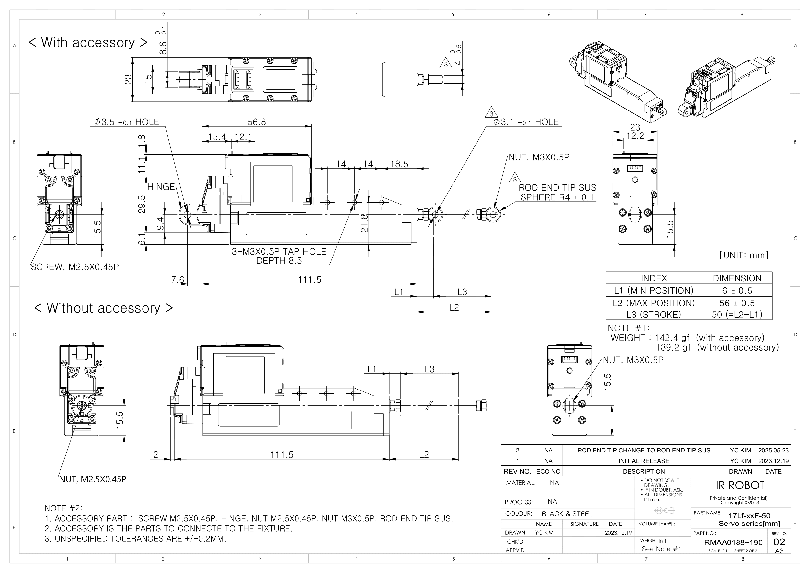
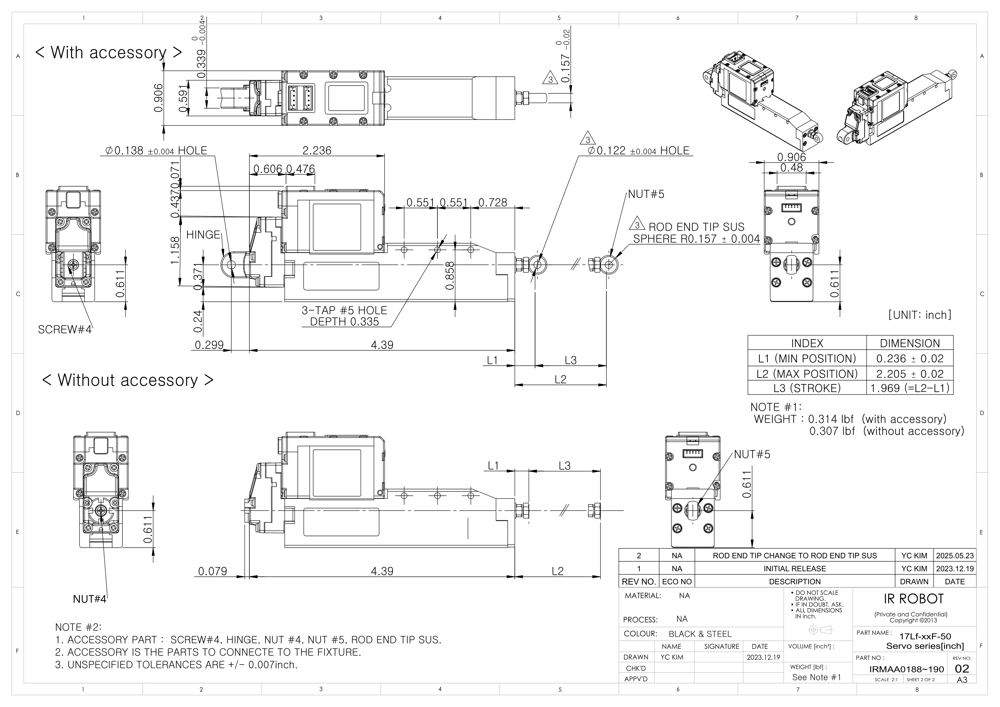

# 17Lf-xx-50 Drawings
## 17Lf-xx-50 Uint : mm
  
**Download** <a class="downloadbtn" href="./data/ENG-17Lf-xxF-50-Sevo-Seriesmm_Rev02_20250523.pdf" download>PDF</a> <a class="downloadbtn" href="./data/17Lf-xxxxx-50-Servo-Series_Rev02_20250523.step" download>STEP</a> <a class="downloadbtn" href="./data/17Lf-xxxxx-50-Servo-Seriesmm_Rev02_20250523.DXF" download>DXF</a>
## 17Lf-xx-50 Uint : Inch
  
**Download** <a class="downloadbtn" href="./data/17Lf-xxxxx-50-Servo-Seriesinch_Rev02_20250523.pdf" download>PDF</a> <a class="downloadbtn" href="./data/17Lf-xxxxx-50-Servo-Series_Rev02_20250523.step" download>STEP</a> <a class="downloadbtn" href="./data/17Lf-xxxxx-50-Servo-Seriesinch_Rev02_20250523.DXF" download>DXF</a>