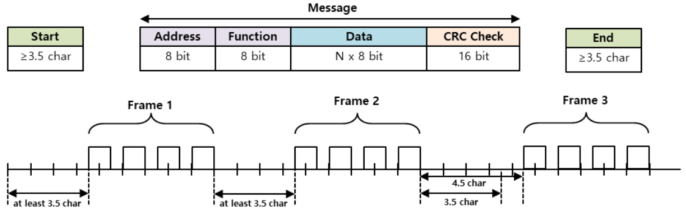

# 1 Introduction

The MODBUS is an industrial protocol and is a standard protocol mainly used for PLC communication.
MODBUS has several different types - RTU, ASCII, and recently TCP method, and we have applied MODBUS RTU for our actuators. 

The industry's de facto serial standard since 1979, MODBUS has enabled millions of automation devices to communicate stably & safely.
MODBUS is a request/response protocol and provides services specified by function code. The frame consists of ADU, which is an Application Data Unit, and PDU, which stands for Protocol Data Unit.

The mightyZAP 17Lf series only provides MODBUS RTU protocol based on RS-485 communication. (For old 12Lf series, IR open protocol is the default protocol, and the user can switch to MODBUS RTU.)

# 2 Frame Structure
## 2.1 Packet Description
The mightyZAP complies with the standard MODBUS-RTU protocol.
For the detailed MODBUS RTU specification not covered in this manual, please refer to the MODBUS official website. [https://www.modbus.org/specs.php]. 

### 2.1.1 Packet Structure
The maximum transmit/receive packet length of the MODBUS-RTU protocol is 256 Bytes. Therefore, please be careful that the total length of the TX/RX packets does not exceed 256 bytes.
MODBUS-RTU communication mode requires an empty space of at least 3.5 Char between the Start and End to distinguish packets as shown in the figure below .

- **Transmit Packet Structure

|      | Address      | Fucntion code | Data | <                  | <                  | Error Check | <        |
| ---- | ------------ | ------------- | ---- | ------------------ | ------------------ | ----------- | -------- |
| byte | 0            | 1             | 2    | 
…
 | 
…
 | n-1         | n        |
| Data | mightyZAP ID | Function      | Data | 
…
 | 
…
 | CRC(MSB)    | CRC(LSB) |

- **Receive Packet Structure - Normal Response

|      | Address      | Fucntion code | Data | <                  | <                  | Error Check | <        |
| ---- | ------------ | ------------- | ---- | ------------------ | ------------------ | ----------- | -------- |
| byte | 0            | 1             | 2    | 
…
 | 
…
 | n-1         | n        |
| Data | mightyZAP ID | Function      | Data | 
…
 | 
…
 | CRC(MSB)    | CRC(LSB) |

- **Receive Packet Structure - Abnormal Response

|      | Address      | Fucntion code   | Data           | Error Check | <        |
| ---- | ------------ | --------------- | -------------- | ----------- | -------- |
| byte | 0            | 1               | 2              | 3           | 4        |
| Data | mightyZAP ID | Function + 0x80 | Exception code | CRC(MSB)    | CRC(LSB) |
### 2.1.2 Packet Element Description
#### 2.1.2.1 Start
- This refers to the minimum time to distinguish between different frames.
- At a communication speed of 57600bps, the transmission time for 1 bit is 0.017msec, and since the start time is 3.5 character time (1 character = 8bit), the minimum start time is 0.486msec.
- If a frame shorter than the minimum start time is transmitted, it is recognized as continuous data from the previous frame.
#### 2.1.2.2 Address
- mightyZAP's ID.  An identifier to support Serial daisy chain connection in a multi-connection method. 
- With the ID '0', it operates as Broadcasting ID.
#### 2.1.2.3 Function Code
- The MODBUS-RTU standard function code supported by mightyZAP is as follows.

| Function                | Code | Description                                                 |
| ----------------------- | ---- | ----------------------------------------------------------- |
| Read Holding Register   | 0x03 | Reading data from mightyZAP                                 |
| Write Single Register   | 0x06 | Setting data value in a specific address of mightyZAP       |
| Write Multiple Register | 0x10 | Setting data values ​​in consecutive addresses of mightyZAP |

#### 2.1.2.4 Data
<b>Transmission</b>
- In the case of the Read Register command, the MODBUS address, number of registers, number of bytes, etc. are specified, and in the case of the Write Register command, the MODBUS address, number of bytes, value to be set, etc. are specified.

<b>Reception</b>
- In the case of the Read Register command, the normal response is that the Node ID and Function Code are received with the same values ​​as when transmitted, and the data is received as the value of each register according to the order of the registers sent during transmission.
- In the case of the Write Single Register command, the same data as transmitted is received. In the case of Write Multi Register, the starting address and number of registers for which data is to be written are received with the Write Multi Register command.
- In the case of an abnormal response, it consists of Node ID, Error Code, and Exception Code, and the packet structure of the abnormal response is the same regardless of the function code.
- In the case of an abnormal response, it consists of Node ID, Error Code, and Exception Code, and the packet structure of the abnormal response is the same regardless of the function code.
#### 2.1.2.5 CRC
- Enter a 16-bit CRC value and it consists of 2 bytes.
- The transmission order is lower 1 byte, upper 1 byte.
- CRC Check Method is CRC-16(X^16 + X^15+X^2+1).
  For easier calculation, get CRC-16 MODBUS calculator on the Internet. 
#### 2.1.2.6 Exception Code
- Exception codes for abnormal responses to all function codes supported by mightyZAP are defined as follows.

| Exception Code |                      | Description                                           |
| -------------- | -------------------- | ----------------------------------------------------- |
| 0x01           | Illegal Function     | Function code which are not supported                 |
| 0x02           | Illegal Data Address | Invalid register address                              |
| 0x03           | Illegal Data Value   | Invalid data value                                    |
| 0x04           | Slave Device Failure | Device failure, parameter setting value error (ready) |
| 0x05           | Acknowledge          | Data is not ready (ready)                             |
| 0x06           | Slave Device Busy    | Parameter lock status                                 |

## 2.2 Protocol Function Code Description
### 2.2.1 Read Holding Register (0x03)
Reads the values ​​of a single register (16-bit data) and consecutive register blocks (16-bit data units).
#### 2.2.1.1 Packet Description
<b>Request Frame</b>

|            | Address | Fucntion code | Starting Address | Quantity of Register |  CRC   |
| ---------- | :-----: | :-----------: | :--------------: | :------------------: | :----: |
| Size(byte) | 1 byte  |    1 byte     |      2 byte      |        2 byte        | 2 byte |
| Data       |         |     0x03      | 0x0000 to 0xffff |    1 to 125(0x7d)    |        |

<b>Request OK</b>

|            | Address | Fucntion code | Byte Count | Register Value |  CRC   |
| ---------- | :-----: | :-----------: | :--------: | :------------: | :----: |
| Size(byte) | 1 byte  |    1 byte     |   1 byte   |  N* x 2 bytes  | 2 byte |
| Data       |         |     0x03      |   2 x N*   |                |        |
*N = Quantity of Registers

<b>Request not OK</b>

|            | Address | Error code | Exception Code |  CRC   |
| ---------- | :-----: | :--------: | :------------: | :----: |
| Size(byte) | 1 byte  |   1 byte   |     1 byte     | 2 byte |
| Data       |         |    0x83    |  0x01 to 0x06  |        |
#### 2.2.1.2 Frame Detail
- **Address**  
  Unique ID of mightyZAP from which user wants to read data.
- **Function Code** 
  Code 0x03, meaning Read Holding Register command
- **Starting Address** 
  Starting address of the data which user wants to read and it consists of 2 bytes.
- **Quantity of Register** 
  Size of the data to be read and it consists of 2 bytes.
- **CRC** 
  It uses the CRC error check method and consists of 2 bytes.
- **Byte Count** 
  Number of responding data.
- **Register Value** 
  Data is transmitted in byte units using the address of the request frame as the starting address. Since the data is a WORD type, the size is the same as doubling the number of bytes.
 - **Error code** 
   The error code is expressed by adding the value 80 (Hex) to the function code. In the case of the Read Holding register, it is transmitted as 83 (Hex).
- **Exception code** 
  Detailed error details and it consists of 1 byte.
#### 2.2.1.3 Example
<b>Example</b> #1 - Read Present Position (0xD2)
- Request 

| Address | Fucntion  code | Starting  Address Hi | Starting  Address Lo | Quantity of Register Hi | Quantity of Register Lo | CRC Lo | CRC hi |
| :-----: | :---------------: | :---------------------: | :---------------------: | :---------------------: | :---------------------: | :----: | :----: |
|  0x01   |       0x03        |          0x00           |          0xD2           |          0x00           |          0x01           |  0x24  |  0x33  |
- Request OK -Present Position Data :1000

| Address | Fucntion  code | Byte  Count | Register  value Hi | Register  value Lo | CRC  Lo | CRC  hi |
| :-----: | :---------------: | :------------: | :-------------------: | :-------------------: | :--------: | :--------: |
|  0x01   |       0x03        |      0x02      |         0x03          |         0xe8          |    0xB8    |    0xFA    |
 - Request Not OK 
 
| Address | Error  code | Exception  Code | CRC  Lo | CRC  hi |
| :-----: | :------------: | :----------------: | :--------: | :--------: |
|  0x01   |      0x83      |        0x04        | CRC  Lo | CRC  hi |

<b>Example</b> #2 - Read Present Current (0xD3)
- Request

| Address | Fucntion  code | Starting  Address Hi | Starting  Address Lo | Quantity of Register Hi | Quantity of Register Lo | CRC Lo | CRC hi |
| :-----: | :---------------: | :---------------------: | :---------------------: | :---------------------: | :---------------------: | :----: | :----: |
|  0x01   |       0x03        |          0x00           |          0xD3           |          0x00           |          0x01           |  0x75  |  0xf3  |
- Request OK -Present Current Data : 426

| Address | Fucntion  code | Byte  Count | Register  value Hi | Register  value Lo | CRC  Lo | CRC  hi |
| :-----: | :---------------: | :------------: | :-------------------: | :-------------------: | :--------: | :--------: |
|  0x01   |       0x03        |      0x02      |         0x01          |         0xAA          |    0x39    |    0xAB    |
 - Request Not OK 

| Address | Error  code | Exception  Code | CRC  Lo | CRC  hi |
| :-----: | :------------: | :----------------: | :--------: | :--------: |
|  0x01   |      0x83      |        0x04        |    0x40    |    0xF3    |
### 2.2.2 Write Single Register
Writes a value to a single register (16-bit data).
#### 2.2.2.1 Packet Description
<b>Request</b>  

|            | Address | Fucntion code | Register Addresse |  Register Value  |  CRC   |
| ---------- | :-----: | :-----------: | :---------------: | :--------------: | :----: |
| Size(byte) | 1 byte  |    1 byte     |      2 byte       |      2 byte      | 2 byte |
| Data       |         |     0x06      | 0x0000 to 0xffff  | 0x0000 to 0xffff |        |

<b>Request OK</b>  

|            | Address | Fucntion code | Register Addresse |  Register Value  |  CRC   |
| ---------- | :-----: | :-----------: | :---------------: | :--------------: | :----: |
| Size(byte) | 1 byte  |    1 byte     |      2 byte       |      2 byte      | 2 byte |
| Data       |         |     0x06      | 0x0000 to 0xffff  | 0x0000 to 0xffff |        |

*N = Quantity of Registers

<b>Request not OK</b>  

|            | Address | Error code | Exception Code |  CRC   |
| ---------- | :-----: | :--------: | :------------: | :----: |
| Size(byte) | 1 byte  |   1 byte   |     1 byte     | 2 byte |
| Data       |         |    0x86    |  0x01 to 0x06  |        |
#### 2.2.2.2 Frame Detail
- **Address** 
  Unique ID of mightyZAP where the user wants to write data.
- **Function Code** 
  Code 0x06, meaning Write Single Register command.     
- **Register Address**
  Address of the data user wants to write and it consists of 2 bytes.
- **Register Value** 
  Data value user wants to write and it consists of 2 bytes.
- **CRC** 
  It uses the CRC error check method and consists of 2 bytes.
- **Error code** 
  The error code is expressed by adding the value 80 (Hex) to the function code, and in the case of the Read Holding register, it is transmitted as 83 (Hex).
- **Exception code** 
  Detailed error details and it consists of 1 byte.
#### 2.2.2.2 Example
<b>Example</b> #1 - Write Goal Position (0xCD)
- Request - Goal Position Data : 1000

| Address | Fucntion  code | Register Address Hi | Register  Address Lo | Register Value Hi | Register Value Lo | CRC Lo | CRC hi |
| :-----: | :---------------: | :--------------------: | :---------------------: | :---------------: | :---------------: | :----: | :----: |
|  0x01   |       0x06        |          0x00          |          0xCD           |       0x03        |       0xE8        |  0x18  |  0x8B  |
- Request OK 

| Address | Fucntion  code | Register Address Hi | Register  Address Lo | Register Value Hi | Register Value Lo | CRC Lo | CRC hi |
| :-----: | :---------------: | :--------------------: | :---------------------: | :---------------: | :---------------: | :----: | :----: |
|  0x01   |       0x06        |          0x00          |          0xCD           |       0x03        |       0xE8        |  0x18  |  0x8B  |
 - Request Not OK

| Address | Error  code | Exception  Code | CRC  Lo | CRC  hi |
| :-----: | :------------: | :----------------: | :--------: | :--------: |
|  0x01   |      0x86      |        0x04        | CRC  Lo | CRC  hi |
<b>Example</b> #2 - Write Goal Current (0xD3)
- Request - Goal Current Data : 800

| Address | Fucntion  code | Register Address Hi | Register  Address Lo | Register Value Hi | Register Value Lo | CRC Lo | CRC hi |
| :-----: | :---------------: | :--------------------: | :---------------------: | :---------------: | :---------------: | :----: | :----: |
|  0x01   |       0x06        |          0x00          |          0xD1           |       0x03        |       0x20        |  0xD8  |  0xDB  |
- Request OK 

| Address | Fucntion  code | Starting  Address Hi | Starting  Address Lo | Quantity of Register Hi | Quantity of Register Lo | CRC Lo | CRC hi |
| :-----: | :---------------: | :---------------------: | :---------------------: | :---------------------: | :---------------------: | :----: | :----: |
|  0x01   |       0x06        |          0x00           |          0xD1           |          0x03           |          0x20           |  0xD8  |  0xDB  |

- Request Not OK

| Address | Error  code | Exception  Code | CRC  Lo | CRC  hi |
| :-----: | :------------: | :----------------: | :--------: | :--------: |
|  0x01   |      0x86      |        0x04        |    0x40    |    0xF3    |
### 2.2.3 Write Multi Register(0x10)
Writes values ​​to consecutive register blocks (16-bit data units).
#### 2.2.3.1 Packet Description
<b>Request</b>  

|            | Address | Fucntion code | Starting Address |    Quantity of Register    | Byte Count | Registers Value |  CRC   |
| ---------- | :-----: | :-----------: | :--------------: | :------------------------: | ---------- | --------------- | :----: |
| Size(byte) | 1 byte  |    1 byte     |     2 bytes      |          2 bytes           | 1Byte      | N* x 2 Bytes    | 2 byte |
| Data       |         |     0x10      | 0x0000 to 0xffff | 0x0000 to 1 to 0x007B(123) | 2 x N*     | value           |        |

<b>Request OK</b>  

|            | Address | Fucntion code | Starting Address |    Quantity of Register    |  CRC   |
| ---------- | :-----: | :-----------: | :--------------: | :------------------------: | :----: |
| Size(byte) | 1 byte  |    1 byte     |     2 bytes      |          2 bytes           | 2 byte |
| Data       |         |     0x10      | 0x0000 to 0xffff | 0x0000 to 1 to 0x007B(123) |        |

*N = Quantity of Registers

<b>Request not OK</b>  

|            | Address | Error code | Exception Code |  CRC   |
| ---------- | :-----: | :--------: | :------------: | :----: |
| Size(byte) | 1 byte  |   1 byte   |     1 byte     | 2 byte |
| Data       |         |    0x90    |  0x01 to 0x06  |        |
#### 2.2.3.2 Frame Detail
- **Address** 
  The unique ID of mightyZAP which user wants to write data.
- **Function Code** 
  Code 0x10, meaning Write Multi Register command
- **Start Addresse** 
  Starting address of the data user wants to write in succession and it consists of 2 bytes.
- **Quantity of Register** 
  Size of data user wants to write and it consists of 2 bytes.
- **Byte Count** 
  Number of data user wants to write in succession.
- **Registers Value** 
  A set of 2 bytes as the value of the data user wants to write. Must add as many data sets as user entered in Byte Count.
- **CRC** 
  It uses the CRC error check method and consists of 2 bytes.
- **Error code** 
  The error code is expressed by adding 80 (Hex) to the function code, and in the case of the read holding register, it is transmitted as 0x90.
- **Exception code** 
  Detailed error details and it consists of 1 byte.
#### 2.2.3.3 Example
<b>Example</b> #1 - Multi Write Goal Speed(0xD0) & Goal Current (0xD1)
- Request - Goal Speed Data : 1000, Goal Current Data : 800

| Address | Fucntion  code | Starting Address Hi | Starting  Address Lo | Quatity of Register Hi | Quatity of Register Lo | Byte Count | Register Value Hi | Register Value Lo | Register Value Hi | Register Value Lo | CRC Lo | CRC hi |
| :-----: | :---------------: | :--------------------: | :---------------------: | :--------------------: | :--------------------: | ------------- | -------------------- | -------------------- | -------------------- | -------------------- | :----: | :----: |
|  0x01   |       0x10        |          0x00          |          0xD0           |          0x00          |          0x02          | 0x04          | 0x03                 | 0xE8                 | 0x03                 | 0x20                 |  0x7F  |  0xAB  |
- Request OK 

| Address | Fucntion  code | Starting Address Hi | Starting  Address Lo | Quatity of Register Hi | Quatity of Register Lo | CRC Lo | CRC hi |
| :-----: | :---------------: | :--------------------: | :---------------------: | :--------------------: | :--------------------: | :----: | :----: |
|  0x01   |       0x10        |          0x00          |          0xD0           |          0x00          |          0x02          |  0x40  |  0x31  |
 
- Request Not OK

| Address | Error  code | Exception  Code | CRC  Lo | CRC  hi |
| :-----: | :------------: | :----------------: | :--------: | :--------: |
|  0x01   |      0x83      |        0x04        |    0x40    |    0xF3    |
# 3. Packet Test

