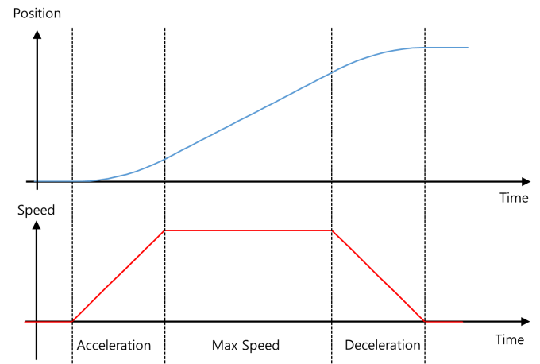
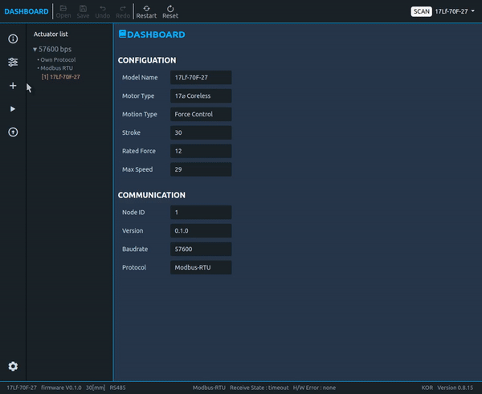
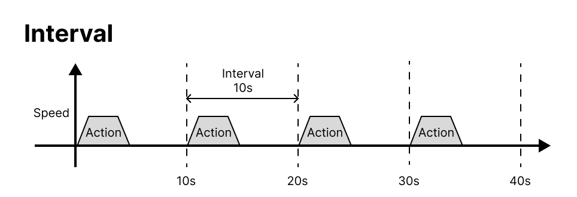
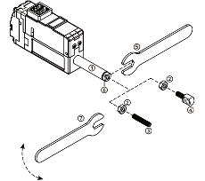

### **Check your product series!  
Does your model number start with 17Lf-?  
> This manual is dedicated for the 17Lf series actuators which only supports MODBUS RTU protocol.  For the users with 12Lf, L12, D12/7 series, please refer to separated manuals. 

# 1. Introduction
The mightyZAP micro linear servo actuators have been designed for robust, precise linear motion in tight spaces in a variety of industries with position, current and speed control feature. The 17Lf servo series is the new mightyZAP servo actuators with a 17mm diameter DC motor offering increased durability and faster speed at the similar rated load specification comparing to the 12Lf series.  The overall functionality is almost same as the 12Lf series, but note that user expandability has been improved through expansion I/O ports, enabling easier and more convenient control.  Only RS-485 communication using MODBUS RTU protocol is provided. 
>[!danger] Caution
> 1. Use within the rated load spec : Constant load larger than rated load specification may lead a damage of the motor. 
> 2. Do not twist the rod :  If excessive twisting force is applied to the rod when installing the rod end tip, it may cause damage to internal components. (Fix the rod with the included M3 spanner and then attach the tips on the rod-end.)
> 3. Comply with the product's operating environment. (Input voltage : 8V~13V(Rated 12V),  Operating temperature : -10℃ ~ +60℃)
> 4. For optimal lifespan management, please do not exceed Duty Rate 50% and do not exceed maximum continuous operation time 30 seconds. Otherwise, an overload error alarm and shutdown will occur.
> 5. Be careful of incorrect wiring.
> 
>
> For detailed info, please refer to  [[#3.1 Precautions for use]] .

> [!warning] Handling and Storage
> - External case may become hot immediately after continuous operation. Be careful of burns.
> - Keep mightyZAP away from moisture, dust, and separation.
> - Designed for indoor use. Outdoor use is prohibited.
> - Keep the product out of reach of children. Even when used by adults, be aware of the risk of personal injury that may occur when the motor operates.
> 
> For detailed info, please refer to  [[#3.1 Precautions for use]] .
## 1.2 Specifications
### 1.2.1 17Lf Series Specifications
| Rated Load | Stroke | Model       | Max Speed (@no load) | Stall Force   at Current (1.6A/800mA/200mA) | Mechanical  Self Lock   (Z axis use)  | Lead Screw  / Gear Ratio  / Gear Type               |
| :--------- | :----- | :---------- | :---------------------- | :------------------------------------------------ | :------------------------------------------ | :-------------------------------------------------------- |
| 17N        | 37mm   | 17Lf-17F-37 | 82mm/s                  | 90N / 58N / 23N                                   | No   (Pay attention   to application) | Lead Angle 20° / 10:1   /Engineering  Plastic Gears |
| ^          | 50mm   | 17Lf-17F-50 | ^                       | ^                                                 | ^                                           | ^                                                         |
| ^          | 87mm   | 17Lf-17F-87 | ^                       | ^                                                 | ^                                           | ^                                                         |
| 20N        | 27mm   | 17-20F-27  | 117mm/s                 | ^                                                 | ^                                           | Lead Angle 22.2° / 9.3:1  /Engineering Plastic Gears   |
| 27N        | 37mm   | 17Lf-27F-37 | 82mm/s                  | 96N / 68N / 27N                                   | ^                                           | Lead Angle 15° / 10:1   /Engineering  Plastic Gears |
| ^          | 50mm   | 17Lf-27F-50 | ^                       | ^                                                 | ^                                           | ^                                                         |
| ^          | 87mm   | 17Lf-27F-87 | ^                       | ^                                                 | ^                                           | ^                                                         |
| 35N        | 27mm   | 17Lf-35F-27 | 90mm/s                  | ^                                                 | ^                                           | Lead Angle 17° / 9.3:1 /   Engineering Plastic Gears   |
| 50N        | 37mm   | 17Lf-50F-27 | 28mm/s                  | 182N / 129N / 50N                                 | Yes   (Applicable)                       | Lead Angle 5° / 10:1   /Engineering  Plastic Gears  |
| ^          | 50mm   | 17Lf-50F-50 | ^                       | ^                                                 | ^                                           | ^                                                         |
| ^          | 87mm   | 17Lf-50F-87 | ^                       | ^                                                 | ^                                           | ^                                                         |
| 70N        | 27mm   | 17Lf-70F-27 | 32mm/s                  | ^                                                 | ^                                           | ^                                                         |
### 1.2.2 Common Specifications
| Item | Stroke | < | Unidirectional |
| :--- | :--- | :--- | :--- |
| **Repeatability** | 27mm / 40mm | < | 30μm (0.03mm) |
| ^ | 53mm | < | 40μm (0.04mm |
| ^ | 90mm | < | 50μm (0.05mm)) |
| **Mechanical Backlash** | < | < | 0.03mm (30μm) |
| **Rod Type** | < | < | Metal Alloy Rod |
| **Motor Type** | < | < | Coreless DC  |
| **Input Voltage** | < | < | 12V (Rated) |
| **Watt** | < | < | 3.8W  |
| **Recommended Duty Cycle** | < | < | Max 50% |
| **Current Accuracy** | < | < | ±15% at Over 50mA |
| **Position Sensor** | < | < | 10KΩ linear Potentiometer |
| **Input Voltage Range** | < | < | 8~13V (Rated 12V) |
| **Current Consumption** | Idle | < | 20mA |
| ^ | Rated | < | 400mA |
| ^ | Stall | Default | 800mA |
| ^ | ^ | MAX | 1.6A |
| **Audible Noise** | < | < | Approx. 50db at 1m |
| **LED Indication** | < | < | Two Errors Indications (Input voltage, Overload) |
| **Pulse Signal / Pulse Range** | < | < | PWM mode to be added later by I/O Port (900μs(Retracted)-1500 μs(center)-2100μs (extended)) |
| **Communication Method / Protocol** | < | < | RS-485 / Modbus-RTU |
| **Ingress Protection** | < | < | IP-54 (Dust &amp; Water Tight) |
| **Dimension(LxHxW)   / Wight**     (Dimension   excluding the rod-end tip   and hinge)  | **27mm** | < | 57.5x40.6x23mm / 65.5g |
| ^ | **37mm** | < | 86.8x57.9x23mm / 113.5g |
| ^ | **50mm** | < | 111.5x57.9x23mm / 140g |
| ^ | **87mm** | < | 151.5x57.9x23mm / 188g |
| **Operating Temperature** | < | < | -10℃ ~ 60℃ |
| **Wire Harness** | < | < | **Comm./Power** : Molex to Molex Type (Molex 0510650400, 4pins) / 200mm length, 0.08×60(22AWG)   **I/O Port Wire harness** : Molex 510210500, 5pins / 200mm length, 0.16 x 7 (26AWG) |
### 1.2.3 Motor Performance Curve
  
# 2. Control Table
The Control Table consists of two types of Parameters for driving and controlling mightyZAP and for indicating the current status.
Using the communication packet, user is able to check the status of mightyZAP by reading feedback data of a specific parameter, or control mightyZAP by changing the data value.
>[!note] Note 
> 17Lf series only provides MODBUS RTU protocol. (IR Open protocol is no supported). For detailed infor for the communication packet, please refer to the [[17Lf Modbus RTU_eng|MODBUS RTU]] section.
>
## 2.1 Description  
### 2.1.1 Memory Type
The Control Table is divided into two areas. The one is Non-Volatile Memory (ROM), which retains the data even if the power is turned off after changing the data, and Volatile Memory (RAM) which initialize the data when the power is turned off/on.
- **Non-Volatile Memory (ROM)** :  Data modification may take approx. 250ms. Additionally, communication may be restricted while saving the memory. Generally, it is only used to set settings before operation. Saved data are not initialized even after power is re-applied.
- **Volatile Memory(RAM)** :  Used when changing data in real time and it consists of general motion control parameters. The data will be initialized when the power is re-applied.
### 2.1.2 Address  
In this manual, Address refers to the "Data Address" in the Control Table.
### 2.1.3 Size  
The data size of all parameters of mightyZAP 17Lf series is 2 bytes.
### 2.1.4 Access  (Access Rights)
Control Table Data is indicated as 'R' or 'RW'. 'R' stands for Read Only, and 'RW' means both Reading and Writing are allowed.
Read-only parameters are mainly used for basic information or monitoring of servo actuators.  Read-Write parameters are used for mightyZAP control purposes.

**Modbus RTU에서는 각 권한에 따라 아래의 명령을 사용하여 통신을 하실 수 있습니다. **
- Read 권한 : Modbus RTU 에서 Read Holding Register 명령을 이용하여 데이터를 읽어옵니다.
- Wirte 권한 : Write Single Register 명령을 이용하여 원하는 데이터를 쓰고, Read Holding Register를 이용하여 입력되어 있는 데이터를 확인할 수 있습니다.
### 2.1.5 Default  
Default value is the initial setting value from the factory. When the value in the Non-Volatile Memory area is modified by the user, the changed value is applied to the default value, and the Volatile Memory area displays the default value as the current state value when power is applied.

## 2.2 Non-volatile Memory (ROM)  

| Rergister Number | Address    | Name                      | Description                               | Access | Default         |
| :--------------- | :--------- | :------------------------ | :---------------------------------------- | :----- | :-------------- |
| 40001            | 0 (0x00)   | Serial Number             | Model Serial Number                       | R      |                 |
| 40002            | 1 (0x01)   | Firmware Version          | Firmware version                          | R      |                 |
| 40005            | 4 (0x04)   | mightyZAP ID              | mightyZAP ID                              | RW     | 1(0x01)         |
| 40006            | 5 (0x05)   | mightyZAP Baudrate        | Communication Speed                       | RW     | 32(0x20)        |
| 40010            | 9 (0x09)   | Alarm Led                 | Hardware Error Alarm LED Indication       | RW     | 33(0x21)        |
| 40011            | 10 (0x0A)  | Alarm Shutdown            | Hardware Error Alarm Function             | RW     | 33(0x21)        |
| 40012            | 11 (0x0B)  | Short Stroke Limit        | Retraction direction limit position value | RW     | 0(0x00)         |
| 40013            | 12 (0x0C)  | Long Stroke Limit         | Extension direction limit position value  | RW     | Each Spec       |
| 40014            | 13 (0x0D)  | Start Compliance Margin   | Start Compliance Margin                   | RW     | 20(0x14)        |
| 40015            | 14 (0x0E)  | End Compliance Margin     | End Compliance Margin                     | RW     | 8(0x08)         |
| 40016            | 15 (0x0F)  | Acceleration              | Acceleration                              | RW     | Individual Spec |
| 40017            | 16 (0x10)  | Deceleration              | Deceleration                              | RW     | Individual Spec |
| 40018            | 17 (0x11)  | Min Position Calibration  | Min Position Trim                         | RW     | Individual Spec |
| 40019            | 18 (0x12)  | Max Position Calibration  | Max Position Trim                         | RW     | Individual Spec |
| 40020            | 19 (0x13)  | Motor Operating Rate Limt | Motor Operating Rate Limit (Motor PWM)    | RW     | 1000            |
| 40021            | 20 (0x14)  | Speed Limit               | Speed Upper Limit                         | RW     | 1000            |
| 40022            | 21 (0x15)  | Current Limit             | Current Upper Limit                       | RW     | 800             |
| 40023            | 22 (0x16)  | Current I Gain            | Current I Gain                            | RW     | Individual Spec |
| 40024            | 23 (0x17)  | Current P Gain            | Current P Gain                            | RW     | Individual Spec |
| 40025            | 24 (0x18)  | Speed D Gain              | Speed D Gain                              | RW     | Individual Spec |
| 40026            | 25 (0x19)  | Speed I Gain              | Speed I Gain                              | RW     | Individual Spec |
| 40027            | 26 (0x1A)  | Speed P Gain              | Speed P Gain                              | RW     | Individual Spec |
| 40041            | 40 (0x28)  | Indirect Addess 0         | Indirect Addess 0                         | RW     | 0(0x00)         |
| 40042            | 41 (0x29)  | Indirect Addess 1         | Indirect Addess 1                         | RW     | 0(0x00)         |
| 40043            | 42 (0x2A)  | Indirect  Addess 2        | Indirect  Addess 2                        | RW     | 0(0x00)         |
| 40044            | 43 (0x2B)  | Indirect  Addess 3        | Indirect  Addess 3                        | RW     | 0(0x00)         |
| 40045            | 44 (0x2C)  | Indirect Addess 4         | Indirect Addess 4                         | RW     | 0(0x00)         |
| 40046            | 45 (0x2D)  | Indirect  Addess 5        | Indirect  Addess 5                        | RW     | 0(0x00)         |
| 40047            | 46 (0x2E)  | Indirect Addess 6         | Indirect Addess 6                         | RW     | 0(0x00)         |
| 40048            | 47 (0x2F)  | Indirect  Addess 7        | Indirect  Addess 7                        | RW     | 0(0x00)         |
| 40049            | 48 (0x30)  | Indirect  Addess 8        | Indirect  Addess 8                        | RW     | 0(0x00)         |
| 40050            | 49 (0x31)  | Indirect Addess 9         | Indirect Addess 9                         | RW     | 0(0x00)         |
| 40051            | 50 (0x32)  | Extened Port Setting 0    | Setting for extended Port 0               | RW     | 0(0x00)         |
| 40052            | 51 (0x33)  | Extened Port Setting 1    | Setting for extended Port 1               | RW     | 0(0x00)         |
| 40053            | 52 (0x34)  | Extened Port Setting 2    | Setting for extended Port 2               | RW     | 0(0x00)         |
| 40054            | 53 (0x35)  | Extened Port Setting 3    | Setting for extended Port 3               | RW     | 0(0x00)         |
| 40061            | 60 (0x3C)  | Action 0 type             | Action 0 Action type                      | RW     | 0(0x00)         |
| 40062            | 61 (0x3D)  | Action 0 distance         | Action 0 Moving Distance                  | RW     | 0(0x00)         |
| 40063            | 62 (0x3E)  | Action 0 Repeat Type      | Action 0 Repeat type                      | RW     | 0(0x00)         |
| 40064            | 63 (0x3F)  | Action 0 Repeat Count     | Action 0 Number of repetitions            | RW     | 0(0x00)         |
| 40065            | 64 (0x40)  | Action 0 Repeat Time      | Action 0  0 Operation time                | RW     | 0(0x00)         |
| 40066            | 65 (0x41)  | Action 0 Goal Speed       | Action 0 Goal Speed                       | RW     | 0(0x00)         |
| 40067            | 66 (0x42)  | Action 0 Goal Current     | Action 0 Goal Current                     | RW     | 0(0x00)         |
| 40068            | 67 (0x43)  | Action 0 Accleration      | Action 0 Acceleration                     | RW     | 0(0x00)         |
| 40069            | 68 (0x44)  | Action 0 Delceration      | Action 0 Deceleration                     | RW     | 0(0x00)         |
| 40070            | 69 (0x45)  | Action 0 Stop             | Action 0 Stop type                        | RW     | 0(0x00)         |
| 40071            | 70 (0x46)  | Action 1 type             | Action 1 Action type                      | RW     | 0(0x00)         |
| 40072            | 71 (0x47)  | Action 1 distance         | Action 1 Moving Distance                  | RW     | 0(0x00)         |
| 40073            | 72 (0x48)  | Action 1 Repeat Type      | Action 1 Repeat type                      | RW     | 0(0x00)         |
| 40074            | 73 (0x49)  | Action 1 Repeat Count     | Action 1 Number of repetitions            | RW     | 0(0x00)         |
| 40075            | 74 (0x4A)  | Action 1 Repeat Time      | Action 1, 1 operation time                | RW     | 0(0x00)         |
| 40076            | 75 (0x4B)  | Action 1 Goal Speed       | Action 1 Goal Speed                       | RW     | 0(0x00)         |
| 40077            | 76 (0x4C)  | Action 1 Goal Current     | Action 1 Goal Current                     | RW     | 0(0x00)         |
| 40078            | 77 (0x4D)  | Action 1 Accleration      | Action 1 Acceleration                     | RW     | 0(0x00)         |
| 40079            | 78 (0x4E)  | Action 1 Delceration      | Action 1 Deceleration                     | RW     | 0(0x00)         |
| 40080            | 79 (0x4F)  | Action 1 Stop             | Action 1 Stop type                        | RW     | 0(0x00)         |
| 40081            | 80 (0x50)  | Action 2 type             | Action 2 Action type                      | RW     | 0(0x00)         |
| 40082            | 81 (0x51)  | Action 2 distance         | Action 2 Moving Distance                  | RW     | 0(0x00)         |
| 40083            | 82 (0x52)  | Action 2 Repeat Type      | Action 2 Repeat type                      | RW     | 0(0x00)         |
| 40084            | 83 (0x53)  | Action 2 Repeat Count     | Action 2 Number of repetitions            | RW     | 0(0x00)         |
| 40085            | 84 (0x54)  | Action 2 Repeat Time      | Action 2, 1 operation time                | RW     | 0(0x00)         |
| 40086            | 85 (0x55)  | Action 2 Goal Speed       | Action 2 Goal Speed                       | RW     | 0(0x00)         |
| 40087            | 86 (0x56)  | Action 2 Goal Current     | Action 2 Goal Current                     | RW     | 0(0x00)         |
| 40088            | 87 (0x57)  | Action 2 Accleration      | Action 2 Acceleration                     | RW     | 0(0x00)         |
| 40089            | 88 (0x58)  | Action 2 Delceration      | Action 2 Deceleration                     | RW     | 0(0x00)         |
| 40090            | 89 (0x59)  | Action 2 Stop             | Action 2 Stop type                        | RW     | 0(0x00)         |
| 40091            | 90 (0x5A)  | Action 3 type             | Action 3 Action type                      | RW     | 0(0x00)         |
| 40092            | 91 (0x5B)  | Action 3 distance         | Action 3 Moving Distance                  | RW     | 0(0x00)         |
| 40093            | 92 (0x5C)  | Action 3 Repeat Type      | Action 3 Repeat type                      | RW     | 0(0x00)         |
| 40094            | 93 (0x5D)  | Action 3 Repeat Count     | Action 3,  Number of repetitions          | RW     | 0(0x00)         |
| 40095            | 94 (0x5E)  | Action 3 Repeat Time      | Action 3,  1 operation time            | RW     | 0(0x00)         |
| 40096            | 95 (0x5F)  | Action 3 Goal Speed       | Action 3 Goal Speed                       | RW     | 0(0x00)         |
| 40097            | 96 (0x60)  | Action 3 Goal Current     | Action 3 Goal Current                     | RW     | 0(0x00)         |
| 40098            | 97 (0x61)  | Action 3 Accleration      | Action 3 Acceleration                     | RW     | 0(0x00)         |
| 40099            | 98 (0x62)  | Action 3 Delceration      | Action 3 Deceleration                     | RW     | 0(0x00)         |
| 40100            | 99 (0x63)  | Action 3 Stop             | Action 3 Stop type                        | RW     | 0(0x00)         |
| 40101            | 100 (0x64) | Action 4 type             | Action 4 Action type                      | RW     | 0(0x00)         |
| 40102            | 101 (0x65) | Action 4 distance         | Action 4 Moving Distance                  | RW     | 0(0x00)         |
| 40103            | 102 (0x66) | Action 4 Repeat Type      | Action 4 Repeat type                      | RW     | 0(0x00)         |
| 40104            | 103 (0x67) | Action 4 Repeat Count     | Action 4, Number of repetitions           | RW     | 0(0x00)         |
| 40105            | 104 (0x68) | Action 4 Repeat Time      | Action 4,  1 operation time            | RW     | 0(0x00)         |
| 40106            | 105 (0x69) | Action 4 Goal Speed       | Action 4 Goal Speed                       | RW     | 0(0x00)         |
| 40107            | 106 (0x6A) | Action 4 Goal Current     | Action 4 Goal Current                     | RW     | 0(0x00)         |
| 40108            | 107 (0x6B) | Action 4 Accleration      | Action 4 Acceleration                     | RW     | 0(0x00)         |
| 40109            | 108 (0x6C) | Action 4 Delceration      | Action 4 Deceleration                     | RW     | 0(0x00)         |
| 40110            | 109 (0x6D) | Action 4 Stop             | Action 4 Stop type                        | RW     | 0(0x00)         |
## 2.3 Volatile Memory(RAM)

| Register Number | Address    | Name                   | Description                  | Access | Default       |     |
| :-------------- | :--------- | :--------------------- | :--------------------------- | :----- | :------------ | --- |
| 40201           | 200 (0xC8) | Force On/Off           | Motor Power On/Off           | RW     | 1(0x01)       |     |
| 40202           | 201 (0xC9) | Actuator Pause         | Motor Pause                  | RW     | 0(0x00)       |     |
| 40203           | 202 (0xCA) | Actuator Stop          | Motor Stop                   | RW     | 0(0x00)       |     |
| 40204           | 203 (0xCB) | LED Color              | LED On/Off                   | RW     | 0(0x00)       |     |
| 40205           | 204 (0xCC) | Hardware Error         | Hardware Error               | R      | 0(0x00)       |     |
| 40206           | 205 (0xCD) | Goal Position          | Goal Position Value          | RW     |               |     |
| 40209           | 208 (0xD0) | Goal Speed             | Goal Speed Value             | RW     | Speed Limit   |     |
| 40210           | 209 (0xD1) | Goal Current           | Max Current Value            | RW     | Current Limit |     |
| 40211           | 210 (0xD2) | Present Position       | Present Position Value       | R      |               |     |
| 40212           | 211 (0xD3) | Present Current        | Present Current Value        | R      |               |     |
| 40214           | 213 (0xD5) | Present Motor PWM      | Motor Input PWM              | R      |               |     |
| 40215           | 214 (0xD6) | Present Voltage        | Present Voltage Value        | R      |               |     |
| 40216           | 215 (0xD7) | Moving                 | Motor Operating Status       | R      |               |     |
| 40218           | 217 (0xD9) | Present Overload Value | Present Overload Value       | R      |               |     |
| 40221           | 220 (0xDC) | Action Enable          | Action Feature On/Off        | RW     |               |     |
| 40231           | 230 (0xE6) | Reset                  | Parameter Reset              | W      |               |     |
| 40232           | 231 (0xE7) | Restart                | System Restart               | W      |               |     |
| 40241           | 240 (0xF0) | Indirect Data 0        | Data for Indirect address  0 |        |               |     |
| 40242           | 241 (0xF1) | Indirect  Data 1       | Data for Indirect address  1 |        |               |     |
| 40243           | 242 (0xF2) | Indirect Data 2        | Data for Indirect address  2 |        |               |     |
| 40244           | 243 (0xF3) | Indirect  Data 3       | Data for Indirect address  3 |        |               |     |
| 40245           | 244 (0xF4) | Indirect Data 4        | Data for Indirect address  4 |        |               |     |
| 40246           | 245 (0xF5) | Indirect  Data 5       | Data for Indirect address  5 |        |               |     |
| 40247           | 246 (0xF6) | Indirect  Data 6       | Data for Indirect address  6 |        |               |     |
| 40248           | 247 (0xF7) | Indirect Data 7        | Data for Indirect address  7 |        |               |     |
| 40249           | 248 (0xF8) | Indirect Data 8        | Data for Indirect address  8 |        |               |     |
| 40250           | 249 (0xF9) | Indirect Data 9        | Data for Indirect address  9 |        |               |     |
## 2.4 Control Table Discription
### 2.4.1  Model Serial Number
Production lot number to identify the mightyZAP Model.
### 2.4.2 Firmware Version  
The firmware version of the product using semantic versioning.
**Semantic Versioning**
	major.minor.patch
	- major : Overall firmware reorganization or modification and addition of major functions
	- minor : In case that features are modified or added
	- patch :  In case that Bug fixes and code complemented

   

### 2.4.3 mightyZAP ID
A unique number to identify respective mightyZAP on the communication line. mightyZAPs connected in a serial daisy-chain must be assigned different IDs.

| value | Description                                                           |
| ----- | --------------------------------------------------------------------- |
| 0     | Broadcast ID (Only writing is possible without feedback and reading.) |
| 1~247 | mightyZAP ID (default ID 1)                                           |
> [!NOTE] Daisy-cahin Connection  
> After receiving Command Packet at multiple qty of mightZAPs, the servo actuator whose ID is N will be operated only. (Only N ID servo will send Feedback packet and execute Command.)
> 
> 

> [!warning]  Unique ID  
>- Each mightZAP servo actuator must have an individual unique ID to prevent interference between same IDs. Therefore, make sure to set individual IDs for each servo in the network node.
>- User may assign 247 different IDs, but the number of connectable actuators are 32 due to the limit of nods of RS-485 standard regulation.
>- As factory default ID is 1, please assign different, individual IDs for each servo. It will be easier if you assign each ID when you connect each servo in Daisy-chain network one by one.

### 2.4.4 Baudrate  
Communication speed between mightyZAP and user's controller.
To apply the set value, mightyZAP must be restarted.

| Value     | Speed (bps)     |
| :-------- | :-------------- |
| 8(0x08)   | 115200          |
| 16(0x10)  | 57600 (default) |
| 32(0x20)  | 38400           |
| 64(0x40)  | 19200           |
| 128(0x80) | 9600 bps        |
### 2.4.5 Alarm LED
When a Hardware Error occurs, the LED is activated if the corresponding Alarm LED bit is set. (1 = active / 0 = inactive)

| Bit   | Name                | LED Indicate     | Description                                                                       |
| ----- | ------------------- | ---------------- | --------------------------------------------------------------------------------- |
| Bit 6 | Overload Error      | RED Blinking     | When load occurs for more than a certain period of time (more than duty rate 50%) |
| Bit 0 | Input Voltage Error | RED Light steady | When the applied voltage is outside the operating voltage range (8~13V)           |
All alarms will disappear when system is restarted.
However, in the case of a low Input Voltage LED Alarm, the LED turns off when the cause is resolved.
> [!note] NOTE   
>For more detailed info, please refer to  [[#2.4.24 Hardware Error]]. 

### 2.4.6 Alarm Shutdown
When a Hardware Error occurs, the motor is shut down if the corresponding Alarm Shutdown bit is set. (1 = active / 0 = inactive)

| Bit   | Name                | Description                                                                       |
| ----- | ------------------- | --------------------------------------------------------------------------------- |
| Bit 6 | Overload Error      | When load occurs for more than a certain period of time (more than duty rate 50%) |
| Bit 0 | Input Voltage Error | When the applied voltage is outside the operating voltage range (8~13V)           |
Shutdown puts the motor in Force-Off state, that is, stops supplying power to the motor, when a hardware error occurs.  The Force Off set by Shutdown can only be canceled by system restart.
However, in case of Shutdown due to the Low input voltage, Force On will occur again when the voltage returns to normal. All mightyZAP actuators are delivered with the enabled Shutdown feature. It can be disabled by the user, however, for safety reasons, disabling is not recommended.
> [!note] NOTE   
>
>For detailed info for the Hardware Error, please refer to  [[#2.4.24 Hardware Error]]

### 2.4.7 Short / Long Stroke Limit  

| Parameter          | Range      | Description               |
| ------------------ | ---------- | ------------------------- |
| Short Stroke Limit | 0 ⁓ 10,000 | Goal Position Lower Limit |
| Long Stroke Limit  | 0 ⁓ 10,000 | Goal Position Upper Limit |
The Short/Long Stroke Limit is to limit the upper (long) and lower (short) limits of the Goal Position range between 0 and 10,000, respectively.  
Therefore, the Goal Position value cannot be smaller than the Short Stroke Limit(A) value and cannot be larger than the Long Stroke Limit(B) value.
If the Goal Position value is smaller than the Short Stroke Limit value or larger than the Long Stroke Limit value, it is replaced with each Stroke Limit value.
Although it is not a parameter that must be used, but users are able to prevent unexpected accident due to user's mistakes by setting the stroke limit. 

> [!note] NOTE   
>Before installing mightyZAP in user's application, it is recommended to measure the actual mechanical operating range, then set the Short Stroke Limit or Long Stroke Limit accordingly for added safety.
If actuator operates beyond application's mechanical operable limit, mightyZAP or the user's application may be damaged, or the overload protection feature may be triggered. Please check [[#3. Precautions]] for more details.

### 2.4.8 Start Compliance Margin  
  
  >[!TIP] Compliance Margin?
Compliance Margin is the minimum value required to start or complete the actuation through a Goal Position command. In general, it is common to start or complete a motion using a single Compliance Margin value, but we designed mightyZAP to set both Start and End Compliance Margin respectively at the start and completion of motion, ensuring stable operation while maintaining better positional repeatability. 
In general, when adjusting the Compliance Margin, it is usually made larger than the default value to ensure stable operation even in unstable environments where external pressure or noise occurs, even if some precision is sacrificed. Conversely, if the Compliance Margin is used with a smaller value than the default value, precision may improve but operation stability may be impaired, so special caution is required.

Start Compliance Margin is the minimum position deviation (margin) value for mightyZAP to move to the Goal Position position value.

| Range   | Description                                       |
| ------- | ------------------------------------------------- |
| 0 ⁓ 255 | Minimum position deviation (margin) value to move |

<b>Start Compliance Margin applies in the following two cases :</b>
1. When changing the Goal Position value to move from the present position to another position.  
    The minimum margin value for mightyZAP to start position movement. The actuator starts operating only when the difference between the present position value and the Goal Position value is greater than the (+) Margin value or smaller than the (-) Margin value.
>[!exam] Ex. 1  
>**When Goal Position is changed to be smaller than Start Compliance Margin**
>- Start Compliance Margin : 20
>- Present Positon  : 1000
>- Goal Position : 1000 -> When changing to 1010
>- Result : The position deviation is smaller than the Margin value, so no position change occurs.  

>[!exam] Ex. 2 
>**When the Goal Position is changed to be greater than the Start Compliance Margin** 
>- Start Compliance Margin : 20
>- Present Positon  : 1000
>- Goal Position : 1000 -> When changing to 950
>- Result : Since the position deviation is greater than Margin value, the motor operates and the Present Position value changes to 950.

2. When the position changes due to external force from the static position  
    If the difference (absolute value) between the final Goal Position value and the present position value changes greater than the Margin value due to physical external pressure or electrical noise, mightyZAP operates to correct the position.
    
    Therefore, the larger the Start Compliance Margin value, the more stable operation will be made even in an environment where external pressure, electrical noise, or mechanical clearance increases, but the sensitivity to accurately drive to the desired position will be lower.

>[!exam] Ex. 1  
>**When position deviation occurs due to external force**
>- Start Compliance Margin : 20
>- Goal Position : 1000
>- Present Positon  : 1000 -> when changing to 1010
>- Result : The position deviation is smaller than the Margin value, so no position change occurs. 

>[!exam] Ex. 2 
>**When the position value changes significantly due to external force** 
>- Start Compliance Margin : 20
>- Goal Positon  : 1000
>- Present Position : 1000 -> when changing to 950
>- Result : Since the position deviation is greater than Margin value, the motor operates and the Present Position value changes to 1000 

>[!tip] TIP
>If the Start Compliance Margin is set larger than default value, it operates insensitive to external factors, which is good for operation safety and durability, but positioning accuracy may decrease. Conversely, if set to less than the default value, precision increases, but the sensitivity of the motor increases, which is not good for durability and stability.  

>[!Caution] Caution
> - Start Compliance Margin must be greater than End Compliance Margin all the time. If the setting is low, malfunction may occur.
>- The default value is selected for minimum stability, so it is NOT recommended to lower it below the default value.

### 2.4.9 End Compliance Margin  
End Compliance Margin is the maximum position deviation value for mightyZAP to stop at a specific position.  
 >[!TIP] Compliance Margin?
Compliance Margin is the minimum value required to start or complete the actuation through a Goal Position command. In general, it is common to start or complete a motion using a single Compliance Margin value, but we designed mightyZAP to set both Start and End Compliance Margin respectively at the start and completion of motion, ensuring stable operation while maintaining better positional repeatability. 
In general, when adjusting the Compliance Margin, it is usually made larger than the default value to ensure stable operation even in unstable environments where external pressure or noise occurs, even if some precision is sacrificed. Conversely, if the Compliance Margin is used with a smaller value than the default value, precision may improve but operation stability may be impaired, so special caution is required.

| Range   | Description                                       |
| ------- | ------------------------------------------------- |
| 0 ⁓ 255 | Maximum position deviation (margin) value to stop |

To be applied when mightyZAP is operating to reduce position deviation. If the deviation between Present Position and Goal Position is less than End Compliance Margin, mightyZAP stops.

For example, if the Goal position command is given to mightyZAP to move to the position value 1000, assuming that it cannot physically stop at the exact position value 1000 due to mechanical errors, circuit errors, acceleration, etc., mighyZAP stops within a certain error range(End Compliance Margin) acknowledging that the command has been executed. 

>[!exam] Ex. 1  
>**In case that Goal Position is 1000,**
>- End Compliance Margin : 8
>- Goal Position : 1000
>- Present Positon  : let's say 992 
>- Result : Consider this as the end of the position and apply an electrical break to the motor. However, it may move additionally due to inertia depending on the load. 
>-  Present Position after electrical break : 998

**Basic Concepts**
The basic concept of End Compliance Margin is as follows.
At the End Compliance Margin position in the direction of travel, mightyZAP automatically issues a set electrical brake command. At this time, mightyZAP stops after moving a certain distance due to electric brakes, internal friction, and inertia. 
If the distance traveled after the electric brake is equal to the value of End Compliance Margin, it will be closest to the given Goal position.

**Reducing End Compliance Margin**    
Under low-load condition, it may be effective to reduce the End compliance Margin to increase repeatability. However, if the sliding distance due to inertia is longer than the End Compliance Margin, it may stop beyond the Goal position or may stop after moving a longer distance.
  
**Correlation between Start Compliance Margin and End Compliance Margin**   
Problems may occur if the distance between Start Compliance Margin and End Compliance Margin is close or the same.  
Ex. 1.  When both Start Margin and End Margin are small
As shown in the image below, if both the Start Margin and End Margin are small, in an environment with a large load or large inertia, overshoot may occur beyond the Start Margin on the other side.
!StartEndMargin](StartEndMargin.gif)
Ex 2.  When Start Margin equals to End Margin
When controlling an object with a small load and low inertia with the Start Margin and End Margin being almost the same, actuator may not stop normally and vibrate due to the position error and noise as shown below.
![[./img/StartEndMargin.gif|700]]
>[!tip] TIP  
>The smaller the End Compliance Margin, the higher the positioning accuracy, but if it is reduced below a certain value, the effect becomes insignificant.

>[!Caution] CAUTION  
> Start Compliance Margin must be greater than End Compliance Margin all the time. Otherwise, malfunction may occur.

>[!Caution] CAUTION  
>The default compliance margin value is selected for minimum safety, so it is not recommended to lower it below the default value.

### 2.4.10 Acceleration/Deceration  
| Parameter    | Description             | range    | Unit |
| ------------ | ----------------------- | -------- | ---- |
| Acceleration | Motor acceleration time | 0 ⁓ 1000 | msec |
| Deceleration | Motor deceleration time | 0 ⁓ 1000 | msec |
Each parameter controls the acceleration and deceleration of mightyZAP. 
This is to reduce motor vibration by controlling the acceleration and deceleration at the start and end of operation to adjust the smoothness of the movement. The value entered in the parameter refers to the acceleration/deceleration control time. The control time may increase depending on the load and is not an absolute value.
If you accelerate or decelerate for too long, the control value may not be sufficient and it may appear to have stopped. Conversely, if the acceleration time is short, it may shock the motor or control object during initial operation and is not good for motor durability. If the deceleration time is short, actuator stops at maximum speed with almost no deceleration time, which increases the distance traveled due to inertia and may cause overshoot.

### 2.4.11 Min/Max Position Calibration  
| Parameter                | Description                                  | Range    |
| ------------------------ | -------------------------------------------- | -------- |
| Min Position Calibration | Minimum position adjustment of Goal Position | 0 ⁓ 1000 |
| Max Position Calibration | Maximum position adjustment of Goal Position | 0 ⁓ 1000 |
Min/Max Position Calibration Parameter is to adjust the position value of the rod at the minimum/maximum value of Goal Position.

Please refer to the below for more info. 

- Min Poisition Calibration
	 Min Position Calibration is a parameter that adjusts the starting position value of the rod. If the Min Position Calibration value is increased, the Min Position at Goal Position value '0' will also increase (extract) and the overall motion stroke will also be shortened.
	 If the Min Position Calibration value is decreased, the Min Position at Goal Position value '0' will also decrease (retract) and the overall motion stroke will be lengthened. But, in this case, the motion linearity of the extended motion section is not good.
- Max Position Calibration
	 Max Position Calibration is a parameter that adjusts the end position value of the rod.  If the Max Position Calibration value is increased, the Max Position at Goal Position value '10000' will decrease (retract) and the overall motion stroke will be shortened.
	  If the Max Position Calibration value is decreased, the Max Position position at the maximum Goal Position value will increase and the overall motion stroke will also increase. However, the nonlinear section at both ends increases.

  
>[!tip] TIP  
>Normally, it is not necessory to adjust Min / Max position calibration parameters. It can be used if user wants to accurately match the starting / ending positions of multiple actuators of the same model. 

### 2.4.12 Motor Operating Rate Limit  
This parameter sets the maximum value of the motor PWM (operating rate) used to control mightyZAP's motor. If the setting value is set to 200 or less, the motor may not operate. When you change the Motor Operating Rate, Stall Force and Speed ​​also change.

| value        | Description                                                  |
| ------------ | ------------------------------------------------------------ |
| -1000 ⁓ 1000 | Setting the maximum value of motor PWM supplied to the motor |
>[!tip] TIP  
> The term "Motor PWM" in Motor Operating Rate is a different concept from the PWM for position control signals in our products.
 
### 2.4.13 Speed Limit  
The maximum speed limit value for mightyZAP.  As a non-volatile parameter, it is saved in memory of actuator even when the power is turned off.  The Goal Speed, a volatile parameter, has the same function, but is not stored in memory.  Since there is a limit to the number of saves, please use the Goal Speed ​​parameter for frequent speed control.

| value    | Description             | Note         |
| -------- | ----------------------- | ------------ |
| 0 ⁓ 1000 | Max speed limit setting | Non-volatile |
Setting the Speed ​​Limit low does not affect the maximum force, but the time to reach the maximum current may vary. The lower the speed value, the longer it takes to reach maximum current.
If the Speed ​​Limit (non-volatile) is changed, the Goal Speed (volatile) ​​also changes.  Additionally, when power is turned on, the Speed ​​Limit value is applied to Goal Speed.  
>[!tip] TIP -  Speed ​​setting according to the load 
>Maximum speed may change depending on load. At this time, the control can be more stable if user also changes the Speed ​​Limit/Goal Speed ​​values.

>[!tip] TIP   
>Even if the Goal Speed is changed, the Speed ​​Limit does not change.

### 2.4.14 Current Limit  
Limits the maximum Current value during motor operation. User is able to use this function to limit the maximum force of mightyZAP. (Default : 800mA). The Goal Current, a volatile parameter, has the same function, but is not stored in memory.  Since there is a limit to the number of saves, please use the Goal Current ​​parameter for frequent Current control.

| value   | Description               | Unit | Note                                   |
| ------- | ------------------------- | ---- | -------------------------------------- |
| 0 ⁓1600 | Set maximum current limit | mA   | default : 800   Error range +/- 15% |
Current Limit is a non-volatile parameter that maintains changed data even when the power is turned off. When the Current Limit value changes, the Goal Current value also changes.
The higher the Current Limit is set, the higher the maximum force that the motor can produce in an overload situation, but it may also cause a shortening of the motor's lifespan. 
Depending on the variation in internal mechanical resistance of each actuator, mightyZAP may operate irregularly or may not move at too-low current settings (200 mA or less). Therefore, please set the current after sufficient testing.
>[!tip] TIP - Tremors due to accumulation of speed errors
>If the Current Limit value is lowered, not only Force but also Speed ​​will also decrease. At this time, if the Speed ​​Limit/Goal Speed ​​values ​​are not lowered at the same time, a tremor or vibration phenomenon may appear at the final position due to the accumulation of speed error values.
>If this phenomenon occurs, reduce Speed ​​Limit/Goal Speed.

>[!tip] TIP - Force and no-load speed according to Current Limit/Goal Current
>Please refer to the motor performance curve and datasheet for operating characteristics regarding Current Limit/Goal current values.

>[!tip] TIP   
>Even if the Goal Current is changed, the Current ​​Limit does not change.

### 2.4.15 Current PI Control  
| Parameter      | Description                     | Range   |
| -------------- | ------------------------------- | ------- |
| Current P Gain | Current PI Proportional control | 0 ⁓ 255 |
| Current I Gain | Current PI Integral control     | 0 ⁓ 255 |
This is the PI gain value for motor current control. Please note that PI control is a sensitive control area, so special caution is required.
If a PI gain value is larger than the default value, rough operation may occur due to Goal Current error.
If a PI gain value smaller than the specified value is applied, it operates smoothly against the Goal Current error, but the error with the Goal Current value may appear large.
> [!warning] Warning  
>Before changing the PID value, please apply and test [[#2.4.10 Acceleration/Deceration]] first.
Before modifying the PID value, please familiarize yourself with the PID.
When modifying the PID value, please test by adding or subtracting a small value from the default value.

### 2.4.16 Speed PID Control  
| Parameter    | Description                    | Range   |
| ------------ | ------------------------------ | ------- |
| Speed P Gain | Speed PID Proportional control | 0 ⁓ 255 |
| Speed I Gain | Speed PID Integral control     | 0 ⁓ 255 |
| Speed D Gain | Speed PID Differential Control | 0 ⁓ 255 |
This is the gain value of speed PID control.  The PID control is a sensitive area, so please study it in advance through other sources. If user enters a value larger than default Gain, it will react quickly to speed and position errors, reducing the time it takes to reach the target position and stop.
However, if a gain value is too large, the motor may not be able to stop at the goal position due to rough operation against the errors, resulting in overshoot or excessive response, and the motor may vibrate.  Additionally, it reacts sensitively to external disturbances (such as external vibration), resulting in poor feedback response.

Conversely, if the lower gain value than default value is applied, the time to reach the goal position may increase, but the motor operation may become smoother. However, if a gain value is too low, actuator may not be reached to the goal position.
Therefore, when modifying the PID value, please test by adding or subtracting a small value from the default value.

> [!warning] Warning  
>Before changing the PID value, please apply and test [[#2.4.10 Acceleration/Deceration]] first.
Before modifying the PID value, please familiarize yourself with the PID. 
When modifying the PID value, please test by adding or subtracting a small value from the default value.

>[!tip] [ General PID value control method ]  
>
 [Reference]  [https://commons.wikimedia.org/wiki/File:PID_Compensation_Animated.gif](https://commons.wikimedia.org/wiki/File:PID_Compensation_Animated.gif) 

### 2.4.17 Indirect Address
Using this function, users can collect and use multiple parameters that are separated from each other.  

| Parameter          | Description              | Range     |
| ------------------ | ------------------------ | --------- |
| Indirect Address N | User indirect addressing | 0 ⁓ 65535 |
Normally, when changing the data of parameters in separated addresses, each parameter must be communicated respectively and  in this case, communication time becomes longer.
On the other hand, consecutive addresses improves communication efficiency allowing data to be applied in one communication packet. 

Therefore, Indirect Address and Indirect Data can be used to set parameters that are separated from each other as consecutive addresses to improve speed of communication. 
- Consecutively set the parameters  in the Indirect address to be set to consecutive addresses.
- Set a specific parameter address in the Indirect address and read or write data from the Indirect data.

[Example]
- Set the parameter which wants to use in the Indirect address by referring to the data map.  At this time, it is recommended to set the writing and reading parameters separately by grouping them. (See the picture below. Red line: for writing, blue line: for reading)
- Once the Indirect Address setting is complete, in actual use, if user writes and reads the data in the Indirect Data parameter, user is able to obtain the same results as reading and writing the value of the Original Parameter Data.
>[!tip] TIP  
>Indirect Address setting can be done easily in Total Manager software. 
>Frequently used parameters are added as options in the Select Box. For unregistered addresses, please write and save them directly in the Test Box next to the Select Box where you selected the 'User Input' Option.
>

### 2.4.18 Extended I/O Control  
The Extended I/O is the ports that provides additional functions that cannot be provided in RS-485 communication. The 17Lf series actuator provides 4 x I/O ports with the following functions. 

| IO PORT   | Function                                                               |
| --------- | ---------------------------------------------------------------------- |
| IO Port 1 | Switch, JOG, Action Enable, Force Off, Stop, Pause, Alarm Out, Restart |
| IO Port 2 | Switch, JOG, Action Enable, Force Off, Stop, Pause, Alarm Out, Restart |
| IO Port 3 | Action Enable, Force Off, Stop, Pause, Alarm Out, Restart              |
| IO Port 4 | Action Enable, Force Off, Stop, Pause, Alarm Out, Restart              |
The Extended I/O Control allows users to control it without programming using switches or the internal [[#2.4.19 Action Control|Action control]] function.
Also, in case of using the output function among the extended I/O functions, the status of mightyZAP can be sent as a digital signal.
The circuit configuration of Extended I/O is configured differently depending on each function and does not require external power.  To avoid problems with mightyZAP, user must connect wiring properly according to the circuit configuration specified in each function description.

>[!note] NOTE  
> Please use the enclosed Extended Wire for connection.

> [!warning] How to modify Extended I/O  
> Please use our Manager software to modify/set the value.
Restart the system for the changes to take effect.
> 
>

**Extended I/O Connect Pin MAP**   

 Function Description
- **Switch**   
	IO Ports 1 and 2 can be used as a Switch function.  The IO port#1 is for short stroke (retract) direction and the port#2 is for long stroke (extension) direction. When one port(between port# 1 and 2) is designated in the program, the remaining IO Ports are automatically designated. This function configures the circuit as shown in the picture below, and by pressing each button once, it moves all the way to the Short stroke Limit (IO Port1) / Long Stroke Limit (IO port2) values. If user presses the switch of the opposite direction before reaching the end of one direction, it immediately changes direction and operates until the end.
	
- **JOG**  
	IO Ports 1 and 2 can be used as a JOG function.  The IO port#1 is for short stroke (retract) direction and the port#2 is for long stroke (extension) direction. When one port(between port# 1 and 2) is designated in the program, the remaining IO Ports are automatically designated. This function configures the circuit as shown in the picture below and it operates in the direction of Short stroke Limit (IO Port1) or Long Stroke Limit (IO port2) only when each button is pressed, and stops when the button is released.
	
- **Action Enable**    
	Action Enable is for Action function.  The functions indicated by IO port N below can be specified in IO port#1~4.
	( For detailed info for Action function, refer to  [[#2.4.19 Action Control]]. )  
	
- **Force Off**  
	Force Off is an input function that cuts off the power to the motor by applying the Force off function to the corresponding I/O port. Connect the switch circuit to the selected I/O port and press the button to perform the Force On/Off Toggle function. When executing the Force Off function, some mightyZAPs, which does not have a "mechanical self-lock" feature, may not be able to maintain its position depending on the installation direction and applied load.
	
- **Stop**   
	This input function applies the Stop function to the corresponding I/O port, and the motor power is not cut off.  When users connects the switch circuit to the selected I/O Port and press the button, mightyZAP stops. This is a complete stop command, and the Goal Position is also to be changed to the current stopped position. After stopping, the Stop Parameter is to be automatically reset.
		
- **Pause**   
	This input function applies the Pause function to the corresponding I/O Port. Connect a switch circuit to the selected I/O Port and press the button to perform the Pause Toggle function.
    This is a Pause command. If the Pause command is issued while moving, it stops at the current position and maintains the position. When the Pause command is canceled, it moves to the Goal Position value again. 
	
- **Alarm Out**      
	This output function sends out a 'High' signal when a hardware error occurs. 
	
	
- **Restart**    
	Input function for Restart. If mightyZAP stops due to a problem such as a hardware error or if the system needs to be restarted, user can use the restart function externally using this function.
	

### 2.4.19 Action Control  
The Action function is a way to control mightyZAP without coding, communication or an external controller.  Total 5 Actions can be created.
Users can create specific motions in the Total Manager software and save it in the actuator. Then, activate it using I/O ports ([[#2.4.18 Extended I/O Control]]). 

<b>Execution and Termination of Action</b>
There are two ways to execute and terminate the Action function.
- Setting available at [[#2.4.34 Action Enable]] with 0 (Stop) or 1 (Run).
- Setting available at [[#2.4.18 Extended I/O Control]] using Action Enable feature. 

Single Action has a total of 10 parameter properties and can be broadly divided into three sections - Action Setting, Repeat Setting, and Moving Setting.  

<b>Action Setting</b>  
Action Setting sets Action Type and Action Data.  Action types are classified as follows.
 - Goal Position: After setting Action Type as Goal Position, enter absolute position value for the Goal Position in Action Data and move to that position at once.
 - Goal Distance : After setting Action Type as Goal Distance, enter a differential value for the Goal Distance in Action Data to move the position by adding or subtracting the Action Data value from the present position. 
 
<b>Repeat Setting</b>  
Repeat Setting parameter sets the number of repetitions for the content set in Action Setting or the action time for single action.   
**Repeat type**  
 - **Interval** : Action is to be performed at every time interval set by Repeat Time.  Use when repeated actions are required at regular intervals.  
 - **dWellTime** : Set the time to stop after the position movement is completed by the Action command. Use in order to maintain the position for a certain period of time after completing the movement. 
   
   
**Repeat time**  
Time value setting for Interval or dWell Time. 

| Range (msec) | Description                           |
| ------------ | ------------------------------------- |
| 0 ⁓ 65535    | Time value for Interval or dWell Time |

**Repeat Count**  
Specifies the number of times to repeat single Action.

| value    | Description                                       |
| -------- | ------------------------------------------------- |
| 1 ~ 1000 | The number of repetation                          |
| 0        | Even if '0' is enterred, mightyZAP operates once. |

<b>Moving Setting</b>  
Moving Setting sets operation characteristics for each Action such as Goal Speed, Goal Current, Acceleration, and Deceleration .    

<b>Index Setting</b>  
Index Action sets the state after completing one Action.

| value  | Description                                                                                                |
| ------ | ---------------------------------------------------------------------------------------------------------- |
| Stop   | Terminates all Actions. It waits until the next Action Enable signal comes.                                |
| Next   | Run the next Index.                                                                                        |
| Repeat | ==Index 0부터 다시 시작하여 Action 정지 명령이 있을 때 까지 모든 Action을 무한 반복 실행합니다. (Index 0부터 Repeat가 입력된 Index까지 반복 수행))== |

### 2.4.20 Force On/Off  
| value | Description                                 |
| ----- | ------------------------------------------- |
| 0     | Cut off the power to the motor. (Force Off) |
| 1     | Supply the power to the motor. (Force On)   |
Execute Force ON/OFF. 
When power is applied to the actuator, it is automatically set to Force ON state.
When the Force Off command is made, the power to the motor is immediately turned off to stop the motor operation. For products that do not support Mechanical Self Lock, the position value may change due to external forces.
After Force Off,  when certain Goal Position command is given without a separate Force ON command, actuator will be "Force ON" automatically . 
>[!tip] TIP  
>For products that support Mechanical Self Lock, it can be considered to use the Force Off command to prevent stress on the motor due to frequent position changes from external factors such as vibration or external force after the position movement is completed. If the motor is forced to operate without rest, it may affect the lifespan of the motor or cause overload.

### 2.4.21 Actuator Pause
| value | Description                                                                                      |
| ----- | ------------------------------------------------------------------------------------------------ |
| 0     | Release the temporary stop of the position movement.                                             |
| 1     | Temporarily stops the position movement. At this time, the power to the motor is still supplied. |
If the Pause command is issued while moving, actuator stops / maintains present position. When the Pause command is released, actuator moves back to the originally designated Goal Position. Under Pause state, motor power is still supplied.  

### 2.4.22 Actuator Stop
| value | Description                                                                                |
| ----- | ------------------------------------------------------------------------------------------ |
| 1     | Stop moving the position and change the Goal Position value to the present position value. |
Actuator completely stops, and the Goal Position value changes to the current stopped position(Present position).  After actuator stops, the Stop Parameter is automatically reset. Under Stop state, motor power is still supplied. 

### 2.4.23LED
The LED display during the time when the error status is not displayed can be controlled according to the user's preference to create a display effect. (Error indication takes priority)

|bit|Description |
|---|---|
|0|RED LED |
|1|GREEN LED|
### 2.4.24 Hardware Error
Among the dangerous situations that occur during operation, mightyZAP has protection functions that detect the following error status and protect itself in various ways.
Each bit is set in duplicate, and protection can be made when an error occurs using the Alarm Shutdown, Alarm LED, and Extend IO functions.
The generally recommended method is to use the [[#2.4.6 Alarm Shutdown|Alarm Shutdown]] function and activate Force Off when the error occurs to protect actuator and the user's system.
If the ShutDown function is set, the motor will not operate unless the Restart command is made.  For the two errors below, the LED alarm and shutdown functions are set as default from the factory.

| Bit   | Name                | Description                                                                           |
| ----- | ------------------- | ------------------------------------------------------------------------------------- |
| Bit 6 | Overload Error      | When overload occurs for more than a certain period of time (more than duty rate 50%) |
| Bit 0 | Input Voltage Error | When the applied voltage is outside the operating voltage range (8~13V)               |

<b>Overload  Error</b>  
  There are two overload measurement methods for the 17Lf series : Continuous cumulative operation time measurement and accumulated current calculation.  Overload error will be triggered when at least one of the two conditions is met.
  - **Accumulated operating time**  
    If the accumulated operation time exceeds 30 seconds, it is recognized as overload state.
    On the below image, accumulated amount of time increases during movement and decreases during rest. Then, if the accumulated amount exceeds 30 seconds, overload occurs.  (Overload does not occur when used under the duty rate of 50% or less.)
        
		
  - **Operating current accumulation**   
    The cumulative operating current measurement method measures the amount of accumulated current generated during operation, and the accumulated current is calculated according to the equation below. It is related to the current consumption according to the actual load applied to the actuator.
    $$ i^2t = i^2_{peak}t-i^2_{norm}t=(I^2_{peak}-i^2_{norm})t$$

      I2T protection is a motor overload protection method based on thermal modeling of the motor, and is a kind of sensorless motor overheating protection method.  The image below is an example of current accumulation and overload occurrence.
            (Actuator's Inorm is set to a low current amount of 60mA or less.)
      The current accumulates during operation and decreases by the rated current amount when stopped. If the accumulated amount exceeds the limit value, overload occurs, and the  I2T  amount when operating for 30 seconds under the rated load becomes the condition for overload.  That is, continuous operation without any short rest is possible for 30 seconds with the rated load. 
      
>[!tip] TIP  
  The value of I2t can be checked as a percentage value in  [[#2.4.33 Present Overload Value]].

  <b>Input Voltage  Error</b>  
- Low Input Voltage  
	  An error occurs if the input voltage is less than 8V. If the input voltage rises above 8V, the error is canceled.
- High Input Voltage  
	  An error occurs if the input voltage is over 13V.  High Input Voltage Error can be cleared by restarting the system.
>[!note] Voltage measurement  
>The voltage measured by migtyZAP has an error of approximately +/- 0.4V.

### 2.4.25 Goal Position
The Goal Position is the command for position movement.  Goal Position can be entered up to the [[#2.4.7 Short / Long Stroke Limit]] setting limit value.
(In other words, even if a Goal Position command is given out of the stroke limit range, it only moves up to the stroke limit position)

| value     | Description                                                                                                                        |
| --------- | ---------------------------------------------------------------------------------------------------------------------------------- |
| 0 ⁓ 10000 | Set the Goal position value of actuator. (Regardless of the stroke length of each model, the position resolution is all 10000.) |
>[!tip] TIP  
>To calculate position value, pease refer to the maximum length of the Stoke of your actuator.  
$$ Position = Full Stroke\times\frac{PresentPosition}{10000}$$

### 2.4.26 Goal Speed
The Goal Speed command changes the operation speed of mightyZAP. (Default speed : Max speed)
When the power is initially turned on, the value is retrieved from the non-volatile parameter "[[#2.4.13 Speed Limit]] " and stored in the volatile parameter "Goal Speed". For frequent speed changes during operation, use the volatile parameter "Goal Speed".

| value    | Description            | Remark  |
| -------- | ---------------------- | ------- |
| 0 ⁓ 1000 | Max speed of mightyZAP | +/- 10% |
(The mobility is OFF at 0 and maximum speed is achieved at 1000.)
The actual expected speed calculation value using the Goal Speed ​​value is as follows.
$$ TargetSpeed = MaxSpeed\times\frac{GoalSpeed}{1000}$$
[[#2.4.13 Speed Limit]] command is used as the initial setting value, and if frequent real-time speed change is required, Goal Speed ​​should be used.

Changing Goal Speed ​​does not affect the Force.
However, if user sets a value too low, the motor's response may be delayed or it may not be able to operate.

### 2.4.27 Goal Current  
Limits the maximum current of the motor. That is, user can limit mightyZAP's maximum stall force by limiting the current value. Please refer to the datasheet for Stall force VS Goal Current graph .

| value    | Description                    | Remark  |
| -------- | ------------------------------ | ------- |
| 0 ⁓ 1600 | Max Current value of mightyZap | +/- 15% |
When the initial power is turned on, the value is retrieved from the non-volatile parameter [[#2.4.14 Current Limit]] and stored in the volatile parameter "Goal Current". For frequent current changes during operation, use the volatile parameter "Goal Current.
> [!note] Note - Force limitation using Goal Current command 
> By adjusting the Goal Current, user can adjust the maximum stall force that the motor can produce. It can be used when user wants to limit the force from exceeding a certain force level depending on the control object and the user's application.
> An excessively low Goal Current may not be able to overcome actuator's mechanical load and may not operate. (200mA or more recommended)
> Please refer to the Goal Current Vs Stall Force graph in the datasheet and apply the appropriate value. The values ​​contain an error of approximately +/-15%.

>[!warning] Warning - Over Current  
>Goal Current 800 이상 또는 1600 설정으로 지속적인 사용시 모터에 무리가 발생합니다. 지속적으로 사용하는 구간이 아닌 특정상황에서 잠시 사용하는 구간입니다. 지속 적으로 사용할 경우 overload Error가 발생하거나 모터의 수명이 짧아지게 됩니다.

### 2.4.28 Present Postion
Indicates the present position value of mightyZAP.  

| Range     | Description            |
| --------- | ---------------------- |
| 0 ⁓ 10000 | Present position value |

User is able to calculate the position value by referring to the maximum stroke length of mightyZAP user is using.     
$$ Position = Full Stroke\times\frac{PresentPosition}{10000}$$  
Even after reaching a Goal Position, minute vibration may occur, but this is normal operation. 

### 2.4.29 Present Current
Indicates the present Current value of mightyZAP.  

| Range    | Description           | Unit | Remark |
| -------- | --------------------- | ---- | ------ |
| 0 ⁓ 1600 | Present current value | mA   | +/-15% |
Present Current contains errors, so please use it for reference.

### 2.4.30 Present Motor Operating Rate
Indicates the motor PWM value supplied to the motor. (To prevent confusion with PWM for communication, the term Motor Operating Rate is used.)

| Range         | Description                           |
| ------------- | ------------------------------------- |
| -10000 ⁓ 1000 | Motor PWM value supplied to the Motor |
| 0             | Motor stop state                      |
Motor Operating Rate varies depending on Goal Speed, Goal Current setting, etc.

### 2.4.31 Present Voltage  
Indicates the supplied input voltage value and the unit is 0.1[V].

| Range   | Description                 | Unit |
| ------- | --------------------------- | ---- |
| 0 ⁓ 130 | Present input voltage value | [v]  |

### 2.4.32 Moving
Indicates whether the motor is operating or not. ==모터가 동작하면 ON되고 목표 위치에 도달할 경우 OFF 됩니다..== 

| value | Description |
| ----- | ----------- |
| 0     | Not moving  |
| 1     | Moving      |

### 2.4.33 Present Overload Value
The accumulated current amount, which is the basis for overload, is displayed as a percentage.

| Range   | Description                                 | Unit |
| ------- | ------------------------------------------- | ---- |
| 0 ⁓ 100 | Accumulated current percentage for overload | %    |
When the motor operates, the current value accumulates and increases, and when the motor stops, the value decreases. The accumulated value varies depending on the applied load amount, and the reduced value is reduced by the standard rated current value when the motor stops.
For more information about overload, please check [[#2.4.24 Hardware Error]].
The maximum value is displayed as 100, and if the value becomes 100, an Overload Error will occur.
Please manage <u>Overload value below 90</u> to prevent Overload Error.
> [!tip] TIP  
> Please manage the operati duty rate below 50%, and the maximum continuous operation time should not exceed 30 seconds. For further details, please refer to [[#2.4.24 Hardware Error]] and [[#3.1.3 Duty Rate]].

### 2.4.34 Action Enable
Use "Action Enable" when executing actions created with an [[#2.4.19 Action Control]] parameter. Even if user writes an Action Parameter, <u>the Action will not work unless Action Enable is activated.</u>

| value | Description |
| ---- | ---- |
| 0 | Action Disable |
| 1 | Action Enable |
> [!tip] TIP  
>For more detailed info for Action, refer to [[#2.4.19 Action Control]].

### 2.4.35 Indirect Data
Read and write data from parameters set by indirect addresses.
For more detailed info, refer to [[#2.4.17 Indirect Address]].

### 2.4.36 Reset
All parameters are initialized <u>except for</u> ID, Baudrate, Protocol, and Min/Max Position Calibration data.   When the reset is complete, mightyZAP's system restarts and the LED quickly blinks twice. 
>[!tip] TIP  
>  To initialize whole data, please execute "<u>Factory Reset</u>" using our Manager software. (All data including ID, Baudrate, Protocol type, Position calibration data to be reset.)

### 2.4.37 Restart  
Set Restart parameter to "1" to restart the system to apply it after changing the Baudrate or Protocol,  or to restore due to a Shutdown due to a Hardware Error.

# 3. Precautions
## 3.1 Precautions for use   
Here is essential information to use mightyZAP properly. To prevent product damage by unintended result and to get proper warranty service, please peruse below before use.

### 3.1.1 How to mount rod end accessory – Do not twist the rod
- Do not press the rod with excessive force during operation. If a force exceeding the rated load is continuously applied,  it affects the lifespan of the motor and may cause damage to the product.
- <u>Do not TWIST the rod with excessive force when tightening the rod end tip</u>.  If you apply excessive twisting force to the rod when tightening the rod and tip (while the body is fixed), it may cause damage to internal part (Engineering Plastic rod-insert).

Follow below instruction to avoid damage.
**How to assemble – Use M3 spanner** - D12, D7 series do not include spanner.
1) Fix the Rod-end with the included M3 spanner (⑤).
   This is to prevent the rod (①) from turning badly and damage while tightening the M3 nut (②).
2) According to preference, install the socket set screw (③) or rod end tip (④) to the proper positioning before hard tightening.
3) Adjust the angle of the rod end tip (④) to the desired angle. By using included M3 spanner(⑦), adjust the position by tightening the M3 nut (②) while rod end is FIXED with another M3 spanner(see below image.).
   This is "double nuts" concept which fixes mechanical position by friction.

**<u>Caution</u>** : The rod-end tip (④) or Socket set screw (③), which are basic accessories, can be fastened through the M3 standard tapping hole of the rod-end (6), and other customized rod-end tip can be installed according to the customer's desire.  However, when fastening the object to the rod-end, make sure to fix the rod-end (⑥) with an M3 spanner. If you excessively apply the force to the rod (①) without fixing the rod-end (⑥) with an M3 spanner, it may cause damage to the internal parts.

   
### 3.1.2 Power Management
Use a DC constant voltage device to apply power to mightyZAP according to the rated voltage. The power input must be between 8.0 and 13V (the rated voltage of the actuator is 12V). Over-voltage exceeding 13V may cause product damage.
Also, when multiple mightyZAPs are connected to one power source, please calculate the maximum allowable current before use. In the default settings, the maximum current used by one mightyZAP is 800mA, which can be calculated as follows. (However, if the user changes the current limit, the maximum current value also changes.)
>[!tip] TIP  
>- For example, when using 3 x mightyZAPs connected
 800mA x 3EA = 2.4A
 For safety reasons, please use a power source of 3A or more to ensure a spare current of 500mA or more.

*When operating at maximum speed with rated load, approximately 600mA is consumed. (excluding starting torque)*

### 3.1.3 Duty Rate
 The lifespan of mightyZAP may vary depending on factors such as the load amount applied to the actuator, the number of consecutive repetitive operations, and the cooling time (Duty Cycle or Duty Rate) between each operation.
 - Be sure to use mightyZAP under conditions below the rated load of each actuator.
   For example, for the model 17Lf-20F-27, the rated load is 20N (approximately 2kg). In other words, 17Lf-20F-27 actuator must be used with a load of 20N or less to maximize the lifespan. The lifespan of mightyZAP improves as you apply a smaller load compared to the rated load.
- Please set Duty Cycle to 50% or less. Due to the nature of DC motors, if continuous operation is performed without a break time, the motor is overloaded, and the overload protection feature is activated to protect the motor, cutting off the motor power.
  Therefore, the duty cycle must be set so that the motor can rest(cooling) for a certain period of time compared to the operating time.
  Duty cycle is the period of rest time compared to the operating time of the DC motor. In other words, Duty Cycle 50% means that if mightyZAP operates 50% of the time, it rests 50% of the time. When the Duty Cycle is 50%, efficient lifespan management of mightyZAP will be ensured.
  For optimal lifespan management, make sure that the maximum duty cycle does not exceed 50% when applied as the shorter the duty cycle, the longer the lifespan of mightyZAP.
- During operation, in situations where mightyZAP is not used, the lifespan of mightyZAP can be extended by [[#2.4.22 Force On/Off]] command.
  
### 3.1.4 Proper Wiring
There is little chance of incorrect wiring when using genuine wire harness with connector provided with the actuator.
However, if users use soldering or a third-party connector according to user's desire, please pay attention to mis-wiring between the communication and power lines. Incorrect wiring results in fatal damage to the PC board or certain electrical components. In addition, do not forget the common GND between the actuator & the customer's communication device to prevent malfunctions and product damage due to electrical noise.
Please refer to the wiring pin map [[#4.1.2 Pinmap / Circuit Connection]] on the user manual to prevent incorrect wiring.

### 3.1.5 Stroke Limit 
Please be sure to match the mechanical limit setting and position movement command range. When installing mightyZAP, user sets the mechanical limits to which mightyZAP can move. After setting the mechanical limit, the position command of mightyZAP must be performed within this limit. Otherwise, it will place a large load on mightyZAP and the overload protection feature will be triggered. If this is repeated continuously, it will affect the lifespan of mightyZAP.
mightyZAP may be damaged(burnt out) if the user disables the Overload protection feature. Due to the nature of precise position control, please make sure to re-check and pay attention to whether it is designed to give position commands within mechanical limits.

### 3.1.6 Synchronous Control for Single Object
It is strongly recommended not to synchronously control multiple mightyZAPs on the same single object. Even if they are the same model, there is a slight speed difference between each mightyZAPs, and even if the position values is same, each mightyZAPs may be overloaded due to the slight position difference made from differences in speed and acceleration/deceleration.

### 3.2 Other Precautions
- mightyZAP's case may feel hot right after operation. Be careful of burns.
- Keep mightyZAP away from moisture, dust, and oil.
- mightyZAP is designed for indoor use. Outdoor use is prohibited.
- Keep the product out of reach of children. Even when used by adults, be aware of the risk of personal injury that may occur when the motor operates.

## 3.2 Storage
Do not use or store the actuator in the extreme environments below. It may cause malfunction or damage to the product.
- High temperature environment of over 70 degrees Celsius or low temperature environment below -20 degrees Celsius
- Direct sunlight or near fire / High temperature, high humidity and dusty places / Places with severe vibration / Places that may cause static electricity

## 3.3 Warranty / Repair
mightyZAP's warranty period is one year from the date of purchase. For warranty repairs, please prepare a receipt to prove the date of purchase and contact the place of purchase or our Customer Satisfaction Center (cs@mightyzap.com).  However, problems resulting from user misuse or negligence, such as normal wear of gears, peeling of wire coating, and burnout of the motor, are excluded from the warranty. Additionally, please understand that any damage resulting from arbitrary disassembly or repair is also excluded from warranty, so all repairs must be performed by a designated company.

# 4. Reference
## 4.1 Accessory
### 4.1.1 Standard Accessories
Standard basic accessories that is included in the actuator package.

>[!warning] Warning
>In addition to fixing the Hinge Shaft, please use the M3 nut(#3) should be used as a stopper between the Rod End Tip and Rod End Nut.
>

### 4.1.2  Pinmap / Circuit Connection
RS-485 communication is used to control the mightyZAP 17Lf Model.
The Pin Map of the RS-485 connector is as follows.

| PIN NUMBER(COLOR) | PIN NAME | FUNCTION(RS485) |
| ----------------- | -------- | --------------- |
| 1(Yellow)         | D-       | RS485 -         |
| 2(White)          | D+       | RS485 +         |
| 3(Red)            | VCC      | Power +         |
| 4(Black)          | GND      | Power -         |
Here is the circuit connection for RS-485 communication between mightyZAP and user's controller.  

In the circuit diagram above, user is able to switch between TX and RX modes of RS485 by controlling the Direction Port pin.
- When the signal level of Direction Port is Low:  Data signal is input to RX.
- When the signal level of Direction Port is High: TX signal is output as Data.
위의 회로도에서 Direction Port 핀을 제어하여 RS485의 Tx 및 Rx 모드를 변환할 수 있습니다.
- Direction Port의 신호  Level이 Low인 경우 : RS 485의 Data 신호를 사용자 보드의 U ART Rx에 수신 하게 설정 -수정됨
- Direction Port의 신호  Level이 High인 경우 : RS 485의 Data 신호에 사용자 보드의 UART Tx의 데이터를 보내도록 설정 -수정됨

>[!warning] CAUTION   
>As shown in the picture, user's controller and mightyZAP's GND must be connected each other.

### 4.1.3 Optional Accessories

**PC USB Interface** 
USB to RS-485 converter for customers who use our PC software or a PC as a controller. Using IR-USB02, user can control the following through a PC, and it is an essential accessory that most customers purchase when initially purchasing an actuator for motion test, parameter setting/monitoring, and future firmware updates.

Dedicated PC software called mightyZAP Total Manager is provided.
- Operating parameters and storage memory settings
- Motion test
- Monitoring voltage, temperature, present position, present current, present voltage, and motor operating rate
- System initialization and firmware update

Connect an actuator with user's PC to perform various parameter settings, motion tests, monitoring, etc. through our Total Manager software. 

**Other Optional Accessories** 
Other various optional accessories such as control boards, mounting brackets, and extension wire harnesses, several rod-end tips are also available. Link to the [Optional Accessories Page](https://mightyzap.com/en/linear_actuator_acc_board/) on our website.

