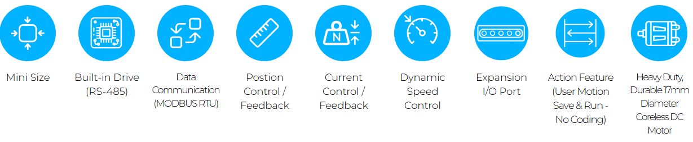

# Overview
- The new mightyZAP servo series with a 17mm diameter motor which improve durability. Provide faster speed under the same rated load specification comparing to the 12Lf series.   
- Overall functionality is almost same as the 12Lf series, but only RS-485 communication and MODBUS RTU protocol are provided, and user expandability has been improved with the expansion I/O port.

## Features
- **Compact size with built-in drive, position sensor, DC motor and gear box**
- **Better durability & faster speed under similar rated load comparing to 12Lf series thanks to the bigger 17mm diameter DC motor**
- **Position, current and speed control along with position & current feedback**
- **Easy digital I/O control through 4 x Expansion I/O ports (No coding)**
- **27/37/50/87mm(*) stroke option**  
    – (*): Each 3mm stroke can be added when adjusting the long stroke limit through Total Manager software.
- **Rated load of 17N~70N depending on the lead angle for each stroke**  
    – Speed is inversely proportional to the rated load, so the higher the rated load, the slower the speed.
- **RS-485 MODBUS-RTU protocol applied (IR open protocol is not provided)**
- **Action feature which enables user’s motion save & run**
