# 1 Getting Started - Total Manager
The Total Manager is the new generation of dedicated software that allows users to easily manage and control mightyZAP Actuators. The Total Manager supports various OSs such as Windows, Linux, and iOS, and has an improved user interface. In addition to the existing L12/D12/D7/12Lf series actuators, user is also able to manage the parameters of new 17Lf series. 
This manual covers the basics of installing Total Manager and using each function.

## 1.1 Introduction
mightyZAP Total Manager is a multi-purpose software with various functions like motion test, parameter settings, parameter monitoring, and firmware updates. User is also able to set up and test special features depending on their actuator model.

>[!note]
>Please refer to the manual of each model for special function settings and test details.


## 1.2 Environment
mightyZAP uses Half Duplex TTL, RS485, and CAN communications depending on the communication version. Users need to use some sort of signal converter for communication between PC and mightyZAP.
The USB Interface Board for mightyZAP (IR-USBXX) can be purchased from our e-shop for easier PC connection.
User is also able to use the 3rd party converter, but for convenience & safety reasons, it is recommended to use our Interface Board .

>[!warning] 주의 사항
> - Make sure to use "data transferable" USB cable between PC and USB converter. Charging only cable does not support data communication. 
> - Make sure proper wiring when using 3rd party converter. 
> - Appropriate DC power matching the rated input voltage of each actuator should be supplied to the actuator so as to utilize the Manager software. When using our USB Interface Board (IR-USBXX), just supply the power through the board.

## 1.3 Feature
### 1.3.1 Information
Displays basic information related to the connected actuator, such as model name, stroke length, rate load, and firmware version. This is the first screen that appears when user runs the software.
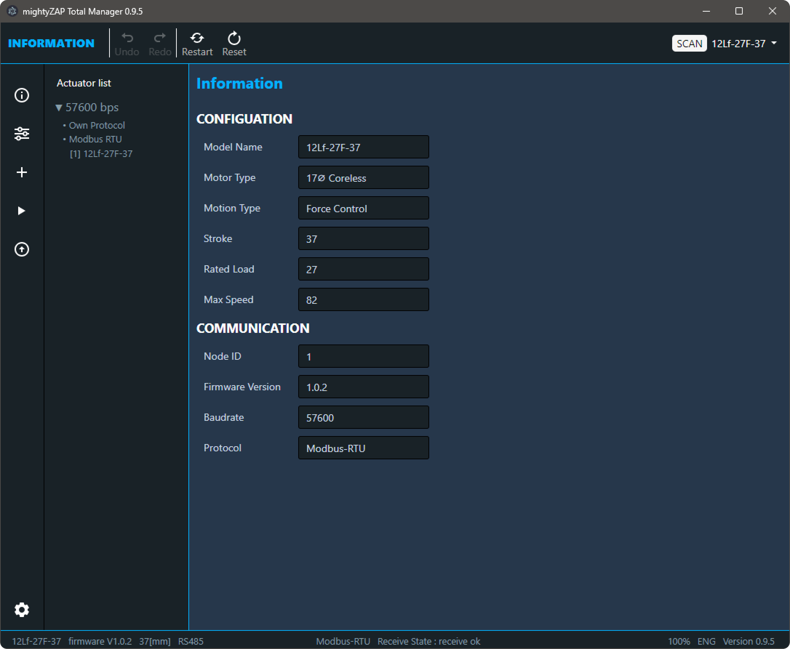
### 1.3.2 Parameter
In the Parameter section, user is able to do a Motion test, changing parameters, and monitoring parameter.
User can select and control only single mightyZAP even if multiple actuators are connected, and the screen is divided into Non-voltatile Memory and Volatile Memoty screens depending on the type of parameter. For detailed explanations of each parameter, please refer to the user manual of each actuator series, [17Lf Manual - 2. Control Table](en/actuator/Mini17Lf/Manual/17Lf_Manual#2. Control Table)  for the 17Lf series. The parameter configuration varies depending on the connected actuator series and model, and the screen configuration changes depending on the screen size.

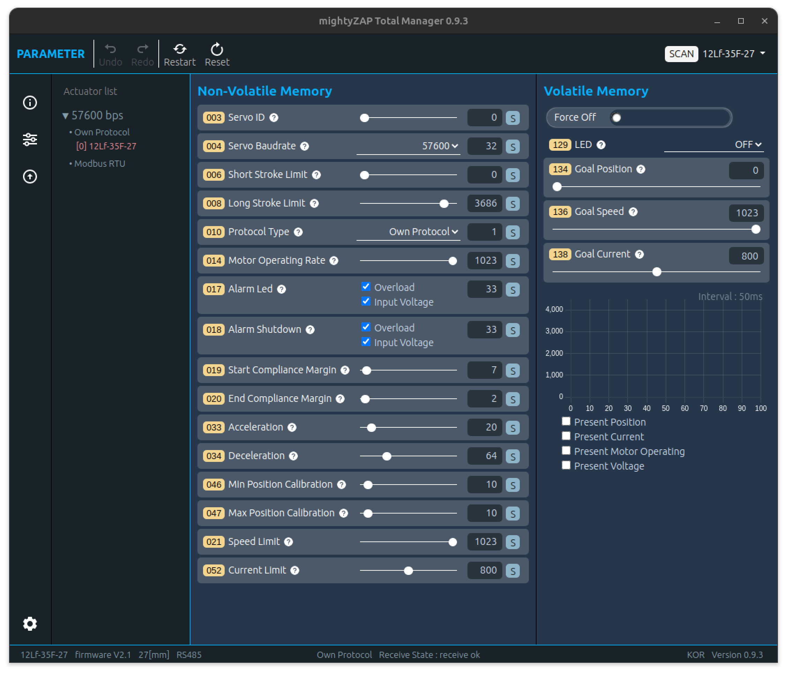

### 1.3.3 Update
It is for the future firmware update. Generally, the latest firmware is applied from the factory, but in very rare cases, a firmware update may be required for products stored by the resellers. If necessory, user can proceed with the update after downloading the update file for user's model from our website. 
Additionally, in this update menu, if the servo motor is not searched due to update failure or user error, user is able to restore the firmware.

# 2 Total Manager Download & Installation
Total Manager is compatible with Windows and Linux.
## 2.1 OS Requirement
- Windows : Windows 10 64bit or higher
- Linux : Ubuntu LTD 20.04 64bit
>[!Note]
>Please download proper installation file for each OS at
>[mightyZAP Total Manager Download](https://github.com/mightyZap1/totalmanager/releases) 
## 2.2 Installation
### 2.2.1 Windows
To install Total Manager software on a Windows PC, please check the OS version of Windows and download the appropriate version.  
- 64bit windows : mightyZAPTotalManagerx.y.z_x64.exe  

**How to check Windows Version**
- Windows 7 : Control Panel -> System and Security -> System -> System Type 
- Windows 10 or higher : Setting -> System -> About -> System Type
<font color="#4f81bd">How to check OS Version</font>

**mightyZAP Total Manager Download Link**

Run the downloaded file and install it according to the instructions of the installation guide. Installation may take several minutes -- 이미지 수정 필요 --

Now, mightyZAP Total Manager software on Windows is ready to use.
### 2.2.2 Linux
Download the file package dedicated for Linux OS. To install Total Manager for Debian/Ubuntu-based Total Manager, download and install the .deb package (64bit) through the following command line.
```
$ sudo dpkg -i [file].deb
```
## 2.3 Screen Layout
The screen layout is divided into four parts: Header, Side bar, Contents, and Footer in general.


1. <font color = "blue">Main Toolbar</font> : Perform actuator reset, restart, data undo/redo, etc. 
2. <font color = "blue">SCAN</font> : Connect Software's communication(COM port) and search connected mightyZAP 
3. <font color = "blue">Main Menu </font>: Always located on the side bar and user can select the main functions of the manager software such as Information, Control, Update, and Setting. 
4. <font color = "blue">Actuator List </font>: Searched mightyZAP model name to be shown along with the communication speed (baudrate) and protocol type. 
5. <font color = "blue">Main contents</font> : Shows various parameters. 
6. <font color = "blue">Actuator Information </font>: Selected mightyZAP's model name, firmware version, and communication method are displayed. 
7. <font color = "blue">Communication Status</font> : Displays Communication status such as protocol type and transmission/reception errors. 
8. <font color = "blue">Manager Status </font>: Displays Manager software's version and Language (English/Korean)

## 2.4 USB Interface Board 
A USB-TTL or RS-485 serial converter is required for Total Manager to communicate with mightyZAP. Below explanation is based on our genuine USB Interface Board - IR-USB02 or 03. First, connect to the PC using a USB cable with IR-USB02 or 03. (IR-USB02 is equipped with a Micro 5 pin USB connector, and IR-USB03 is equipped with a new C type USB connector.)

> [!CAUTION] 
> - Make sure to use "data transferable" USB cable between PC and USB converter. Charging only cable does not support data communication
> - Make sure proper wiring when using 3rd party converter.
> - Appropriate DC power matching the rated input voltage of each actuator should be supplied to the actuator so as to utilize the Manager software. When using our USB Interface Board (IR-USBXX), just supply the power through the board.

### 2.4.1 For Windows
We have two types of USB Interface Board depending on the time of release, and the method of installing the driver is different for each type. Install the driver by referring to the instructions below.

1) **IR-USB02 Driver installation** (CH340x)
	Download the driver for IR-USB02 from the link below.
	[Download link](https://www.wch.cn/downloads/file/65.html?time=2024-07-17%2010:07:13&code=DwmHVUI3gI6XcgRteBdx84KFdjUXkRx3daZBPF6P)
	After running the downloaded file, click the INSTALL button to install the driver.
	
2) **IR-USB03 Driver installation**
	The IR-USB03 driver is automatically installed by Windows Update. If it does not install automatically, please download the driver through the link below.
	 [Download Link](https://www.silabs.com/documents/public/software/CP210x_Universal_Windows_Driver.zip) 
	In the unzipped folder, right-click the silabser.inf file and select Install
	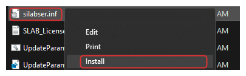
	When the Install button is selected, a warning message appears as follows. At this time, click the OPEN button to proceed with installation. 
	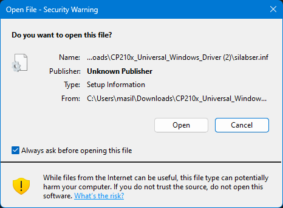  
	When installation is complete, a pop-up message will appear as below. 
	

3) Interface Board Connection Check
	Connect the USB Interface Board to the PC. Check whether the Serial Port is properly connected in [System]-[Device manager]- [Ports]. If connected properly, user can see that a new COM port is added as shown in the image below.
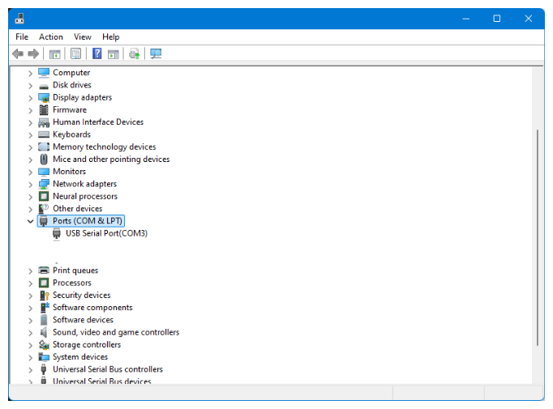
### 2.4.2 Linux[ubuntu/Demian]
<font size="5"> Driver Installation</font>
1) IR-USB02 Driver Installation (CH341 Driver)
	The CH341 driver can be used only for IR-USB-02. The serial drivers for CH340 and CH341 are built-in starting from Linux kernel version 2.6.24, and its location is drivers/usb/serial/ch341.c. However, if user wishes to keep the driver up-to-date, please see below.
	 - Please download the driver for Linux from the website below.  
	   [LINUX용 CH341 Driver Donwload(ZIP)](https://www.wch.cn/downloads/CH341SER_LINUX_ZIP.html)  
	 - Unzip the downloaded file.
	 - Open a terminal window and move to the downloaded directory.
	 - Enter the following commands	 
```bash
$ make clean  
$ make  
$ sudo make load    
```

 - To check the installed driver, connect IR-USB02 to the PC and enter the following command. If installed properly, it should be displayed as "ch34x".
	 
```bash
$ sudo dmesg | grep ch34    
[   xxx] usbcore: registered new interface driver ch341  
[   xxx] usbserial: USB Serial support registered for ch341-uart  
[   xxx] ch341 1-6.4.3:1.0: ch341-uart converter detected  
[   xxx] usb 1-6.4.3: ch341-uart converter now attached to ttyUSB1  
```
 -  정상적으로 설치가 되었다면 "ch34x"로 표시되어야 합니다.

2) IR-USB03 Driver Installation (CP210x)
   The CP210x driver has been distributed as part of the Linux kernel since v2.6.12. On Linux, the CP210x driver appears as /dev/ttyUSBx. 
   How to check COM port:
	   - USB Interface board를 PC와 적절한 USB Cable로 연결합니다.
	- 터미널 창을 열고 다음을 입력하면 다음과 같은 출력이 나타납니다.
```bash - 수정 필요요
$ dmesg|grep cp21x  
[   xxx] USB Serial support registered for cp210x
[   xxx] cp210x 2-2.1:1.0: cp210x converter detected
[   xxx] cp210x 2-2.1: cp210x converter now attached to ttyUSB0

```

3) Obtaining Serial Port Permissions
   Ubuntu basically requires users to log in as a regular user, not as a root user, so user needs to set permissions to handle system devices such as the Serial Port. First, enter the command below to check the connected port name
 ```
$ dmesg|grep tty  
[   xxx] printk: console [tty0] enabled  
[   xxx] cp210x 2-2.1: cp210x converter now attached to ttyUSB0  
```
 
   Check the usage group using the serial port identified through the “ls -l” command.
```bash
$ ls -l /dev/ttyUSB0  
crw-rw---- 1 root dialout 188,  0 11월  1 10:49 /dev/ttyUSB0  
```
   Use the “id Gn” command to check which group the currently logged in user belongs to.
```baSH
$ id -Gn  
user adm cdrom sudo dip plugdev  
```
   Since the currently logged-in user is not included in the dialout group, add the dialout group to the current user.
```bash
$ sudo adduser $USER dialout
[sudo] password for user.
Adding user 'user' to group 'dialout' ...
Adding user user to group dialout
Done
```
After adding to a group, user must log out and log in again for the changes to take effect.

# 3 Total Manager Description
## 3.1 Communication connection & Search
Run the program, and click the SCAN button on the right side of the top menu bar to activate a pop-up window for Actuator Scan.  
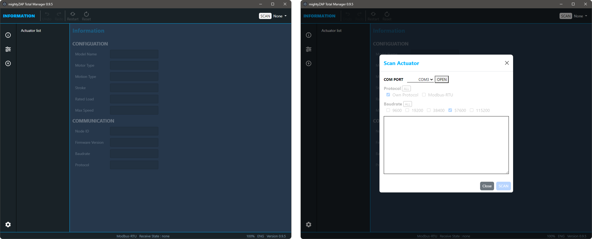

### 3.1.1 Basic information
Actuator Scan pop-up window is as follows.  
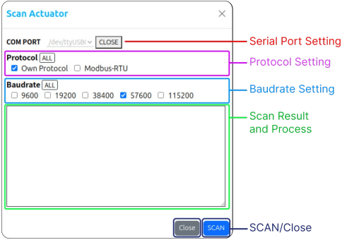

- **COM Port**  : USB Interface Board의 Serial Port
- **Protocol** : Communication protocol selection. Default protocol varies depending on the actuator series, so can be selected both protocols for scanning.
- **Baudrate** :  Communication speed selection (default 57600bps). Duplicate selection available for scanning
- **Scan Result** : SCAN progress and result.
- **SCAN, CLOSE** : SCAN and Close window button
### 3.1.2 Communication Setting
##### 1. Serial COM Port Selection
Please refer to [[## 2.4 USB Interface Board]] above and check the Serial Port name before proceeding. Select the same port as the connected serial port and click the OPEN button to connect the serial port  

The option items(protocol and baudarate) becomes active when the user opens the serial port.  
Each item can be selected individually or in duplicate and progress sequentially during the search. Click the "All" button to select or deselect all.
   
  
Here are default setting information for protocol type and baudrate.

| Actuator Series   | Protocol(dafault) | Baudrate (dafault) |
| :---------------- | :---------------- | :----------------- |
| **Mini L12/12Lf** | Own Protocol      | 57600pbs           |
| **Mini 17Lf**     | Modbus Protocol   | 57600pbs           |

>[!note] NOTE
>- If user searches actuator with different value from the protocol type and baudrate previously set by the user, the actuator cannot be searched..
>- If user does not remember the protocol type and baudrate they previously set, set it to All and search.
>- However, when set to All, the search time will naturally increase

### 3.1.3 Scan Actuator
 When clicking the SCAN button, the search begins sequentially according to the selected option and the corresponding results are to be displayed
 When desired actuators are scanned, user can stop scan process by clicking the STOP button to end the search without waiting for completion.
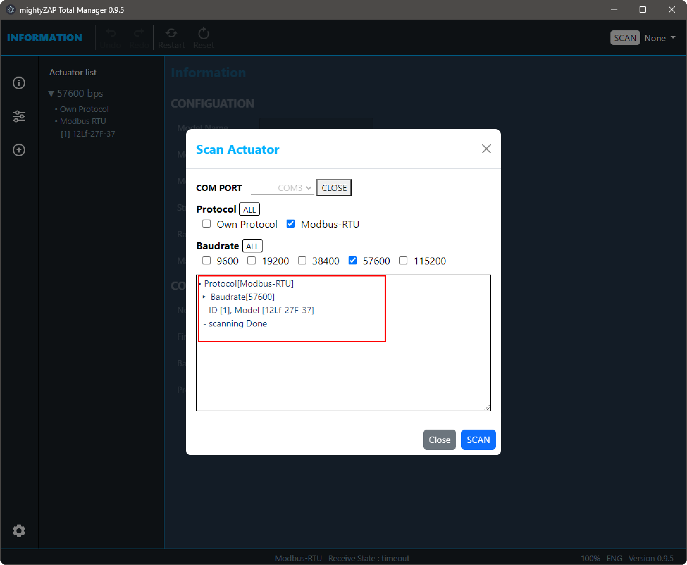
 
 When the scan is complete, click the Close button to close the Pop-up window.
## 3.2 First page after scan
The "information" page displays general information of the connected actuator such as the model name, rated Load, stroke, and firmware version. 

This is the first screen when the Manager is launched after completing the scan. User can go back to the page anytime by clicking the first icon in the sidebar menu as shown in the image below.


### 3.2.1 Actuator List
As shown in the picture below, the scanned actuator is displayed on the left side of the Manager software. 
Scanned actuators are classified / displayed according to Baudrate and Protocol, and can be fold/unfold by Baudrate.
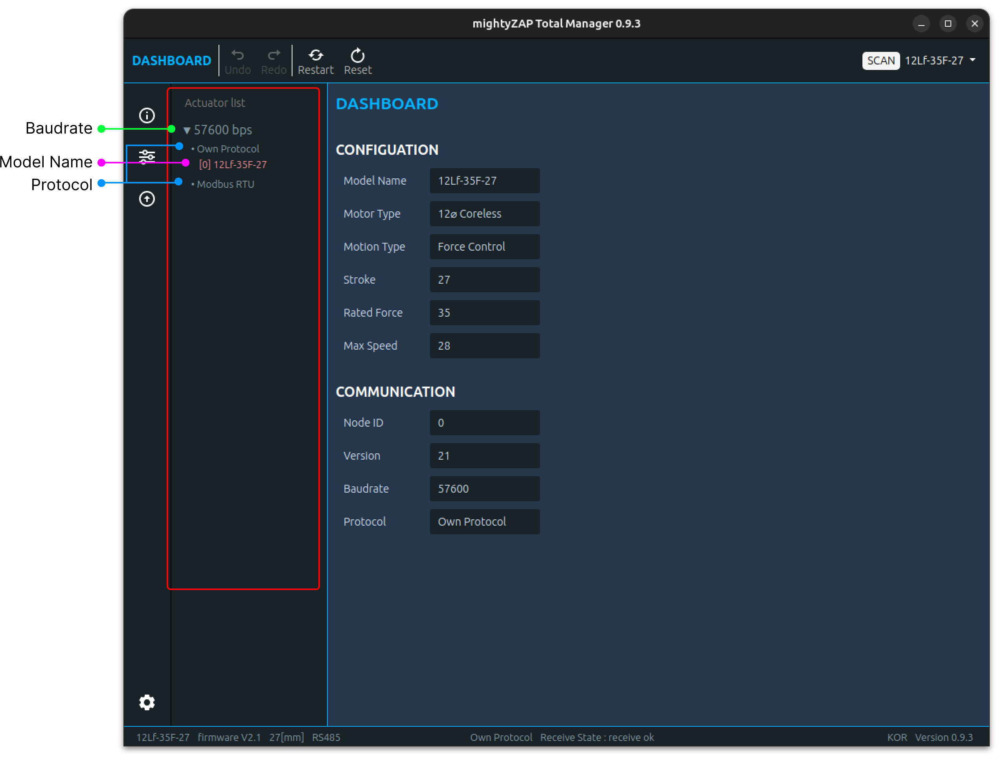

>[!Note] NOTE
>When scanning multiple actuators through a serial daisy chain connection, <u>the IDs of each actuator must be different</u>  to prevent communication conflicts. If the IDs are different, all connected actuators can be scanned, but each must be set individually.

### 3.2.2 Information
Select a scanned actuator in the Actuator List, then general information such as the model name, stroke length, rated load, and communication protocol of the actuator are displayed
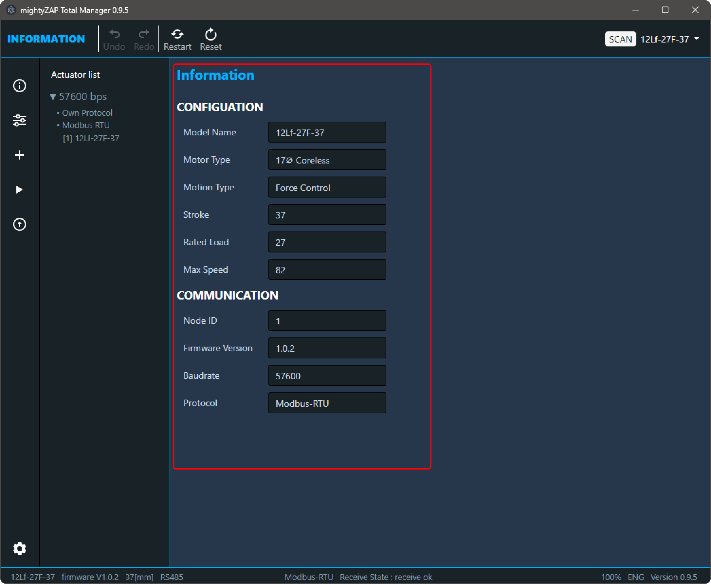

Please note that some important information is displayed in the bottom footer of the Manager as below. 

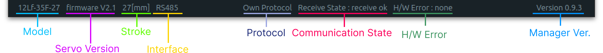
The information in the footer is also displayed on other pages.
## 3.3 Parameter
In Parameter page, user is able to set up various parameters of the mightyZAP Actuator, perform a motion test, and monitor the operation status.
Click the icon shown below in the Menu selection window to go to this page.  

User can set various parameters such as Stroke, ID, Baudrate, etc. to suit user's requirement and perform a simple motion test.
For a description of each parameter, please refer to the parameter description in each actuator user manual.
### 3.3.1 Screen Layout
- The configuration of the Parameter page is divided into Non-Volatile Memory and Volatile Memory areas.
- The Non-volatile parameters are in the non-volatile memory area, and modified / saved data is stored in the internal flash memory, thus, they will not be erased even when the motor power is turned off. 
- The Volatile parameters is a volatile memory area and modified / saved data is stored in the RAM until the power is turned off. But the data will be erased/ initialized when the power is turned off  
- When user reduces the size of the Manager window, the mainly used Volatile-Memory area moves to the top.   


**Tooltip function**
There are question mark icons( <span style="display:inline-block;background-color:black; color:white;width:18px;border-radius:25px;padding:0 6px;font-size:12px">?</span> ) next to each Parameter name. Hover the mouse over the icon, a brief description of the parameter will be displayed. The language of the tooltip also changes depending on the language setting


### 3.3.2 Parameter Control
- **Slide Control** : <font color="#4f81bd">Non-volatile Memory</font>  
  The most common method of changing data for Non-Volatile Memory parameters. Drag the slide bar or directly enter the data into the TextBox.
  
  The color of value in the TextBox on the right changes to blue when user changes the value. Click the "S" button to save the changed data.
  
  If user tries to change another parameter without clicking the S button, the data will be restored to its original state and the color of TextBox value will change back to white.  
  
- **Slide Control** : <font color="#4f81bd">Volatile Memory</font>  
  The Slide control for Volatile Memory parameter is similar to one of the Non-Volatile Memory, but there is no "S (Save)" button. Changed data is applied immediately once dragging the slide bar.
    
  Also, when entering data through a TextBox, if user changes the data and then presses the Enter key, the changed data will be applied immediately. Also, even if the data changes, the color of TextBox does not change to blue.

    
  
> [!tip] 
  >After clicking the Goal Position TextBox, user can control the value with keyboard keys as below. 
  > 	'a' : Move to minimum stroke
  > 	's' : Move to the center position of the stroke
  > 	'd' : Move to maximum stroke  
- **Check Control Box** : <font color="#4f81bd">Non-volatile Memory</font>   
  Check Control allows user to change data using the Check box function. Please note that the value in a Textbox is in a "Read Only" state, so only the data value and status can be read.
  
  The check box supports "Select All", "Clear All", and "Partial selection" as well. The color of value in the TextBox on the right changes to blue when user changes the value. Click the "S" button to save the changed data. 
  If user tries to change another parameter without clicking the S button, the data will be restored to its original state and the color of TextBox value will change back to white.   
- **Select Control box** : <font color="#4f81bd">Non-volatile Memory</font>   
  Select Control Box allows user to change data using the Select button function. Please note that the value in a Textbox is in a "Read Only" state, so only the data value and status can be read.
  The color of value in the Text Box on the right changes to blue when user changes the select value. Click the "S" button to save the changed data.
  If user tries to change another parameter without clicking the S button, the data will be restored to its original state and the color of TextBox value will change back to white.
  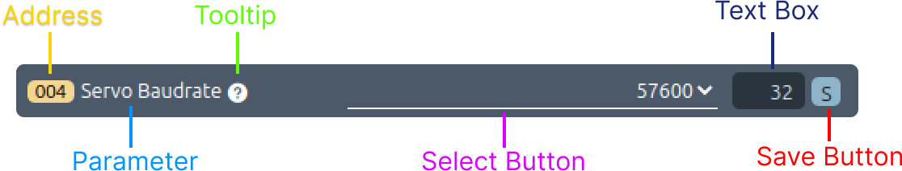  
- **Select Control box** : <font color="#4f81bd">Volatile Memory</font>   
  There is no TextBox in the Select Control Box for Volatile Memory. Selected data using the Select function to be applied Immediately.
  
  
- **Button Control Box** : <font color="#4f81bd">Volatile Memory</font>   
   The "Button Control Box" is a feature exclusive to **Volatile Memory** used to stop the motor's operation
   As shown in the image below, the button has two different images depending on its **enabled or disabled state**. For a detailed description of this parameter, please refer to the product's user manual.
   
### 3.3.3 Monitoring
User is able to to check and get feedback for several key parameters such as present position, present current, present motor operating value, etc in real time basis on the Manager software. 
Parameter items vary depending on the actuator series, and only one parameter can be selected through the check box.

Monitoring function is composed as follows.

- **Data Range**
  The data range changes automatically to match the range of the selected parameter.
- **Number of sample expressions**
  The maximum number of samples of data displayed is 200, and previous data that has passed over time cannot be checked. The maximum number of Sample Counter is 899, and if it becomes larger than 899, it is reset to 0.
- **Interval**  
  Interval refers to the reading time interval per data sample and operates at approximately 50ms intervals.
- **Hover function**
  When user places the mouse over the graph, the data value and Sample Counter value at that location are displayed.
## 3.4 Update    
All actuators are applied with the latest firmware when shipped from the factory. If the firmware is updated over time after purchase, user can update to the latest firmware. To improve product performance and functionality, we recommend users to maintain the latest firmware version. However, before applying the updated firmware, it is necessory to test whether the changes are suitable for the user's environment before applying. Please download the latest firmware file from our website Digital archives.

[Firmware Download](https://mightyzap.com/en/digitalarchive4/?category1=Firmware&mod=list&pageid=1)
### 3.4.1 화면 구성    
As shown in the image, the Update Page consists of firmware update and actuator recovery areas, and each can be executed by selecting the corresponding icon from the menu in the top header.


### 3.4.2 Firmware Update   
**Actuator Connection**  
Connect the servo actuator to be updated and run SCAN.  

> [!CAUTION] 
>For the firmware update, connect only single actuator and only single actuator should remain in the actuator list after scan. If multiple actuators are connected, the update will proceed abnormally and fail eventually so that the concerned actuator will become inoperable.
  
**Update File Select**  
As shown in the picture, click the "Select file" button to select the downloaded update file.    
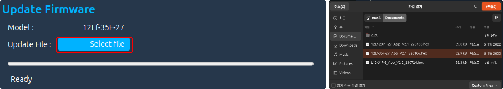
> [!CAUTION]  
>Make sure not to select the firmware file of another model. Check thoroughly if the model name in the Actuator List and the model name in the update file are the same.

**Update** 
When everything is ready, click the Update icon in the top menu bar.  
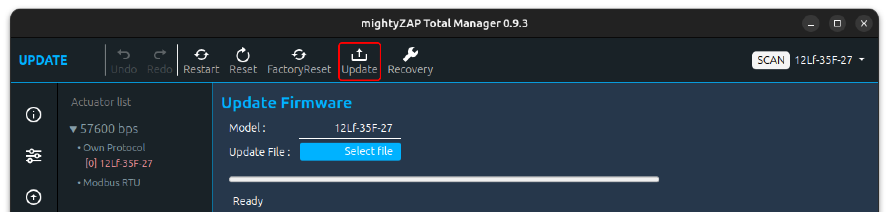
If two or more actuators are connected, the following warning message appears and the SCAN operation is performed again.

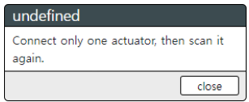
 When mightyZAP restarts for an update, if communication does not occur normally, a message (Reconnect Actuator) appears asking user to reconnect the connector as shown below. At this time, simply disconnect / reconnect the connector connected to the actuator, the update will proceed normally


**Update completed**
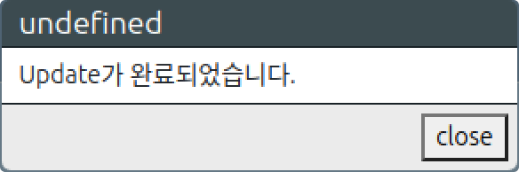
If necessary, user can additionally perform a reset or factory reset.
  
**Update failure**  
If the update fails, the Fail message appears as shown in the image below. In that case, please try the update again first. Once again, please make sure whether the update file is for the update model before the update. 

If the update fails again despite additional update attempts, please run Recovery below and if it still fails, please contact us at cs@mightyzap.com.
### 3.4.3 Recovery  
If the firmware update fails or the actuator cannot be searched through SCAN, proceed with recovery. After connecting only single problematic actuator, click the Recovery icon in the top menu. 

Recovery progress is displayed with images or text for each stage.
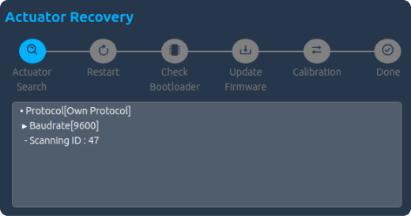
 - **Actuator Search**  
   During the search phase for recovery, searching is made for all Baudrates and Protocols types. If actuator is discovered, recovery will be completed and actuator will be automatically added to the Servo List.
   

- **Restart**   
 If an actuator is not discovered for recovery process, a pop-up window will appear asking user to reconnect the connector. Click the Close button and the message "Reconnect Actuator" will be shown on the Update window. Reconnect the connector on the actuator, then actuator automatically attempts Restart process.
  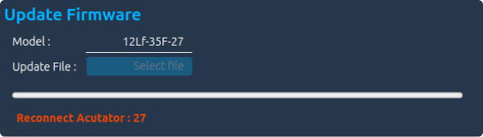
- **Check Bootloader &Update Firmware**  
  After reconnecting connector to the actuator, system checks the bootloader and a popup window will appear asking user to select the actuator's update file to be recovered. Click the Select File button, then select the update file as like Update process.
  
- **Calibration**  
  Unlike Update process, Recovery performs calibration for safety. In the calibration stage, the actuator's stroke extend/retract several times. Just wait until it is completed. 
- **Done**
  An update completion pop-up window will appear, then the SCAN window will be activated.
  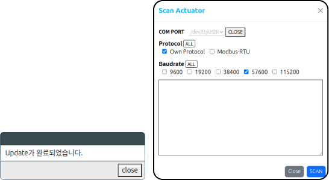

### 3.4.4 Reset
A command to reset(initialize) the parameters of mightyZAP except ID, Baudrate, Protocol, and Calibration Parameters. 
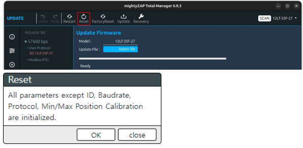  
Click the Reset icon on the top menu, a popup window will appear as above. Click OK button for parameters reset. Then, the screen blinks and moves to the parameter window, and the reset data is loaded again.

### 3.4.5 Restart  
Can be used to restart mightyZAP's system. Usually, to initialize the servo system after Overload error shutdown or to check changes in data of changed Non-Volatile Parameters.
  
Click the Restart button at the top menu, then the screen blinks once and moves to the Parameter window to read the data again.
### 3.4.6 Factory Reset   
Return the actuator to the factory default setting including ID, Baudrate, Protocol, and Calibration Parameters. Calibration process will be made.
>[!CAUTION] 
>During Factroy Reset, the actuator moves back and forth to the maximum/minimum position for calibration. For proper calibration, secure a no-load state without connecting the actuator to the user's application, and perform the calibration in a space where the maximum operating stroke can be maintained.

FClick Factory Reset button on the top menu, the pop-up window will appear

##### 1. Screen Layout
See the pop-up window. In the pop-up window, there are two "remind(maintain)" options, progress state text box and Factory reset button.
![[en/software/TotalManager/img/FactoryReset-Disc.png]]
##### 2. Options
There are two remind options for Factory Reset - ID Remind and Baudrate Remind. When checking the Remind checkbox, the parameter will NOT be reset, and all other parameters will be initialized. Options user wants to maintain even after Factory Reset can be selected in the Remind options. Protocol type and Min/Max Position Calibration, which are not initialized in a general Reset, are initialized, and the internal parameters are also modified while performing calibration of the potentiometer.  
##### 3. Factory Reset 
Click the Factory Reset button at the bottom for Factory Reset. Reset progress states are displayed in the Text Area window.
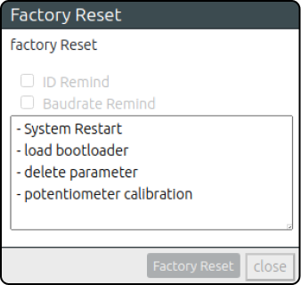
For Factory Reset, the actuator restarts the system several times with the LED blinkings. Also, during calibration, the actuator extend/retract to its maximum position during calibration. 
When Factory Reset is completed, the Close button at the bottom is activated and moves to the Parameter window to show completely reset data.

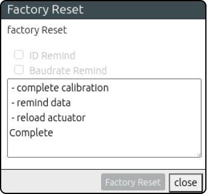

> [!CAUTION] 
During Factroy Reset, the actuator moves back and forth to the maximum/minimum position for calibration. For proper calibration, secure a no-load state without 3. Factory Reset connecting the actuator to the user's application, and perform the calibration in a space where the maximum operating stroke can be guaranteed.
