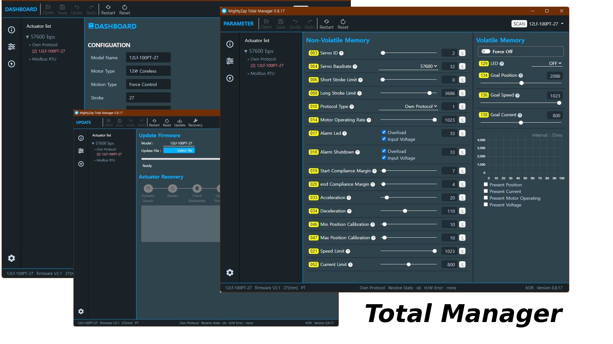

# Overview
mightyZAP Total Manager is a multi-purpose software with various functions like motion test, parameter settings, parameter monitoring, and firmware updates. User is also able to set up and test special features depending on their actuator model.
