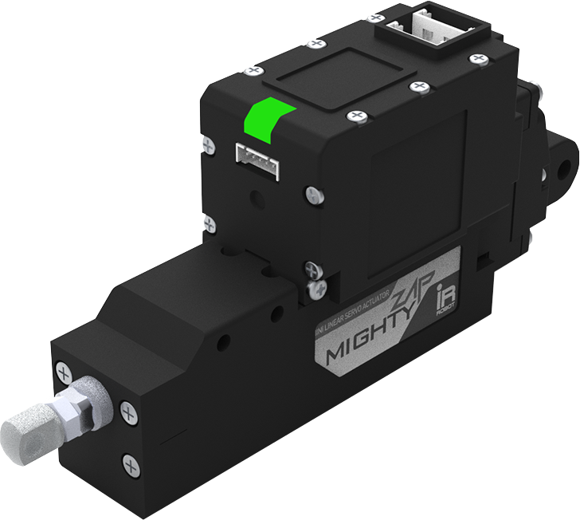

---
# https://vitepress.dev/reference/default-theme-home-page
layout: home

hero:
  name: "mightyZAP e-manual"
  # text: "mightyZAP e-manual"
  tagline: My great project tagline
  # actions:
  #   - theme: brand
  #     text: Actuator
  #     link: /actuator
  #   - theme: alt
  #     text: Software
  #     link: /software

# features:
#   - title: Feature A    
#     details: Lorem ipsum dolor sit amet, consectetur adipiscing elit
#   - title: Feature B
#     details: Lorem ipsum dolor sit amet, consectetur adipiscing elit
#   - title: Feature C
#     details: Lorem ipsum dolor sit amet, consectetur adipiscing elit
---

  <a href="/actuator" class="mainLinkBtn">
    
Actuator

    
    

      
소형 미니 사이즈

      
고출력/고내구성 17ϕ CLDC Motor

      
드라이브 회로 내장

      
역동적 스피드 컨트롤

      
데이터 통신 제어 (MODBUS RTU)

      
확장 I/O포트 제공으로 확장성 개선

      
사용자 모션 저장 (No coding)

    

  </a>
  <a href="/software" class="mainLinkBtn">
    
Software

    
    

      
소형 미니 사이즈

      
고출력/고내구성 17ϕ CLDC Motor

      
드라이브 회로 내장

      
역동적 스피드 컨트롤

      
데이터 통신 제어 (MODBUS RTU)

      
확장 I/O포트 제공으로 확장성 개선

      
사용자 모션 저장 (No coding)

    

  </a>
  <a href="/accessores-etc" class="mainLinkBtn">
    
Acc & ETC

    
    

      
소형 미니 사이즈

      
고출력/고내구성 17ϕ CLDC Motor

      
드라이브 회로 내장

      
역동적 스피드 컨트롤

      
데이터 통신 제어 (MODBUS RTU)

      
확장 I/O포트 제공으로 확장성 개선

      
사용자 모션 저장 (No coding)

    

  </a>

