## 1 Total Manager 시작하기
mightyZAP Total Manager는 다양한 운영체제에서 다양한 mightyZAP Actuator를 쉽게 관리 및 제어할 수 있는 새롭게 개선된 Software입니다. Total Manager는 윈도우즈, 리눅스 등의 다양한 OS를 지원하고, 사용자 인터페이스를 개선하였습니다.  기존의 L12/D12/D7/12Lf시리즈 뿐만이 아니라, 신모델인 17Lf시리즈의 파라메터도 제어할 수 있습니다.  

본 매뉴얼에서는 Total Manager의 설치 및 각 기능의 사용법에 대한 기본 사항을 다룹니다.

### 1.1 개요
mightyZAP Total Manager는 다양한 기능을 가진 다목적 Software입니다. mightyZAP의 동작 Test,  Parameter 설정 및 동작 상태 Monitoring과 Firmware Update를 기본적으로 제공합니다.  또한 시리즈별 모델에 따른 특수 기능을 설정 및 테스트 할 수도 있습니다. 

>[!note]
>특수 기능 설정 및 테스트 내용은 각 모델의 매뉴얼을 참조하시기 바랍니다.


### 1.2 사용 환경
mightyZAP은 통신 버전에 따라, Half Duplex TTL, RS485, CAN 통신을 사용합니다. PC와의 통신을 위한 Converter를 사용해야 mightyZAP과의 통신이 가능합니다.  
mightyZAP을 위한 USB Interface Board(IR-USB XX series)를 당사의 웹사이트에서 판매하고 있습니다. 당사의 전용  Interface Board를 사용할 경우 손쉽게 mightyZAP을 PC와 연결할 수 있습니다.  시중의 3rd party converter를 구매하여 사용하실 수 있지만, 편의성 및 안전성을 위하여 가급적 당사의 Interface Board를 사용하여 주시기 바랍니다.
>[!warning] 주의 사항
> - PC와 Interface Board 연결에 충전 전용 USB Cable을 사용하여 통신이 연결되지 않는 경우가 있습니다. 반드시 Data통신이 가능한 Cable인지 확인하시고 사용하여 주시기 바랍니다. 
> - 3rd party 컨버터 사용시, 제품 파손 방지를 위해 배선에 유의하시기 바랍니다. 

### 1.3 Feature
#### 1.3.1 Information
연결된 mightyZAP의 Model 명, Stroke, Rate Load, Firmware Version 등 Actuator와 관련된 기본 정보를 표시합니다. Software를 실행하였을 경우 제일 처음에 나타나는 화면입니다.
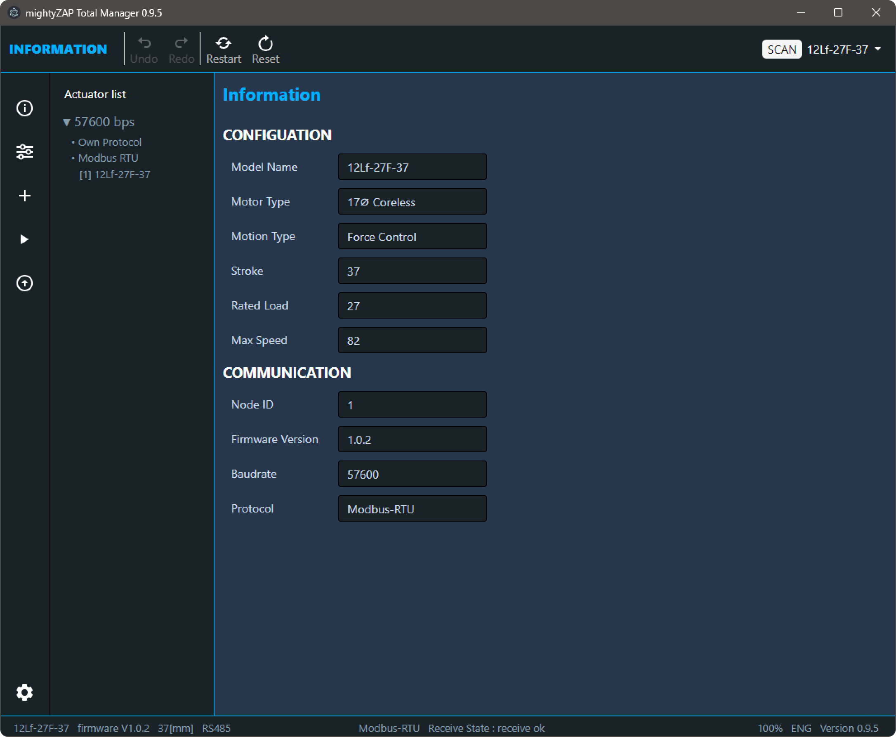
#### 1.3.2 Parameter
mightyZAP을  제어하거나 Parameter 변경 및 Parameter Monitoring을 할 수 있습니다.   
연결된 여러 개의 mightyZAP 중 하나의 mightyZAP을 선택하여 제어할 수 있으며, Parameter의 Type에 따라 비휘발성(Non-voltatile Memory)와 휘발성(Volatile Memoty) 화면으로 나누어져 있습니다.  각 파라메터에 대한 구체적인 설명은 각 액츄에이터 시리즈의 사용자매뉴얼 - 17Lf시리즈의 경우[[17Lf User Manual_kor#2.4 Control Table Discription]]  을 참고하시기 바랍니다. 연결된 액츄에이터 시리즈 및 모델에 따라 Parameter의 구성이 달라지며, 화면의 크기에 따라 화면 구성이 변하게 됩니다.  


#### 1.3.3 Update
mightyZAP의 Firmware를 업데이트할 때 사용합니다. 기본적으로 공장출하시에는 최신 펌웨어가 적용됩니다만 아주 드물게, 유통업체에서 보관하던 제품의 경우 펌웨어 업데이트가 필요할 수도 있습니다. 당사의 Website 에서 해당 모델에 맞는 업데이트 파일을 다운로드 받으신 후 업데이트를 진행 하실 수 있습니다.  
또한, Update Fail 및 사용자의 실수로 인해 서보모터가 검색이 되지 않을 경우 Firmware를 검사 및 복구 하실 수도 있습니다. 

## 2 Total Manager 다운로드 및 설치
Total Manager는 Window , Mac OS, Linux 에서 모두 설치가 가능합니다.
### 2.1 요구 사항
- Windows : windows 7(32bit) / windows 10 64bit 이상
- Linux : Ubuntu LTD 20.04 64bit
>[mightyZAP Total Manager Download](https://github.com/mightyZap1/totalmanager/releases) 페이지에서 각 OS에 맞게 다운로드 하실 수 있습니다.

### 2.2 설치
#### 2.2.1 Windows
Windows 컴퓨터에서 mightyZAP Total Manager를 설치하려면 사용 중인 Windows의 
OS 버전을 확인하신 후 버전에 맞게 다운로드하여 주시기 바랍니다.   
- 32bit windows : mightyZAPTotalManagerx.y.z_ia32.exe
- 64bit windows : mightyZAPTotalManagerx.y.z_x64.exe  

**Windosw Version 확인 방법**
- windows  7 : 제어판 -> 시스템 확인
- windows 10 이상 : 설정 -> 시스템 -> 정보
<font color="#4f81bd">OS Version 확인 방법</font>

**mightyZAP Total Manager Download Link**

다운로드한 파일을 실행하여, 설치 가이드의 지침에 따라 설치하시면 됩니다.  
설치에는 몇 분 정도 걸릴 수 있습니다.

이제 Window에서 mightyZAP Total Manager를 사용하실 수 있습니다.  
#### 2.2.2 Linux
Linux 전용 파일 패키지를 다운로드 합니다.
Debian/Ubuntu 기반의 배포용 Total Manager를 설치하기 위해서는 다음과 같은 Command Line을 통해 .deb 패키지(64bit)를 다운로드하고 설치합니다.
```
$ sudo dpkg -i [file].deb
```

### 2.3 화면 구성
화면 구성은 크게 4가지로  Header 부분과 Side bar, Contents, Footer로 구성되어 있습니다.  
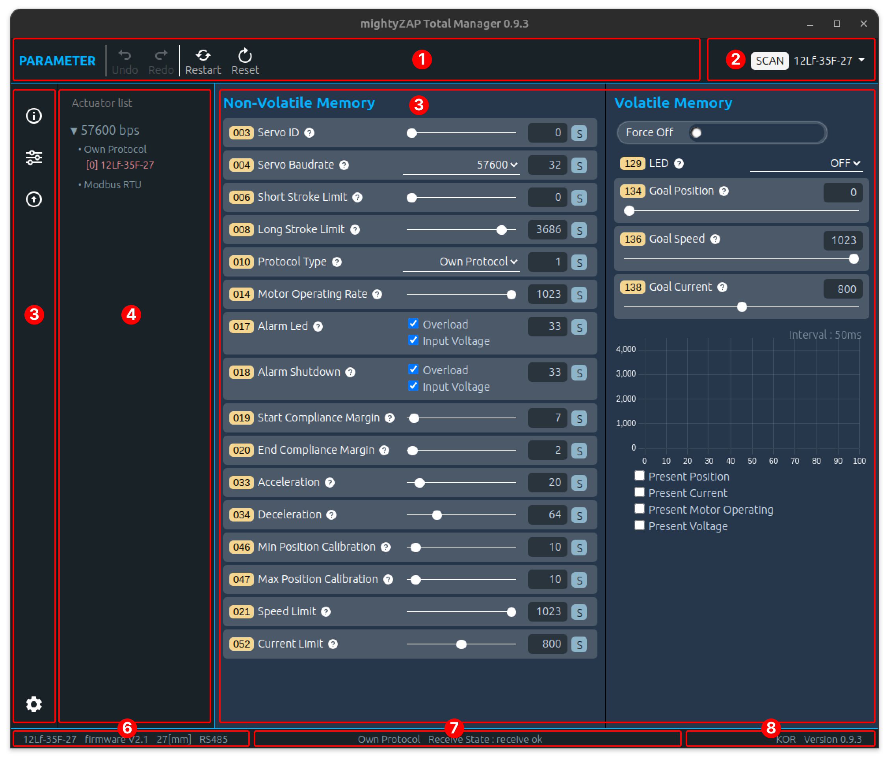

1. Main Toolbar : Actuator의 Reset, Restart, Data Undo/Redo 등을 수행  
2. SCAN : Software의 통신(COM Port)을 연결하고 연결된 mightyZAP을 검색  
3. Main Menu : 항상 사이드 바에 위치하며 사용자는 Information, Control, Update, Manager setting 등 Manager software의 주요 기능을 선택할 수 있습니다.
4. Actuator List : 검색된 mightyZAP의 모델명이 통신 속도와 Protocol에 따라 분류되어 표시  
5. Main contents : 매니저에 제공하는 Main 기능 표시  
6. Actuator Information : 선택된 Actuator의 모델명, Firmware Version, 통신 방식 등이 표기    
7. 통신 상태 : 통신 Protocol 및 송수신 Error 등 통신 상태 표시  
8. Manager Status :  Manager 의 버전 및 Language 등 표시  

### 2.4 USB Interface Board 
Total Manager와 mightyZAP과의 통신을 위하여 Serial Convertor 가 필요합니다.  
해당 설명은 당사의 USB Interface Board를 기준으로 설명이 되어있습니다.  
먼저 USB Cable을 이용하여 PC와 IR-USB02 (또는 USB03)을 연결하여 주시기 바랍니다.   
(IR-USB02는 Micro 5 pin USB커넥터가, IR-USB03은 신형 C type USB 커넥터가 장착되어 있습니다.)
> [!warning] 주의사항
> - 충전 전용 케이블이 아닌 통신이 가능한 케이블을 사용하여 주셔야합니다.
> - 타사의 컨버터를 사용할 때는 배선이 올바른지 확인하셔야 합니다.
> - 매니져 소프트웨어를 활용하기 위해서는 액츄에이터의 정격 입력 전압에 맞는 적절한 DC 전원을 액츄에이터에 공급해야 합니다. USB  Interface Board IR-USBxx를 사용할 경우 보드를 통해 전원을 공급하기만 하면 됩니다.

#### 2.4.1 Windows
당사의 Interface Board 는 출시 시점에 따라 2가지 Type이 있으며, 각 type에 따라 드라이버를 설치하는 방식이 다릅니다. 아래의 설명을 참조하여 드라이버를 설치 합니다.

1) **IR-USB02 Driver 설치** (CH340x)
	아래의 링크에서 IR-USB02의 Driver를 다운로드 합니다.
	[Download link](https://www.wch.cn/downloads/file/65.html?time=2024-07-17%2010:07:13&code=DwmHVUI3gI6XcgRteBdx84KFdjUXkRx3daZBPF6P)
	다운로드 받은 파일을 실행한 후 INSTALL 버튼을 클릭하여 드라이버를 설치합니다
	
2) **IR-USB03 Driver 설치 (CP210x)**
	USB03 Dirver는 Windows Update에 의해 자동으로 설치 됩니다.  
	만약 자동으로 설치가 되지 않을 경우 아래의 링크를 통해 드라이버를 다운로드 받으시기 바랍니다.
	 [Download Link](https://www.silabs.com/documents/public/software/CP210x_Universal_Windows_Driver.zip) 
	압축이 해제된 폴더에서 silabser.inf 파일을 마우스 오른쪽 버튼으로 클릭하고 설치를 선택합니다.
	
	Install 버튼을 클릭하면 다음과 같이 경고 메세지가 나타납니다. 이때 OPEN 버튼을 누르고 설치를 진행합니다.  
	  
	설치가 완료되면 아래와 같은 팝업창이 나타납니다. 
	

3) **Interface Board 연결 확인**
	USB Interface Board를 PC와 연결합니다.
	[시스템]-[장치관리자]-[port]에서 Serial Port가 정상적으로 연결되었는지 확인합니다.  
	정상적으로 연결되어 있을 경우 아래 이미지에서와 같이 새로운 com port가 추가되는것을 확인할 수 있습니다.
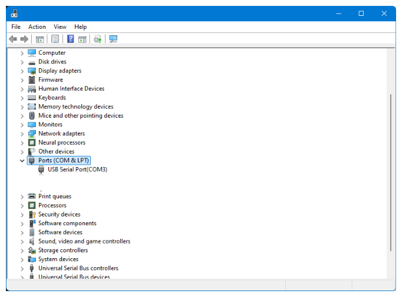
#### 2.4.2 Linux[ubuntu/Demian]  
<div style="font-size:18px;color:'blue';">Driver 설치</div>
<font size="4" color="blue"> Driver 설치</font>
1) IR-USB02 Driver 설치 (CH341 Driver)
	CH341 driver는 USB-02 Model에서 만 사용됩니다. 
	CH340, CH341 의 시리얼 드라이버는 Linux 커널 버전 2.6.24부터 내장되어 있으며, 해당 위치는 "drivers/usb/serial/ch341.c"입니다. 다만 드라이버를 최신 상태로 유지 하기 원하실 경우 아래의 방법을 사용하기 바랍니다.
	 - 아래의 사이트에서 Linux용 드라이버를 다운로드 받으시기 바랍니다.  
	   [LINUX용 CH341 Driver Donwload(ZIP)](https://www.wch.cn/downloads/CH341SER_LINUX_ZIP.html)  
	 - 다운로드한 파일의 압축을 풉니다.
	 - 터미널 창을 열고 다운로드한 디렉토리로 이동을 합니다.
	 - 다음의 명령들을 입력합니다
	 
```bash
$ make clean  
$ make  
$ sudo make load    
```

 - 설치된 드라이버를 확인하기 위해 USB-02를 PC와 연결한 후 다음의 명령을 입력합니다.  
	 
```bash
$ sudo dmesg | grep ch34    
[   xxx] usbcore: registered new interface driver ch341  
[   xxx] usbserial: USB Serial support registered for ch341-uart  
[   xxx] ch341 1-6.4.3:1.0: ch341-uart converter detected  
[   xxx] usb 1-6.4.3: ch341-uart converter now attached to ttyUSB1  
```
 -  정상적으로 설치가 되었다면 "ch34x"로 표시되어야 합니다.

2) IR-USB03 Driver 설치 (CP210x)
   CP210x 드라이버는 v2.6.12 부터 Linux  커널의 일부로 배포되었습니다. Linux 에서는 CP210x 드라이버가 /dev/ttyUSBx로 표시됩니다.  
   Com port를 확인하는 방법 :  
	- USB Interface board를 PC와 적절한 USB Cable로 연결합니다.
	- 터미널 창을 열고 다음을 입력하면 다음과 같은 출력이 나타납니다.
```bash - 수정 필요요
$ dmesg|grep cp21x  
[   xxx] USB Serial support registered for cp210x
[   xxx] cp210x 2-2.1:1.0: cp210x converter detected
[   xxx] cp210x 2-2.1: cp210x converter now attached to ttyUSB0

```

3) Serial Port 권한 얻기
   ubuntu는 기본적으로  root 사용자가 아닌 일반 사용자로 로그인하도록 하기 때문에 Serial Port와 같은 시스템 장치를 다루기 위해서는 권한 설정을 해야 합니다.   
   먼저 연결된 Port 명을 확인하기 위해 아래의 명령을 입력합니다.
 ```
$ dmesg|grep tty  
[   xxx] printk: console [tty0] enabled  
[   xxx] cp210x 2-2.1: cp210x converter now attached to ttyUSB0  
```
 
   "ls -l" 명령을 통해 확인된 Serial Port를 이용하여 사용 그룹을 확인합니다.
```bash
$ ls -l /dev/ttyUSB0  
crw-rw---- 1 root dialout 188,  0 11월  1 10:49 /dev/ttyUSB0  
```
   "id Gn" 명령을 통해 현재 로그인 중인 사용자가 속한 그룹을 확인합니다.
```baSH
$ id -Gn  
user adm cdrom sudo dip plugdev  
```
   현재 로그인한 사용자가 dialout 그룹에 포함되어 있지 않기 때문에, 현재 사용자에게 dialout 그룹을 추가해 줍니다.
```bash
$ sudo adduser $USER dialout
[sudo] password for user.
Adding user 'user' to group 'dialout' ...
Adding user user to group dialout
Done
```

그룹에 추가 한 후에는 반드시 로그아웃 후 로그인 해야 변경 사항이 적용 됩니다.
## 3 Total Manager Description
### 3.1 통신 연결 및 검색
아래의 이미지와 같이 프로그램을 실행 한 후 상단 매뉴바에서 Scan 버튼을 누르면 Actuator Scan을 위한 팝업 창이 활성화 됩니다.   
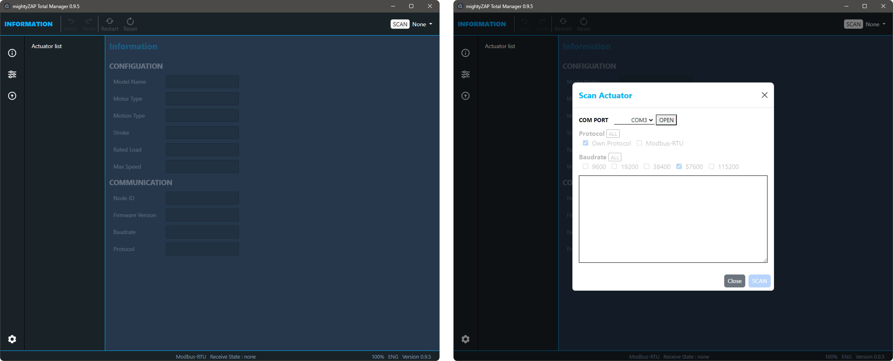

#### 3.1.1 SCAN 화면 구성
Actuaotor Scan 팝업 창의 화면 구성은 아래와 같습니다.  

- **Serial Port**  : USB Interface Board의 Serial Port
- **Protocol** : 통신 프로토콜 설정, Actutator Model에 따라 다르며 Scan시 중복 선택 가능
- **Baudrate Select** :  통신 속도 설정 (default 57600bps) Scan시 중복 선택 가능
- **Scan 결과 창** : SCAN 진행 상황과 결과를 출력한다.
- **SCAN, CLOSE** : SCAN 실행 및 창 닫기 버튼
#### 3.1.2 통신 설정
###### 1. Port 선택
위 [#2.4 USB Interface Board]] 의 설명을 참조하시어 Serial Port 명을 확인 하신 후 진행하시기 바랍니다.  연결된 Serial Port와 동일한 Port를 선택한 후 OPEN 버튼을 클릭하여 Serial Port를 연결합니다.  

Serial Port 를 Open하면 Option 항목이 활성화 됩니다.  
모든 옵션은 중복으로 선택할 수 있으며 검색 시 순차적으로 진행이 됩니다.  
All 버튼을 누르게 되면 모든 선택하거나 모두 선택 해지를 하게 됩니다.

  
다음은 모델에 따른 기본 설정 값에 대한 예시 입니다.   

| 예시 모델             | Protocol(dafault) | Baudrate (dafault) |
| :---------------- | :---------------- | :----------------- |
| **Mini L12/12Lf** | Own Protocol      | 57600pbs           |
| **Mini 17Lf**     | Modbus Protocol   | 57600pbs           |

>[!note] NOTE
>- 사용자가 미리 설정한 Protocol Type 및Baudrate와 다른 값으로 액츄에이터를 검색할 경우 해당 액츄에이터를 검색할 수 없습니다.
>- 사용자가 이전에 설정한 Protocol Type과 Baudrate가 기억나지 않으면 모두로 설정하고 검색하세요.
>- 단, All로 설정하면 검색 시간이 자연스럽게 늘어납니다.

#### 3.1.3 Actuator 검색
 SCAN 버튼을 누르게 되면 선택한 옵션에 따라 차례로 검색을 시작하여 해당 결과를 표시합니다.
 원하는 Actuator 가 모두 검색 되었을 경우, 완료를 기다리지 않고 STOP 버튼을 click하면 검색을 종료하면 됩니다.  
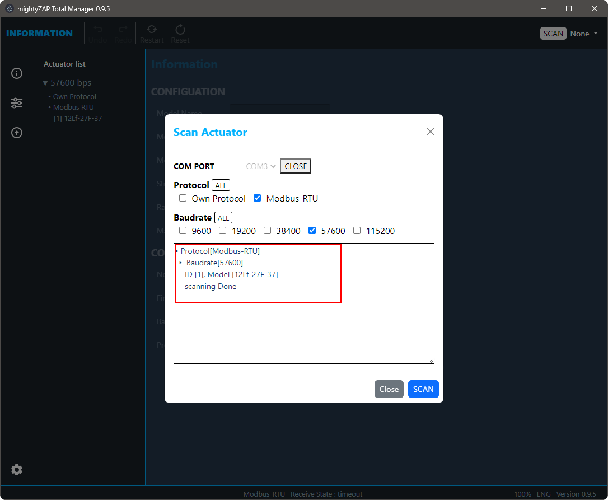
 
 검색이 완료되었으면 Close 버튼을 click하여 Popup 창을 닫습니다.
### 3.2 Information
mightyZAP Actuator의 Model명, Rated Load, Stroke, firmware Version등 관련된 정보를 표시하는 페이지 입니다.  

Manager가 실행이 되면 처음 표시하는 창이  창이며, 아래의 이미지와 같이 사이드 바 메뉴의 첫번째 아이콘을 클릭하여 해당 페이지로 이동합니다. 


#### 3.2.1 서보모터 List 확인
아래의 그림과 같이 매니저에 왼쪽에는 검색된 서보모터가 Display 됩니다.  
Actuator List는 Baudrate와 Protocol에 따라 분류되어 표시 되며,  Baudrate 별로 접거나 펼 수 습니다


>[!Note] NOTE
>직렬 daisy chain  연결을 통해 여러 액추에이터를 SCAN 할 때 통신 충돌을 방지하려면 <u>각 액추에이터의 ID가 달라야</u> 합니다. ID가 다를 경우 연결된 모든 액츄에이터를 SCAN 할 수 있지만 각각 개별적으로 설정해야 합니다

#### 3.2.2 정보 확인
Actuator List를 선택하면 해당 Actuator의 모델 명, Stroke 길이, 정격 부하, 통신 Protocol 등의 정보가 표시됩니다. 


이중 중요한 일부 정보가 Manager의 하단 Footer에 표시됩니다.

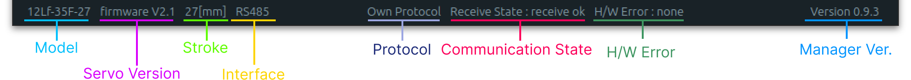
Footer에 표시된 정보는 information Page가 아닌 다른 Page에서도 볼 수 있습니다. 
### 3.3 Parameter
mightyZAP Actuator를 설정 및 간단한 동작 테스트를 하고, 동작 상태를 Monitoring하는 페이지 입니다.  
Menu 선택 창에서 아래의 그림과 같은 아이콘을 클릭하면 해당 페이지로 이동합니다.  

사용자 환경에 맞게 Stroke, ID, Baudrate 등을 설정하고 간단한 동작 테스트를 진행할 수 있습니다.  
각 Parameter에 대한 설명은 해당 모델의 사용자 매뉴얼에서 Parameter 설명을 참조하시기 바랍니다.  
#### 3.3.1 화면 구성
- Parameter 페이지의 구성은 Non-Volatile Memory 영역과 Volatile Memory 영역으로 나뉩니다.
- Non-volatile Meomory는 비 휘발성 메모리 영역의 Parameter로 수정 및 저장된 Data가 내부 Falsh Memeory에 저장이 되며, 모터의 전원이 꺼지게 되어도 지워지지 않고 저장되어있습니다.  
- Volatile Memory는 휘발성 메모리 영역으로 내부 Ram에 저장이 되며, 전원이 꺼지기 전까지는 해당 Data를 저장하고 있지만, 전원이 꺼지게 되면 해당 Data는 초기화 됩니다.  
- Parameter 영역은 매니저의 크기를 줄일 경우, 주로 사용되어지는 Volatile-Memeory 영역이 상단으로 이동합니다.   


**Tooltip 기능**
각 Paremater 이름의 옆에는 (<span style="display:inline-block;background-color:black; color:white;width:18px;border-radius:25px;padding:0 6px;font-size:12px">?</span>)를 한 아이콘이 있습니다. 해당 아이콘에  mouse를 가져가 대면 해당 Paremater에 대한 간단한 설명이 표시됩니다.  

#### 3.3.2 Parameter Control
- **Slide Control** : <font color="#4f81bd">Non-volatile Memory</font>  
  Non-Volatile Memeory의 가장 일반적인 Data 변경 방식으로 Slide bar의 Drag 또는 TextBox에 직접 Data를 입력하는 방법으로 Data를 변경 합니다.   
  
  값을 변경할 경우 오른쪽의 TextBox의 값이 푸른색으로 변경되며, 변경한 data를 저장하기 위해서는 S  버튼을 클릭해야 합니다.   
  
  S 버튼을 클릭하지 않고 다른 Parameter를 변경하려 할 경우 Data는 원래 상태로 복구 되며 TextBox의 font가 다시 흰색으로 변경됩니다.  
  
- **Slide Control** : <font color="#4f81bd">Volatile Memory</font>  
  Volatile Memory에서의 Slide Control 방식은 Non-Volatile Memory 방식과 유사하지만, S 버튼이 없으며, Slide bar를 Drag할 경우 변경된 Data가 즉시 적용됩니다.  
    
  또한 TextBox를 통해 Data를 입력할 경우 Data를 변경한 후 Enter key를 입력하면 변경된 Data가 즉시 적용됩니다.
  또한 Data가 변경되도 TextBoxd의 Font는 푸른색으로 변경되지 않습니다.
    
> [!tip] 
  >Goal Position TextBox를 클릭한 후 다음과 같이 키보드 키로 제어가 가능합니다.  
  > 	'a' : 최소 stroke로 이동
  > 	's' : stroke 중간 위치로 이동
  > 	'd' : 최대 Stroke로 이동  
- **Check Control Box** : <font color="#4f81bd">Non-volatile Memory</font>   
  Check Control은 check 기능을 이용하여 Data를 변경 가능하며, 이때 Textbox는 Read Only 상태로 Data값과 상태만을 확인할 수 있습니다.   

  

  checkbox는 모두 선택, 모두 해제, 부분 선택 모두 가능하며,선택 값이 변경되었을 경우 TestBox의 font가 푸른색으로 변경됩니다.  
  수정한 값을 적용하기 위해서는 S 버튼을 눌러 수정된 값을 저장해야 합니다.  
  버튼을 클릭하지 않고 다른 Parameter를 변경하려 할 경우 Data는 원래 상태로 복구 되며 TextBox의 font가 다시 흰색으로 변경됩니다.   
- **Select Control box** : <font color="#4f81bd">Non-volatile Memory</font>   
   Select Control box는 Select 기능을 이용하여 Data를 변경 가능하며, 이때 Textbox는 Read Only 상태로 Data값과 상태만을 확인할 수 있습니다.
  select 값이 변경되었을 경우 TestBox의 font가 푸른색으로 변경되며, 
  수정한 값을 적용하기 위해서는 S 버튼을 눌러 수정된 값을 저장해야 합니다.
  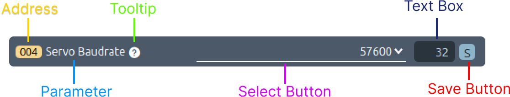  
  버튼을 클릭하지 않고 다른 Parameter를 변경하려 할 경우 Data는 원래 상태로 복구 되며 TextBox의 font가 다시 흰색으로 변경됩니다.  
- **Select Control box** : <font color="#4f81bd">Volatile Memory</font>   
  Volatile Memory 의 Select Control Box에는 TextBox가 존재하지 않습니다.
  Select 기능을 이용하여 선택된 Data를 즉시 적용합니다.  
  
  
- **Button Control Box** : <font color="#4f81bd">Volatile Memory</font>   
   Button control Box 기능은 Volatilte Memory에 만 있는 기능으로 Motor의 동작을 정지하기 위해 사용됩니다.
   아래의 그림과 같이 Button은 활성화 비활성화에 따라 2가지의 이미지를 가지고 있으며, 해당 Parameter에 대한 자세한 설명은 해당 제품의 사용자 메뉴얼을 참조하여 주시기 바랍니다.
   
#### 3.3.3 Monitoring
Monitoring 기능은 mightyZAP Actuator의 현재 위치, 모터 입력 값, 전류 등을 실시간으로 확인하는 기능을 가지고 있습니다.  
Parameter 항목은 Model에 따라 다르게 표시되며, Check box를 통해 하나의 Parameter만 선택하실 수 있습니다.  

Monitoring 기능은 아래와 같이 구성 되어있습니다.
- **Data 범위**
  Data 표현 범위는 선택된 Parameter의 표현 범위에 맞게 변경이 됩니다.
- **Sample 표현 갯 수**
  최대 Display되는 Sample 갯 수는 200개이며 이전 Data는 확인할 수 없습니다. Sample Counter의 최대 표현 수는 899이며 이보다 클 경우 0으로 리셋이 됩니다.
- **Interval**  
  Interval은 Data Sample 당 읽어오는 시간 간격을 의미하며 약 50ms 간격으로 동작 합니다.     
- **Hover 기능**
  마우스를 그래프 위에 놓으면 해당 위치의 데이터 값과 Sample Counter 값을 표기합니다.
### 3.4 Update    
펌웨어를 업데이트 하는 페이지 입니다.  Firmware의 버전은 최신 버전을 유지하는 것을 추천 드립니다. 다만 수정된 펌웨어를 적용하기 전에  변경 사항이 사용자의 Apllication과 적합한지 테스트 하신 후에 적용하시기 바랍니다.   
펌웨어 파일은 당사의 homepage에서 다운로드 받으시기 바랍니다.  

#### 3.4.1 화면 구성    
Update Page는 이미지와 같이 펌웨어 업데이트, Actuator Recovery 영역으로 되어있으며, 각각의 실행은 상단 header의 메뉴에서 해당 아이콘을 선택하여 실행할 수 있습니다.


#### 3.4.2 Firmware Update   
**Actuator 연결**  
업데이트를 진행할 서보 모터를 연결하고 SCAN 을 합니다.  

> [!warning] 주의 사항
>펌웨어 업데이트 시에는 업데이트를 진행할 actuator 하나만 연결하고 SCAN 작업을 진행하여 Actuator List에 하나의 actuator만 남아 있어야 합니다.  하나 이상의 actuator 가 연결 된 상태에서 업데이트를 진행하면 업데이트가 비정상적으로 진행되어 실패하게 되고 해당  actuator 는 동작이 되지 않게 됩니다.  
  
**업데이트 파일 선택**  
firmware update를 진행 할 경우 그림과 같이 Select file 버튼을 눌러 다운로드 받은 업데이트 파일을 선택해야 합니다.    
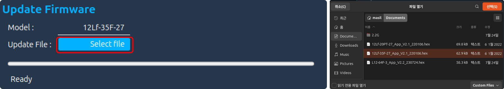
> [!warning] 주의 사항 
>이때 다른 모델의 firmware file 을 선택하지 않게 조심해야 합니다. Actuator List에 나와있는 Model 명과 uipdate file의 이름이 동일한지 확인해야 합니다.

**업데이트** 
모든 사항이 준비가 다 되었으면 상단 메뉴바에서 Update 아이콘을 클릭합니다.   

이때 둘 이상의 actuator 가 연결되었을 경우 다음과 같은 경고창이 나타나고 SCAN  작업을 다시 합니다. 

 mightyZAP이 업데이트를 위해서 재 시작하는데 정상적으로 통신이 이루어지지 않는 경우 아래의 그림과 같이 커넥터를 다시 연결하라는 메세지가 나타납니다. 이때 mightyZAP에 연결된 커넥터를 빼신 후 다시 연결하시면 정상 적으로 업데이트가 진행 됩니다.  


**업데이트 완료**
업데이트가 진행되면 그림과 같이 progress bar가 진행이 됩니다. 100%까지 완료되면 update 완료 메세지가 나타납니다.    

필요에 따라 reset이나 Factory Reset을 추가적으로 진행하시면 됩니다.  
  
**펌웨어 업데이트 실패**  
업데이트가 실패 되었을 경우 아래의 이미지와 같이 Fail 문구가 나타납니다. 그럴 경우 먼저 업데이트를 다시 실행하여 주시기 바랍니다. 이 때 업데이트 파일이 업데이트 모델의 업데이트 파일인지 확인하신 후 실행하여 주시기 바랍니다.   

추가적인 업데이트 시도에도 업데이트 실패 시 아래의 Recovery를 실행하여 주시고 그래도 실패할 경우 cs@mightyzap.com 으로 문의를 주시기 바랍니다.  
#### 3.4.3 Recovery  
Firmware 가 업데이트 실패 또는 SCAN을 통해 서보 모터를 검색하지 못할 경우 Recovery를 진행합니다. 문제가 발생한 Actuator 만을 연결한 후 상단 메뉴의 Recovery 아이콘을 클릭합니다.  

Recovery 진행 사항은 각 단계마다 이미지 또는  Text로 그 단계를 표시합니다.

 - **Actuator Search**  
   검색 단계에서는 각 모든 Baudrate와 Protocol로 mightyZAP을 검색합니다. 이때 mightyZAP이 검색이 될 경우 Recovery를 완료하고 mightyZAP을 Servo List에 자동으로 추가합니다.  
   

- **Restart**   
   검색이 되지 않았을 경우 아래의 팝업 창이 나타나면서 커넥터를 다시 연결하라는 문구가 나타납니다. Close 버튼을 누르면 업데이트 창에 "Reconnect Actuator" 문구가 나타납니다. 이때 서보모터의 연결된 커넥터를 제거 한 후 다시 연결하여 주시기 바랍니다.
    
- **Check Bootloader &Update Firmware**  
  커넥터를 다시 연결하면 Bootloader를 확인 한 후 복구할 Actuator의 Update 파일을 선택하라는 팝업 창이 나타납니다. Select 버튼을 누른 후 Update때와 같이 업데이트 파일을 선택하시면  업데이트가 진행이 됩니다.
  
- **Calibration**  
  Recovery는 Update와는 다르게 Update 후 Calibration 작업을 진행합니다. Calibration 단계에서는 서보모터의 Stroke가 수축 및 확장 작업을 진행하며 완료 될 때 까지 기다리시면 됩니다.  
- **Done**
  완료가 되면 업데이트 완료 팝업이 나타나고, SCAN 창이 활성화 됩니다. 
  

#### 3.4.4 Reset
mightyZAP의 Parameter를 초기화하는 명령입니다. 이때 ID, Baudrate, Protocol 및 Calibration Parameter는 초기화 되지 않습니다.  
  
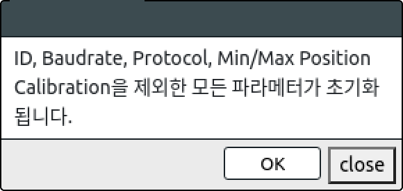
Reset 아이콘을 클릭하면 다음과 같은 Popup창이 나타납니다.  OK 버튼을 누르면 Parameter가 리셋이 되며 화면이 깜빡이며 Parameter 창으로 이동하며 Data를 다시 불러옵니다.  

#### 3.4.5 Restart  
mightyZAP의 시스템을 재 시작 할 때 사용합니다. Overload Shutdown 초기화 또는 변경된 Non Volatile Parameter의 Data를 확인하기 위해 사용합니다.  
  
해당 버튼을 누르면 화면이 한번 깜빡이고 Parameter창으로 이동하여 Data를 다시 읽어옵니다.
#### 3.4.6 Factory Reset   
Actuator의  상태를 공장 출하 시의 초기 상태로 돌리고, 위치 값을 결정하는 Potentiometer의 Calibration을 진행합니다.  
>[!warning] 주의사항
>Factroy Reset 중에 Actuator가 Calibration을 위해 최대/최소로 위치이동을 합니다. 정상적인 Calibration을 위해 장치에 연결하지 않고 무부하에 최대 동작거리를 유지할 수 있는 공간에서 진행해 주시기 바랍니다.

Factory Reset은 Update Page에 들어오면 상단 메뉴바에 추가 되어있는 것을 확인할 수 있습니다.   
해당 아이콘을 클릭하면 Factory Reset 을 하기 위한 팝업 창이 활성화 됩니다.

###### 1. 화면 구성
Factory Reset을 선택하면 팝업 창이 나타납니다. 팝업창에는 Factory Reset 관련 Option 선택창과 Text Area가 나타나고 하단에 Factory Reset 을 위한 버튼이 존재합니다.  

###### 2. Options
Factory Reset에 대한 Option은 2가지로 ID Remind와 Baudrate Remind 입니다. 그 외의 다른 Parameter들은 모두 초기화 됩니다.  
일반적인 Reset 에서는 초기화 되지 않는 Protocol, Min/Max Position Calibration이 초기화 되고, Potentiometer의 Calibration을 실행하면서 해당 내부 Parameter도 수정이 됩니다.  
Factopry Reset 후에도 유지하고 싶은 Option을 선택하시면 됩니다.  
###### 3. Factory Reset 
하단의 Factory Reset 버튼을 클릭하면, Factory Reset을 실행합니다. 실행 중 진행되는 사항을 Option 선택 아래의 Text Area 창에 표시합니다. 

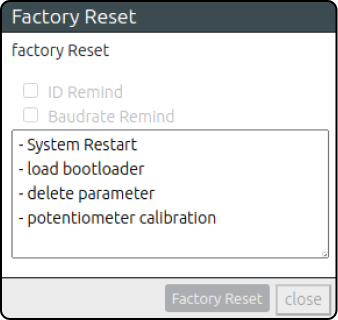
Factory Reset 진행이 되면서 Actuator가 몇 번의 시스템 재 시작을 하면서 LED가 깜빡입니다. 또한 Potenmtiometer Calibration 시에는 Actuator가 최대로 확장 및 수축 행동을 하면서 Calibration 을 진행합니다.  
최종적으로 Factory Reset이 완료되면 하단의 Close 버튼이 활성화 되면서 Parameter 창으로 이동하여 reset된 Data를 보여줍니다.

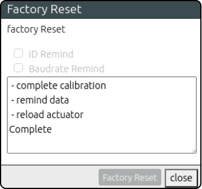

> [!warning] 주의 사항  
Factory Rest 중에 액추에이터는 Calibration 을 위해 최대/최소 위치로 앞뒤로 움직입니다. 
적절한 Calibration을 위해서는 액츄에이터를 사용자의 장비에 연결하지 않고 무부하 상태로 진행해야 하며, 최대 작동 스트로크가 보장되는 공간에서  실행하여 주시기 바랍니다.
